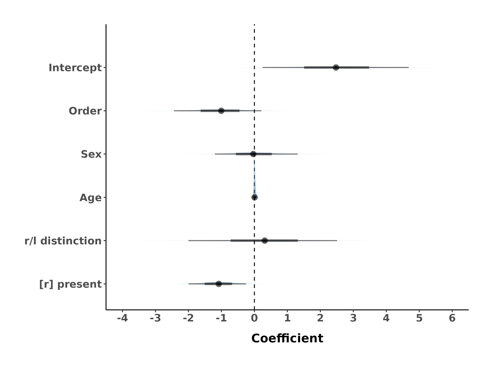
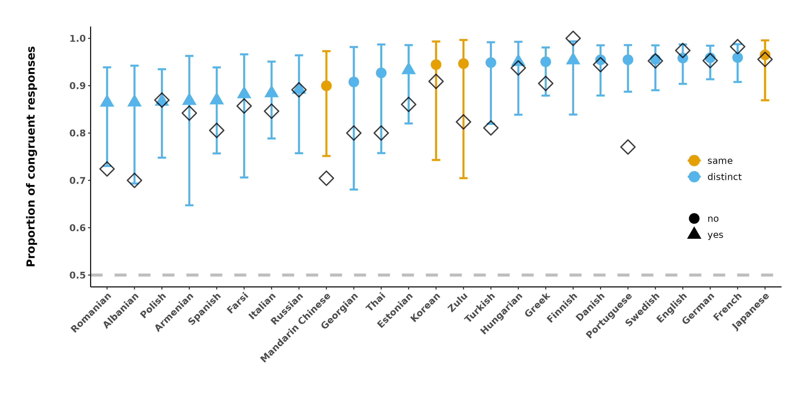

```{r setup, include=FALSE}
knitr::opts_chunk$set(echo = TRUE)
```

# Introduction:

This script uses the output of "r_l_preparation.Rmd" and returns all
values reported in the paper.

# Setup:

Load packages:

```{r, message = FALSE, warning = FALSE}
library(tidyverse) # data processing
library(brms) # bayesian models
#library(cmdstanr) # install it with: install.packages("cmdstanr", repos = c("https://mc-stan.org/r-packages/", getOption("repos"))) followed by install_cmdstan()
library(ggdist) # for plotting
# option for Bayesian regression models:
# use all available cores for parallel computing
options(mc.cores = parallel::detectCores())

## Set the script's path as working directory
#parentfolder = rstudioapi::getActiveDocumentContext()$path 
#setwd(dirname(parentfolder))
#parentfolder <- getwd()
parentfolder <- "."; # assume current folder is the document folder

models        <- paste0(parentfolder, '/models/')
plots         <- paste0(parentfolder, '/plots/')
data          <- paste0(parentfolder, '/data/')
```

```{r libraries and auxiliary functions for model fitting}
# Various auxiliary functions:
library(parallel);
library(lme4);
library(performance);
library(brms);
library(bayestestR);
library(ggplot2);
library(gridExtra);
library(ggpubr);
library(sjPlot);

brms_ncores  <- max(detectCores(all.tests=TRUE, logical=FALSE), 4, na.rm=TRUE); # try to use multiple cores, if present

# Verbal interpretation of Bayes factors (BF):
BF_interpretation <- function(BF, model1_name="m1", model2_name="m2")
{
  if( BF > 100 )   return (paste0("extreme evidence for ",model1_name," against ",model2_name, " (BF=",sprintf("%.3g",BF),")"));
  if( BF > 30 )    return (paste0("very strong evidence for ",model1_name," against ",model2_name, " (BF=",sprintf("%.3g",BF),")"));
  if( BF > 10 )    return (paste0("strong evidence for ",model1_name," against ",model2_name, " (BF=",sprintf("%.3g",BF),")"));
  if( BF > 3 )     return (paste0("moderate evidence for ",model1_name," against ",model2_name, " (BF=",sprintf("%.3g",BF),")"));
  if( BF > 1 )     return (paste0("anecdotal evidence for ",model1_name," against ",model2_name, " (BF=",sprintf("%.3g",BF),")"));
  if( BF == 1 )    return (paste0("no evidence for ",model1_name," nor ",model2_name, " (BF=",sprintf("%.3g",BF),")"));
  if( BF > 0.33 )  return (paste0("anecdotal evidence for ",model2_name," against ",model1_name, " (BF=",sprintf("%.3g",BF),")"));
  if( BF > 0.10 )  return (paste0("moderate evidence for ",model2_name," against ",model1_name, " (BF=",sprintf("%.3g",BF),")"));
  if( BF > 0.033 ) return (paste0("strong evidence for ",model2_name," against ",model1_name, " (BF=",sprintf("%.3g",BF),")"));
  if( BF > 0.010 ) return (paste0("very strong evidence for ",model2_name," against ",model1_name, " (BF=",sprintf("%.3g",BF),")"));
  return (paste0("extreme evidence for ",model2_name," against ",model1_name, " (BF=",sprintf("%.3g",BF),")"));
}

# Here I hack brms' kfold code to make it run in parallel using good old mclapply instead of futures
# this avoid random crashes which seem to be due to future, but works only on *NIX (which, for me here, is not an issue)
# Adapted the code from https://github.com/paul-buerkner/brms/blob/master/R/loo.R and https://github.com/paul-buerkner/brms/blob/master/R/kfold.R
if( Sys.info()['sysname'] == "Windows" )
{
  # In Windows, fall back to the stadard implementation in brms:
  add_criterion_kfold_parallel <- function(model, K=10, chains=1)
  {
    return (add_criterion(model, criterion="kfold", K=K, chains=chains));
  }
} else
{
  # On anything else, try to use maclapply:
  add_criterion_kfold_parallel <- function(model, K=10, chains=1)
  {
    model <- restructure(model);
  
    mf <- model.frame(model); 
    attributes(mf)[c("terms", "brmsframe")] <- NULL;
    N <- nrow(mf);
    
    if( K > N ) return (model); # does not work in this case...
    
    fold_type <- "random"; folds <- loo::kfold_split_random(K, N);
    Ksub <- seq_len(K);
  
    kfold_results <- mclapply(Ksub, function(k) 
    {
      omitted <- predicted <- which(folds == k);
      mf_omitted <- mf[-omitted, , drop=FALSE];
      
      if( exists("subset_data2", envir=asNamespace("brms")) )
      {
        # Newer versions of brms:
        model_updated <- base::suppressWarnings(update(model, newdata=mf_omitted, data2=brms:::subset_data2(model$data2, -omitted), refresh=0, chains=chains));
        
        lppds <- log_lik(model_updated, newdata=mf[predicted, , drop=FALSE], newdata2=brms:::subset_data2(model$data2, predicted), 
                         allow_new_levels=TRUE, resp=NULL, combine=TRUE, chains=chains);
      } else if( exists("subset_autocor", envir=asNamespace("brms")) )
      {
        # Older versions of brms:
        model2 <- brms:::subset_autocor(model, -omitted, incl_car=TRUE);
        model_updated <- base::suppressWarnings(update(model2, newdata=mf_omitted, refresh=0, chains=chains));
        
        lppds <- log_lik(model_updated, newdata=mf[predicted, , drop=FALSE], allow_new_levels=TRUE, resp=NULL, combine=TRUE, chains=chains);
      } else
      {
        stop("Unknown version of brms!");
      }
  
      return (list("obs_order"=predicted, "lppds"=lppds));
    }, mc.cores=ifelse(exists("brms_ncores"), brms_ncores, detectCores()));
    
    # Put them back in the form expected by the the following unmodifed code:
    obs_order <- lapply(kfold_results, function(x) x$obs_order);
    lppds     <- lapply(kfold_results, function(x) x$lppds);
    
    elpds <- brms:::ulapply(lppds, function(x) apply(x, 2, brms:::log_mean_exp))
    # make sure elpds are put back in the right order
    elpds <- elpds[order(unlist(obs_order))]
    elpd_kfold <- sum(elpds)
    se_elpd_kfold <- sqrt(length(elpds) * var(elpds))
    rnames <- c("elpd_kfold", "p_kfold", "kfoldic")
    cnames <- c("Estimate", "SE")
    estimates <- matrix(nrow = 3, ncol = 2, dimnames = list(rnames, cnames))
    estimates[1, ] <- c(elpd_kfold, se_elpd_kfold)
    estimates[3, ] <- c(-2 * elpd_kfold, 2 * se_elpd_kfold)
    out <- brms:::nlist(estimates, pointwise = cbind(elpd_kfold = elpds))
    atts <- brms:::nlist(K, Ksub, NULL, folds, fold_type)
    attributes(out)[names(atts)] <- atts
    out <- structure(out, class = c("kfold", "loo"))
    
    attr(out, "yhash") <- brms:::hash_response(model, newdata=NULL, resp=NULL);
    attr(out, "model_name") <- "";
    
    model$criteria$kfold <- out;
    model;
  }
}

# Bayesian fit indices for a given model:
brms_fit_indices <- function(model, indices=c("bayes_R2", "loo", "waic", "kfold"), K=10, verbose=TRUE, do.parallel=TRUE)
{
  if( "bayes_R2" %in% indices )
  {
    if( verbose) cat("R^2...\n");
    #attr(model, "R2") <- bayes_R2(model); 
    model <- add_criterion(model, "bayes_R2"); 
  } else
  {
    # Remove the criterion (if already there):
    if( !is.null(model$criteria) && "bayes_R2" %in% names(model$criteria) ) model$criteria[[ which(names(model$criteria) == "bayes_R2") ]] <- NULL;
  }
  
  if( "loo" %in% indices )
  {
    if( verbose) cat("LOO...\n");
    model <- add_criterion(model, "loo"); 
  } else
  {
    # Remove the criterion (if already there):
    if( !is.null(model$criteria) && "loo" %in% names(model$criteria) ) model$criteria[[ which(names(model$criteria) == "loo") ]] <- NULL;
  }
  
  if( "waic" %in% indices )
  {
    if( verbose) cat("WAIC...\n");
    model <- add_criterion(model, "waic"); 
  } else
  {
    # Remove the criterion (if already there):
    if( !is.null(model$criteria) && "waic" %in% names(model$criteria) ) model$criteria[[ which(names(model$criteria) == "waic") ]] <- NULL;
  }
  
  if( "kfold" %in% indices )
  {
    if( verbose) cat(paste0("KFOLD (K=",K,")...\n"));
    model1 <- NULL;
    if( !do.parallel )
    {
      try(model1 <- add_criterion(model, "kfold", K=K, chains=1), silent=TRUE);
    } else
    {
      try(model1 <- add_criterion_kfold_parallel(model, K=K, chains=1), silent=TRUE);
    }
    if( !is.null(model1) )
    {
      model <- model1;
    } else
    {
      # Remove the criterion (if already there):
      if( !is.null(model$criteria) && "kfold" %in% names(model$criteria) ) model$criteria[[ which(names(model$criteria) == "kfold") ]] <- NULL;
    }
  } else
  {
    # Remove the criterion (if already there):
    if( !is.null(model$criteria) && "kfold" %in% names(model$criteria) ) model$criteria[[ which(names(model$criteria) == "kfold") ]] <- NULL;
  }

  gc();
  
  return (model);
}

# Bayesian model comparison:
#model1 <- b_uvbm__blue
#model2 <- b_popsize__blue
brms_compare_models <- function(model1, model2, name1=NA, name2=NA, bayes_factor=TRUE, print_results=TRUE)
{
  if( !is.null(model1$criteria) && "bayes_R2" %in% names(model1$criteria) && !is.null(model1$criteria$bayes_R2) &&
      !is.null(model2$criteria) && "bayes_R2" %in% names(model2$criteria) && !is.null(model2$criteria$bayes_R2) )
  {
    R2_1_2 <- (mean(model1$criteria$bayes_R2) - mean(model2$criteria$bayes_R2));
  } else
  {
    R2_1_2 <- NA;
  }
  
  if( bayes_factor )
  {
    invisible(capture.output(bf_1_2 <- brms::bayes_factor(model1, model2)$bf));
    bf_interpret_1_2 <- BF_interpretation(bf_1_2, ifelse(!is.na(name1), name1, "model1"), ifelse(!is.na(name2), name2, "model2")); 
  }
  else
  {
    bf_1_2 <- NULL; bf_interpret_1_2 <- NA;
  }
  
  if( !is.null(model1$criteria) && "loo" %in% names(model1$criteria) && !is.null(model1$criteria$loo) &&
      !is.null(model2$criteria) && "loo" %in% names(model2$criteria) && !is.null(model2$criteria$loo) )
  {
    loo_1_2 <- loo_compare(model1, model2, criterion="loo", model_names=c(ifelse(!is.na(name1), name1, "model1"), ifelse(!is.na(name2), name2, "model2")));
  } else
  {
    loo_1_2 <- NA;
  }
  
  if( !is.null(model1$criteria) && "waic" %in% names(model1$criteria) && !is.null(model1$criteria$waic) &&
      !is.null(model2$criteria) && "waic" %in% names(model2$criteria) && !is.null(model2$criteria$waic) )
  {
    waic_1_2 <- loo_compare(model1, model2, criterion="waic", model_names=c(ifelse(!is.na(name1), name1, "model1"), ifelse(!is.na(name2), name2, "model2")));
    mw_1_2 <- model_weights(model1, model2, weights="waic", model_names=c(ifelse(!is.na(name1), name1, "model1"), ifelse(!is.na(name2), name2, "model2")));
  } else
  {
    waic_1_2 <- NA; 
    mw_1_2 <- NA;
  }
  
  if( !is.null(model1$criteria) && "kfold" %in% names(model1$criteria) && !is.null(model1$criteria$kfold) &&
      !is.null(model2$criteria) && "kfold" %in% names(model2$criteria) && !is.null(model2$criteria$kfold) )
  {
    kfold_1_2 <- loo_compare(model1, model2, criterion="kfold", model_names=c(ifelse(!is.na(name1), name1, "model1"), ifelse(!is.na(name2), name2, "model2")));
  } else
  {
    kfold_1_2 <- NA;
  }
  
  if( print_results )
  {
    cat(paste0("\nComparing models '",ifelse(!is.na(name1), name1, "model1"),"' and '",ifelse(!is.na(name2), name2, "model2"),"':\n\n"));
    cat(paste0("\ndelta R^2 = ",sprintf("%.1f%%",100*R2_1_2),"\n\n"));
    cat(bf_interpret_1_2,"\n\n");
    cat("\nLOO:\n"); print(loo_1_2);
    cat("\nWAIC:\n"); print(waic_1_2);
    cat("\nKFOLD:\n"); print(kfold_1_2);
    cat("\nModel weights (WAIC):\n"); print(mw_1_2);
    cat("\n");
  }
  
  gc();
  
  return (list("R2"=R2_1_2, "BF"=bf_1_2, "BF_interpretation"=bf_interpret_1_2, "LOO"=loo_1_2, "WAIC"=waic_1_2, "KFOLD"=kfold_1_2, "model_weights_WAIC"=mw_1_2));
}

# print model comparisons
.print.model.comparison <- function(a=NULL, a.names=NULL, b=NULL) # a is the anova and b is the Bayesian comparison (only one can be non-NULL), a.names are the mappings between the inner and user-friendly model names
{
  # ANOVA:
  if( !is.null(a) )
  {
    a <- as.data.frame(a);
    if( !is.null(a.names) )
    {
      if( length(a.names) != nrow(a) || !all(names(a.names) %in% rownames(a)) )
      {
        stop("a.names do not correspond the anova model names!");
        return (NULL);
      }
      rownames(a) <- a.names[rownames(a)];
    }
    i <- which.min(a$AIC);
    s.a <- sprintf("%s %s %s: ΔAIC=%.1f, ΔBIC=%.1f", 
                   rownames(a)[i], 
                   ifelse((!is.na(a[2,"Pr(>Chisq)"]) && a[2,"Pr(>Chisq)"] <0.05) || (abs(a$AIC[1] - a$AIC[2]) > 3), ">", "≈"),
                   rownames(a)[3-i],
                   abs(a$AIC[1] - a$AIC[2]), 
                   abs(a$BIC[1] - a$BIC[2]));
    if( !is.na(a[2,"Pr(>Chisq)"]) )
    {
      s.a <- paste0(s.a,
                    sprintf(", *p*=%s", scinot(a[2,"Pr(>Chisq)"])));
    }
    
    # return value:
    return (s.a);
  }
  
  # Bayesian comparison:
  if( !is.null(b) )
  {
    s.b <- sprintf("BF: %s, ΔLOO(%s %s %s)=%.1f (%.1f), ΔWAIC(%s %s %s)=%.1f (%.1f), ΔKFOLD(%s %s %s)=%.1f (%.1f)",
                   # BF:
                   b$BF_interpretation, 
                   # LOO:
                   rownames(b$LOO)[1],
                   ifelse(abs(b$LOO[1,1]-b$LOO[2,1]) < 4 || abs(b$LOO[1,1]-b$LOO[2,1]) < b$LOO[2,2], "≈", ifelse(abs(b$LOO[1,1]-b$LOO[2,1]) < 2*b$LOO[2,2], ">", ">>")),
                   rownames(b$LOO)[2], 
                   abs(b$LOO[1,1]-b$LOO[2,1]), b$LOO[2,2], 
                   # WAIC:
                   rownames(b$WAIC)[1], 
                   ifelse(abs(b$WAIC[1,1]-b$WAIC[2,1]) < 4 || abs(b$WAIC[1,1]-b$WAIC[2,1]) < b$WAIC[2,2], "≈", ifelse(abs(b$WAIC[1,1]-b$WAIC[2,1]) < 2*b$WAIC[2,2], ">", ">>")), 
                   rownames(b$WAIC)[2], 
                   abs(b$WAIC[1,1]-b$WAIC[2,1]), b$WAIC[2,2],
                   # KFOLD:
                   ifelse(is.null(b$KFOLD) || all(is.na(b$KFOLD)), "?", rownames(b$KFOLD)[1]), 
                   ifelse(is.null(b$KFOLD) || all(is.na(b$KFOLD)), "?", ifelse(abs(b$KFOLD[1,1]-b$KFOLD[2,1]) < 4 || abs(b$KFOLD[1,1]-b$KFOLD[2,1]) < b$KFOLD[2,2], "≈", ifelse(abs(b$KFOLD[1,1]-b$KFOLD[2,1]) < 2*b$KFOLD[2,2], ">", ">>"))), 
                   ifelse(is.null(b$KFOLD) || all(is.na(b$KFOLD)), "?", rownames(b$KFOLD)[2]), 
                   ifelse(is.null(b$KFOLD) || all(is.na(b$KFOLD)), NA, abs(b$KFOLD[1,1]-b$KFOLD[2,1])), ifelse(is.null(b$KFOLD) || all(is.na(b$KFOLD)), NA, b$KFOLD[2,2]));
    
    # return value:
    return (s.b);
  }
}

# Standard error of the mean:
std <- function(x) sd(x)/sqrt(length(x))

# Root Mean Square Error (RMSE) between observed (y) and predicted (yrep) values:
rmse <- function(y, yrep)
{
  yrep_mean <- colMeans(yrep)
  sqrt(mean((yrep_mean - y)^2))
}

# Log odds to probability (logistic regression):
lo2p <- function(x){ o <- exp(x); return (o/(1+o));}

# Scientific notation using Markdown conventions (inspired from https://www.r-bloggers.com/2015/03/scientific-notation-for-rlatex/):
scinot <- function(xs, digits=2, pvalue=TRUE)
{
  scinot1 <- function(x)
  {
    sign <- "";
    if(x < 0)
    {
      sign <- "-";
      x <- -x;
    }
    exponent <- floor(log10(x));
    if(exponent && pvalue && exponent < -3) 
    {
      xx <- round(x / 10^exponent, digits=digits);
      e <- paste0("×10^", round(exponent,0), "^");
    } else 
    {
      xx <- round(x, digits=digits+1);
      e <- "";
    }
    paste0(sign, xx, e);
  }
  vapply(xs, scinot1, character(1));
}

# Escape * in a string:
escstar <- function(s)
{
  gsub("*", "\\*", s, fixed=TRUE);
}
```


For reproducible reporting:

```{r, message = FALSE, warning = FALSE}
packageVersion('tidyverse')
packageVersion('ggplot2')
packageVersion('brms')
#packageVersion('cmdstanr')
packageVersion('ggdist')
```

Load ggplot2 theme and colors:

```{r, message = FALSE, warning = FALSE}
source('theme_timo.R')

colorBlindBlack8  <- c("#000000", "#E69F00", "#56B4E9", "#009E73", 
                       "#F0E442", "#0072B2", "#D55E00", "#CC79A7")
```

Load data:

```{r, message = FALSE, warning = FALSE}
web     <- read_csv(paste0(data, 'web_experiment_cleaned.csv'))
web_raw <- read_csv(paste0(data, '/web_raw_trials.csv'))

field     <- read_csv(paste0(data, 'field_experiment_cleaned.csv'))
field_raw <- read_csv(paste0(data, '/field_raw_trials.csv'))
```

# Online experiment

## Descriptive statistics

First, how many participants?

```{r}
nrow(web)
```

Sex division

```{r}
table(web$Sex)
```

Ages

```{r}
summary(web$Age)
```

Order division

```{r}
# Counts
table(web$Order)
# Percentage
prop.table(table(web$Order)) * 100
```

First, how many languages?

```{r}
web %>% count(Name) %>% nrow()
```

Does this number correspond with the L1s?

```{r}
web %>% count(Language) %>% nrow()
```

How many families?

```{r}
web %>% count(Family) %>% nrow()
```

How many have the R/L distinction in the L1 among the languages?

```{r}
web %>% count(Language, r_l_distinction_L1) %>% count(r_l_distinction_L1)
```

How many really use the alveolar trill in L1 among the languages?

```{r}
web %>% count(Language, trill_real_L1) %>% count(trill_real_L1)
```

How many really have the alveolar trill in L1 as an allophone among the
languages?

```{r}
web %>% count(Language, trill_occ_L1) %>% count(trill_occ_L1)
```

What about the same questions for L2. But this will not neatly sum up to
25, due to various possible scenarios for L2 within a specific L1.

How many have the R/L distinction in the L2 among the languages?

```{r}
web %>% count(Language, r_l_distinction_L2) %>% count(r_l_distinction_L2)
```

How many really use the alveolar trill in L2 among the languages?

```{r}
web %>% count(Language, trill_real_L2) %>% count(trill_real_L2)
```

How many really have the alveolar trill in L2 as an allophone among the
languages?

```{r}
web %>% count(Language, trill_occ_L2) %>% count(trill_occ_L2)
```

What is the grand average congruent behavior?

```{r}
mean(web$Match)
```

87.3%

What about only among those who have L1 without the distinction?

```{r}
web %>%
  filter(r_l_distinction_L1 == "0") %>%
  summarize(mean_match = mean(Match, na.rm = TRUE))
```

83.9%

What about only among those who have L1 without the distinction and no
L2 that distinguishes?

```{r}
web %>%
  filter(r_l_distinction_L1 == "0") %>%
  filter(!EnglishL2YesNo) %>% 
  filter(r_l_distinction_L1 == '0') %>% 
  summarize(mean_match = mean(Match, na.rm = TRUE))
```

85.1%

Compute average matching behavior per language and sort:

```{r}
web_avg <- web %>%
  group_by(Language) %>% 
  summarize(M = mean(Match)) %>% 
  arrange(desc(M)) %>% 
  mutate(percent = round(M, 2) * 100,
         percent = str_c(percent, '%'))

# Show:

web_avg %>% print(n = Inf)
```

Check some demographics, also to report in the paper. First, the number
of participants per language:

```{r}
web %>% 
  count(Name, sort = TRUE) %>% print(n = Inf)
```

Then, the number of L1 speakers who have R/L distinction vs. who don't:

```{r}
web %>% count(r_l_distinction_L1) %>%
  mutate(prop = n / sum(n),
         percent = round(prop, 2) * 100,
         percent = str_c(percent, '%'))
```

How many people do not have any L2?

```{r}
sum(is.na(web$L2)) / nrow(web)

# bilinguals:
1 - sum(is.na(web$L2)) / nrow(web)
```

Check how many people knew English as their L2:

```{r}
web %>% count(EnglishL2YesNo) %>% 
  mutate(prop = n / sum(n),
         percent = round(prop, 2) * 100,
         percent = str_c(percent, '%'))
```

Of those that don't use a R/L distinction in their L1, how many use R/L
distinction in their L2? (double-check if logic alright!)

```{r}
web %>%
  filter(r_l_distinction_L1 == 0) %>% 
  count(r_l_distinction_L2 == 1) %>% 
  mutate(prop = n / sum(n),
         percent = round(prop, 2) * 100,
         percent = str_c(percent, '%'))
```

How many "pure" speakers were there?, i.e., those people that 1) don't
know English, 2) don't use an L1 with a R/L distinction, and 3) don't
know an L2 that distinguishes R/L.

```{r}
web %>% 
  filter(r_l_distinction_L1 == 0) %>%  # excludes English as well
  filter(!EnglishL2YesNo) %>% 
  filter(r_l_distinction_L2 == 0) %>% 
  nrow()
```

1 person!

Let's check if this is correct. This gives the list of all participants
for whom this applies.

```{r}
web %>% 
    filter(r_l_distinction_L1 == 0 & !EnglishL2YesNo & r_l_distinction_L2 == 0) %>% 
    print(n = 50)
```

Are these really "pure"? What languages do they speak?

```{r}
web %>% 
  filter(r_l_distinction_L1 == 0) %>%  # excludes English as well
  filter(!EnglishL2YesNo) %>% 
  filter(r_l_distinction_L2 == 0) %>% 
  count(Language)
```

One Japanese speaker.

Nevertheless, let's explore whether these also show matches?

```{r}
web %>% 
  filter(r_l_distinction_L1 == 0) %>%  # excludes English as well
  filter(!EnglishL2YesNo) %>% 
  filter(r_l_distinction_L2 == 0) %>% 
  count(Match) %>% 
  mutate(prop = n / sum(n),
         percent = round(prop, 2) * 100,
         percent = str_c(percent, '%'))
```

Yes, similar to above 85%.


## Regression models


### What random structure to use?

An important point to clarify is what should be the random effects structure of our regression models.

On the one hand, it is usually recommended that one should include the full random structure, which in our case would mean not just the three "grouping factors" *Language*, *Family* and (Autotyp) *Area*, but also the random slopes for all the fixed effects (and their interactions) included in the model.
So, for example, in a model with Order, r/t distinction (in L1) and the their interaction as fixed effects, we should have the following fixed and random effects structure:
```
Match ~ 1 + Order + r_l_distinction_L1 + Order:r_l_distinction_L1 +
  (1 + Order + r_l_distinction_L1 + Order:r_l_distinction_L1 | Language) +
  (1 + Order + r_l_distinction_L1 + Order:r_l_distinction_L1 | Family) +
  (1 + Order + r_l_distinction_L1 + Order:r_l_distinction_L1 | Autotyp_Area)
```

<center> under a CC-BY-4.0 license.](./autotyp_areas_map.jpg){width="8in"}</center>

However, when it comes to the r/l distinction and the presence of [r] in the language (L1 or L2), it is clear that these variables do *not*, by definition, vary within *Language* (so there should be no random slope here), and, at least in our current data, they very very little within the levels of the other two grouping factors as well (see below), raising the legitimate question whether we should model random slopes for these two variables at all.

**Order**: we know this varies within all levels of Language, Family and Area because of the experiment design, so Order should have varying slopes for all three.

**Sex**: likewise, sex varies by design so it should have random slopes for all three.

**Age**: same for age, so it should have random slopes for all three.

**r/l distinction in L1**:
```{r}
table(web$r_l_distinction_L1, web$Language)
table(web$r_l_distinction_L1, web$Family)
#web %>% group_by(Family) %>% select(Family, Name) %>% unique() %>% arrange(Family)
table(web$r_l_distinction_L1, web$Autotyp_Area)
#web %>% group_by(Autotyp_Area) %>% select(Autotyp_Area, Name) %>% unique() %>% arrange(Autotyp_Area)
```
This is perfectly uniform within the levels of each of the three factors, so random slopes are arguably not justified *a priori* for neither of them.

**r/l distinction in L2**:
```{r}
table(web$r_l_distinction_L2, web$Language)
table(web$r_l_distinction_L2, web$Family)
table(web$r_l_distinction_L2, web$Autotyp_Area)
```
There is almost no "absent" at all, so random slopes are arguably not justified *a priori* for neither of them.

**presence of [r] in L1**:
```{r}
table(web$trill_real_L1, web$Language)
table(web$trill_real_L1, web$Family)
table(web$trill_real_L1, web$Autotyp_Area)
```
This is almost uniform within *Language*, but there is variation for the IE level of *Family* (almost 50%:50% between "no" and "yes"), and between 2 levels of *Area* (Europe with 60%:40% and Greater Mesopotamia with 55%:45% "no":"yes"), making the decision here much harder.

**presence of [r] in L2**:
```{r}
table(web$trill_real_L2, web$Language)
table(web$trill_real_L2, web$Family)
table(web$trill_real_L2, web$Autotyp_Area)
```
Here there is enough variation within the levels for all three factors, justifying the inclusion of random slopes.

**Given these**, we did the following:

- we always **include** random slopes for *Order*, *Sex* and *Age*
- we **do not** model random slopes for the *r/l distinction* in L1 or L2
- for the *presence of [r]* in *L2*, we **do** model random slopes, but for *L1* we we fit *two models* (a) with random slopes for Family and Area and (b) a model without any random intercepts (and we perform model comparison between the two).

However, we also performed, for all these predictors, model comparisons between the model with the full random efefcts structure (as appropriate for each predictor, see above) and a model with a simpler random effects structure, as detailed below.

Please note that in the frequentist models (using `glmer`) we could not fit the full random effects structure (due to various convergence issues), but we report which structure was used in each case.

```{r checks and coding factors}
web <- mutate(web, Order = factor(Order, levels = c('r_first', 'l_first'))) # make factor with r_first as baseline

web %>% count(Order) %>% mutate(prop = n / sum(n)) 
# the order effect is decently balanced: 51.6% vs 48.3%

web %>% count(r_l_distinction_L1) %>%
  mutate(prop = n / sum(n))
# highly imbalanced: 15.8% vs 84.2%

web %>% count(trill_real_L1) %>%
  mutate(prop = n / sum(n))
# ok: 58.8% vs 41.2%

web %>% count(trill_occ_L1) %>%
  mutate(prop = n / sum(n))
# 100% are 1 --> excluded from the model

## And for L2, just in case
web %>% count(r_l_distinction_L2) %>%
  mutate(prop = n / sum(n))
# 13.5% missing, the rest almost all (86.3%) are 1 and 0.2% are 0 ---> exclude as well

web %>% count(trill_real_L2) %>%
  mutate(prop = n / sum(n))
# 13.5% missing, the rest is balanced: 53.8% vs 32.7%

web %>% count(trill_occ_L2) %>%
  mutate(prop = n / sum(n))
# 13.5% missing, the rest are all (86.5%) are 1 ---> exclude as well

#web <- mutate(web,
#               order_num = ifelse(Order == 'r_first', -0.5, +0.5))

# Code them as factors:
web$r_l_distinction_L1_f <- factor(c("same", "distinct")[web$r_l_distinction_L1 + 1], levels=c("same", "distinct"));
web$trill_real_L1_f      <- factor(c("no", "yes")[web$trill_real_L1 + 1], levels=c("no", "yes"));
web$trill_occ_L1_f       <- factor(c("no", "yes")[web$trill_occ_L1 + 1], levels=c("no", "yes"));
web$r_l_distinction_L2_f <- factor(c("same", "distinct")[web$r_l_distinction_L2 + 1], levels=c("same", "distinct"));
web$trill_real_L2_f      <- factor(c("no", "yes")[web$trill_real_L2 + 1], levels=c("no", "yes"));
web$trill_occ_L2_f       <- factor(c("no", "yes")[web$trill_occ_L2 + 1], levels=c("no", "yes"));
```

(Please note that we hide the code for the model fitting as it is too large and clutters the output, but it can be consulted in the `Rmarkdown` file.)

```{r Model fitting, echo=FALSE}
# Model fitting:
.save_models <- TRUE; # should we also save the actual models? these models are quite large on disk but allow later checks without re-running everything

if( !file.exists("./models/web_regressions_L1_summaries.rds") ||
    !(.save_models & file.exists("./models/web_regressions_L1_models.rds")) )
{
  # Actually fit the models and save various summaries (and potentially the actual models as well)
  # It's pretty computationally expensive, especially the Bayesian ones!
  
  # icc:
  m0 <- glmer(Match ~ 1 + 
                (1 | Language), # (1 | Family)  (1 | Autotyp_Area) have variance 0!
              data = web,
              family = binomial(), 
              control = glmerControl(optimizer="bobyqa", optCtrl=list(maxfun = 1e7)));
  summary(m0); # looks good
  icc(m0); # 8.6%
  
  # check random slopes:
  m_Order <- glmer(Match ~ 1 + Order +
                     (1 | Language), # random slope for Order results in boundary (singular) fit
                   data = web,
                   family = binomial(), 
                   control = glmerControl(optimizer="bobyqa", optCtrl=list(maxfun = 1e7)));
  summary(m_Order); # p=1.87e-05 ***
  anova(m_Order, m0); # p=1.266e-05 *** ΔAIC=-17.06
  
  m_Sex <- glmer(Match ~ 1 + Sex +
                   (1 | Language), # random slope for Sex results in boundary (singular) fit
                 data = web,
                 family = binomial(), 
                 control = glmerControl(optimizer="bobyqa", optCtrl=list(maxfun = 1e7)));
  summary(m_Sex); # p=0.652
  anova(m_Sex, m0); # p=0.657 ΔAIC=1.8
  
  m_Age <- glmer(Match ~ 1 + Age +
                   (1 + Age | Language), # random slope for Age has tiny variance (0.0006003)
                 data = web,
                 family = binomial(), 
                 control = glmerControl(optimizer="bobyqa", optCtrl=list(maxfun = 1e7)));
  summary(m_Age); # p=0.944
  anova(m_Age, m0); # p=0.26 ΔAIC=1.98
  
  m_rl <- glmer(Match ~ 1 + r_l_distinction_L1_f +
                  (1 | Language), 
                data = web,
                family = binomial(), 
                control = glmerControl(optimizer="bobyqa", optCtrl=list(maxfun = 1e7)));
  summary(m_rl); # p=0.514
  anova(m_rl, m0); # p=0.521 ΔAIC=1.59
  
  m_trill <- glmer(Match ~ 1 + trill_real_L1_f +
                     (1 | Language), # random slope for trill_real_L1 has correlation slope-intercept 1.00 and boundary (singular) fit
                   data = web,
                   family = binomial(), 
                   control = glmerControl(optimizer="bobyqa", optCtrl=list(maxfun = 1e7)));
  summary(m_trill); # p=0.201
  anova(m_trill, m0); # p=0.19 ΔAIC=0.31
  
  # VIF:
  m_vif <- glmer(Match ~ 1 + r_l_distinction_L1_f + trill_real_L1_f + Order + Sex + Age +
                   (1 | Language),
                 data = web,
                 family = binomial(), 
                 control = glmerControl(optimizer="bobyqa", optCtrl=list(maxfun = 1e7)));
  summary(m_vif);
  performance::check_collinearity(m_vif); # all VIFs < 1.25, so OK
  
  # L2:
  m_rl2 <- glmer(Match ~ 1 + r_l_distinction_L2_f +
                   (1 | Language),
                 data = web[ !is.na(web$r_l_distinction_L2_f), ],
                 family = binomial(), 
                 control = glmerControl(optimizer="bobyqa", optCtrl=list(maxfun = 1e7)));
  summary(m_rl2); # p=0.776
  anova(m_rl2, update(m0, . ~ ., data=web[ !is.na(web$r_l_distinction_L2_f), ])); # p=0.581 ΔAIC=1.69
  
  m_trill2 <- glmer(Match ~ 1 + trill_real_L2_f +
                      (1 + trill_real_L2_f | Language),
                    data = web[ !is.na(web$trill_real_L2_f), ],
                    family = binomial(), 
                    control = glmerControl(optimizer="bobyqa", optCtrl=list(maxfun = 1e7)));
  summary(m_trill2); # p=0.985
  anova(m_trill2, update(m0, . ~ ., data=web[ !is.na(web$trill_real_L2_f), ])); # p=0.76 ΔAIC=4.82
  
  # VIF:
  m_vif2 <- glmer(Match ~ 1 + r_l_distinction_L1_f + trill_real_L1_f + r_l_distinction_L2_f + trill_real_L2_f + Order + Sex + Age +
                    (1 | Language),
                  data = web,
                  family = binomial(), 
                  control = glmerControl(optimizer="bobyqa", optCtrl=list(maxfun = 1e7)));
  summary(m_vif2);
  performance::check_collinearity(m_vif2); # all VIFs < 1.25, so OK
  
  
  
  
  # with brms:
  
  # prior predictive checks:
  # what priors we can set (use Order for that):
  get_prior(Match ~ 1 + Order +
              (1 + Order | Language) +
              (1 + Order | Family) +
              (1 + Order | Autotyp_Area),
            data=web,
            family=bernoulli(link='logit'));
  # -> "sd" priors seem alright (student_t(3, 0, 2.5)), as does the "Intercept" (student_t(3, 0, 2.5)), but lkj(1) for "cor" might too accepting of extreme correlations, and (flat) for "b" is clearly not ok
  # so, we keep "sd" and "Intercept" but use lkj(2) for "cor" and student_t(5, 0, 2.5) for "b"
  b_priors <- brms::brm(Match ~ 1 + Order +
                          (1 + Order | Language) +
                          (1 + Order | Family) +
                          (1 + Order | Autotyp_Area),
                        data=web,
                        family=bernoulli(link='logit'),
                        prior=c(brms::set_prior("student_t(5, 0, 2.5)", class="b"), 
                                brms::set_prior("lkj(2)", class="cor")),
                        sample_prior='only',  # needed for prior predictive checks
                        seed=998, cores=brms_ncores, iter=10000, warmup=4000, thin=2, control=list(adapt_delta=0.999, max_treedepth=13));
  plot_prefix <- "./plots/web_L1";
  g <- arrangeGrob(pp_check(b_priors, type='stat', sta ='min') + xlab('p(match)') + ggtitle('Prior predictive distribution of minimum values'),
                   pp_check(b_priors, type='stat', stat='mean') + xlab('p(match)') + ggtitle('Prior predictive distribution of means'),
                   pp_check(b_priors, type='stat', stat='max') + xlab('p(match)') + ggtitle('Prior predictive distribution of maximum values'),
                   ncol=1); # seems fine but our value is a bit extreme
  as_ggplot(g); ggsave(paste0(plot_prefix,"_prior_predictive_checks.jpg"), plot=g, device="jpeg", width=6, height=4*3, units="in", quality=85);
  
  b0 <- brm(Match ~ 1 + 
              (1 | Language) +
              (1 | Family) +
              (1 | Autotyp_Area),
            data = web,
            family=bernoulli(link='logit'),
            save_pars=save_pars(all=TRUE), # needed for Bayes factors
            sample_prior=TRUE,  # needed for hypotheses tests
            seed=998, cores=brms_ncores, iter=10000, warmup=4000, thin=2, control=list(adapt_delta=0.999, max_treedepth=13));
  summary(b0); mcmc_plot(b0, type="trace"); mcmc_plot(b0); # very decent
  bayestestR::hdi(b0, ci=0.95);
  b0 <- brms_fit_indices(b0);
  # posterior predictive checks
  plot_prefix <- "./plots/web_L1_null"; b <- b0;
  mcmc_plot(b, type="trace"); ggsave(paste0(plot_prefix,"_mcmctrace.jpg"), device="jpeg", width=7, height=6, units="in", quality=85);
  mcmc_plot(b); ggsave(paste0(plot_prefix,"_mcmcestim.jpg"), device="jpeg", width=7, height=4, units="in", quality=85);
  pp_check(b, ndraws=100) + xlab('p(match)') + ggtitle('Posterior predictive density overlay'); ggsave(paste0(plot_prefix,"_ppchecks_densoverlay.jpg"), device="jpeg", width=6, height=4, units="in", quality=85);
  g <- arrangeGrob(pp_check(b, type='stat', sta ='min') + xlab('p(match)') + ggtitle('Posterior predictive distribution of minimum values'),
                   pp_check(b, type='stat', stat='mean') + xlab('p(match)') + ggtitle('Posterior predictive distribution of means'),
                   pp_check(b, type='stat', stat='max') + xlab('p(match)') + ggtitle('Posterior predictive distribution of maximum values'),
                   ncol=1); # seems fine (the observed, y, does fall in the predicted distributions, y_{rep} for the max, mean and min)
  as_ggplot(g); ggsave(paste0(plot_prefix,"_ppchecks_min_mean_max.jpg"), plot=g, device="jpeg", width=6, height=4*3, units="in", quality=85);
  
  # Let's check if Family and Area matter as random effects:
  b0_noF <- brm(Match ~ 1 + 
                  (1 | Language) +
                  (1 | Autotyp_Area),
                data = web,
                family=bernoulli(link='logit'),
                save_pars=save_pars(all=TRUE), # needed for Bayes factors
                sample_prior=TRUE,  # needed for hypotheses tests
                seed=998, cores=brms_ncores, iter=10000, warmup=4000, thin=2, control=list(adapt_delta=0.999, max_treedepth=13));
  summary(b0_noF); mcmc_plot(b0_noF, type="trace"); mcmc_plot(b0_noF); # very decent
  bayestestR::hdi(b0_noF, ci=0.95);
  b0_noF <- brms_fit_indices(b0_noF);
  brms_compare_models(b0, b0_noF, "[null model]", "[null model without Family]"); # without Family seems slightly better

  b0_noA <- brm(Match ~ 1 + 
                  (1 | Language) +
                  (1 | Family),
                data = web,
                family=bernoulli(link='logit'),
                save_pars=save_pars(all=TRUE), # needed for Bayes factors
                sample_prior=TRUE,  # needed for hypotheses tests
                seed=998, cores=brms_ncores, iter=10000, warmup=4000, thin=2, control=list(adapt_delta=0.999, max_treedepth=13));
  summary(b0_noA); mcmc_plot(b0_noA, type="trace"); mcmc_plot(b0_noA); # very decent
  bayestestR::hdi(b0_noA, ci=0.95);
  b0_noA <- brms_fit_indices(b0_noA);
  brms_compare_models(b0, b0_noA, "[null model]", "[null model without Area]"); # without Area seems equivalent with null

  b0_noFA <- brm(Match ~ 1 + 
                   (1 | Language),
                 data = web,
                 family=bernoulli(link='logit'),
                 save_pars=save_pars(all=TRUE), # needed for Bayes factors
                 sample_prior=TRUE,  # needed for hypotheses tests
                 seed=998, cores=brms_ncores, iter=10000, warmup=4000, thin=2, control=list(adapt_delta=0.999, max_treedepth=13));
  summary(b0_noFA); mcmc_plot(b0_noFA, type="trace"); mcmc_plot(b0_noFA); # very decent
  bayestestR::hdi(b0_noFA, ci=0.95);
  b0_noFA <- brms_fit_indices(b0_noFA);
  brms_compare_models(b0, b0_noFA, "[null model]", "[null model without Family and Area]"); # without Family and Area seems a bit better than null...
  

  ## Individual IVs:
  
  ## Order:
  # Full random structure:
  b_Order <- brm(Match ~ 1 + Order +
                   (1 + Order | Language) +
                   (1 + Order | Family) +
                   (1 + Order | Autotyp_Area),
                 data = web,
                 family=bernoulli(link='logit'),
                 prior=c(brms::set_prior("student_t(5, 0, 2.5)", class="b"), 
                         brms::set_prior("lkj(2)", class="cor")),
                 save_pars=save_pars(all=TRUE), # needed for Bayes factors
                 sample_prior=TRUE,             # needed for hypotheses tests
                 seed=998, cores=brms_ncores, iter=10000, warmup=4000, thin=2, control=list(adapt_delta=0.999, max_treedepth=13));
  summary(b_Order); mcmc_plot(b_Order, type="trace"); mcmc_plot(b_Order); # very decent
  brms::hypothesis(b_Order, c("Orderl_first = 0")); # p=0.50
  b_Order <- brms_fit_indices(b_Order);
  brms_compare_models(b0, b_Order, "[null model]", "[+ order]"); # order clearly better
  # posterior predictive checks
  plot_prefix <- "./plots/web_L1_order"; b <- b_Order;
  mcmc_plot(b, type="trace"); ggsave(paste0(plot_prefix,"_mcmctrace.jpg"), device="jpeg", width=7, height=6, units="in", quality=85);
  mcmc_plot(b); ggsave(paste0(plot_prefix,"_mcmcestim.jpg"), device="jpeg", width=7, height=4, units="in", quality=85);
  pp_check(b, ndraws=100) + xlab('p(match)') + ggtitle('Posterior predictive density overlay'); ggsave(paste0(plot_prefix,"_ppchecks_densoverlay.jpg"), device="jpeg", width=6, height=4, units="in", quality=85);
  g <- arrangeGrob(pp_check(b, type='stat', sta ='min') + xlab('p(match)') + ggtitle('Posterior predictive distribution of minimum values'),
                   pp_check(b, type='stat', stat='mean') + xlab('p(match)') + ggtitle('Posterior predictive distribution of means'),
                   pp_check(b, type='stat', stat='max') + xlab('p(match)') + ggtitle('Posterior predictive distribution of maximum values'),
                   ncol=1); # seems fine (the observed, y, does fall in the predicted distributions, y_{rep} for the max, mean and min)
  as_ggplot(g); ggsave(paste0(plot_prefix,"_ppchecks_min_mean_max.jpg"), plot=g, device="jpeg", width=6, height=4*3, units="in", quality=85);
  plot_model(b, type="pred", terms="Order"); ggsave(paste0(plot_prefix,"_pred.jpg"), device="jpeg", width=4, height=4, units="in", quality=85);
  
  # Only Language as random effect:
  b_Order_L <- brm(Match ~ 1 + Order +
                     (1 + Order | Language),
                   data = web,
                   family=bernoulli(link='logit'),
                   prior=c(brms::set_prior("student_t(5, 0, 2.5)", class="b"), 
                           brms::set_prior("lkj(2)", class="cor")),
                   save_pars=save_pars(all=TRUE), # needed for Bayes factors
                   sample_prior=TRUE,             # needed for hypotheses tests
                   seed=998, cores=brms_ncores, iter=10000, warmup=4000, thin=2, control=list(adapt_delta=0.999, max_treedepth=13));
  summary(b_Order_L); mcmc_plot(b_Order_L, type="trace"); mcmc_plot(b_Order_L); # very decent
  brms::hypothesis(b_Order_L, c("Orderl_first = 0")); # p=0.53
  b_Order_L <- brms_fit_indices(b_Order_L);
  brms_compare_models(b0, b_Order_L, "[null model]", "[+ order]"); # order clearly better
  brms_compare_models(b_Order, b_Order_L, "[full random structure]", "[only Language]"); # only Language seems better
  # posterior predictive checks
  plot_prefix <- "./plots/web_L1_order_L"; b <- b_Order_L;
  mcmc_plot(b, type="trace"); ggsave(paste0(plot_prefix,"_mcmctrace.jpg"), device="jpeg", width=7, height=6, units="in", quality=85);
  mcmc_plot(b); ggsave(paste0(plot_prefix,"_mcmcestim.jpg"), device="jpeg", width=7, height=4, units="in", quality=85);
  pp_check(b, ndraws=100) + xlab('p(match)') + ggtitle('Posterior predictive density overlay'); ggsave(paste0(plot_prefix,"_ppchecks_densoverlay.jpg"), device="jpeg", width=6, height=4, units="in", quality=85);
  g <- arrangeGrob(pp_check(b, type='stat', sta ='min') + xlab('p(match)') + ggtitle('Posterior predictive distribution of minimum values'),
                   pp_check(b, type='stat', stat='mean') + xlab('p(match)') + ggtitle('Posterior predictive distribution of means'),
                   pp_check(b, type='stat', stat='max') + xlab('p(match)') + ggtitle('Posterior predictive distribution of maximum values'),
                   ncol=1); # seems fine (the observed, y, does fall in the predicted distributions, y_{rep} for the max, mean and min)
  as_ggplot(g); ggsave(paste0(plot_prefix,"_ppchecks_min_mean_max.jpg"), plot=g, device="jpeg", width=6, height=4*3, units="in", quality=85);
  plot_model(b, type="pred", terms="Order"); ggsave(paste0(plot_prefix,"_pred.jpg"), device="jpeg", width=4, height=4, units="in", quality=85);
  
  
  ## Sex:
  b_Sex <- brm(Match ~ 1 + Sex +
                 (1 + Sex | Language) +
                 (1 + Sex | Family) +
                 (1 + Sex | Autotyp_Area),
               data = web,
               family=bernoulli(link='logit'),
               prior=c(brms::set_prior("student_t(5, 0, 2.5)", class="b"), 
                       brms::set_prior("lkj(2)", class="cor")),
               save_pars=save_pars(all=TRUE), # needed for Bayes factors
               sample_prior=TRUE,             # needed for hypotheses tests
               seed=998, cores=brms_ncores, iter=10000, warmup=4000, thin=2, control=list(adapt_delta=0.999, max_treedepth=13));
  summary(b_Sex); mcmc_plot(b_Sex, type="trace"); mcmc_plot(b_Sex); # very decent
  brms::hypothesis(b_Sex, c("SexM = 0")); # p=0.84
  b_Sex <- brms_fit_indices(b_Sex);
  brms_compare_models(b0, b_Sex, "[null model]", "[+ sex]"); # sex does not matter
  # posterior predictive checks
  plot_prefix <- "./plots/web_L1_sex"; b <- b_Sex;
  mcmc_plot(b, type="trace"); ggsave(paste0(plot_prefix,"_mcmctrace.jpg"), device="jpeg", width=7, height=6, units="in", quality=85);
  mcmc_plot(b); ggsave(paste0(plot_prefix,"_mcmcestim.jpg"), device="jpeg", width=7, height=4, units="in", quality=85);
  pp_check(b, ndraws=100) + xlab('p(match)') + ggtitle('Posterior predictive density overlay'); ggsave(paste0(plot_prefix,"_ppchecks_densoverlay.jpg"), device="jpeg", width=6, height=4, units="in", quality=85);
  g <- arrangeGrob(pp_check(b, type='stat', sta ='min') + xlab('p(match)') + ggtitle('Posterior predictive distribution of minimum values'),
                   pp_check(b, type='stat', stat='mean') + xlab('p(match)') + ggtitle('Posterior predictive distribution of means'),
                   pp_check(b, type='stat', stat='max') + xlab('p(match)') + ggtitle('Posterior predictive distribution of maximum values'),
                   ncol=1); # seems fine (the observed, y, does fall in the predicted distributions, y_{rep} for the max, mean and min)
  as_ggplot(g); ggsave(paste0(plot_prefix,"_ppchecks_min_mean_max.jpg"), plot=g, device="jpeg", width=6, height=4*3, units="in", quality=85);
  plot_model(b, type="pred", terms="Sex"); ggsave(paste0(plot_prefix,"_pred.jpg"), device="jpeg", width=4, height=4, units="in", quality=85);
  
  # Only Language as random effect:
  b_Sex_L <- brm(Match ~ 1 + Sex +
                   (1 + Sex | Language),
                 data = web,
                 family=bernoulli(link='logit'),
                 prior=c(brms::set_prior("student_t(5, 0, 2.5)", class="b"), 
                         brms::set_prior("lkj(2)", class="cor")),
                 save_pars=save_pars(all=TRUE), # needed for Bayes factors
                 sample_prior=TRUE,             # needed for hypotheses tests
                 seed=998, cores=brms_ncores, iter=10000, warmup=4000, thin=2, control=list(adapt_delta=0.999, max_treedepth=13));
  summary(b_Sex_L); mcmc_plot(b_Sex_L, type="trace"); mcmc_plot(b_Sex_L); # very decent
  brms::hypothesis(b_Sex_L, c("SexM = 0")); # p=0.90
  b_Sex_L <- brms_fit_indices(b_Sex_L);
  brms_compare_models(b0, b_Sex_L, "[null model]", "[+ sex]"); # sex does not matter
  brms_compare_models(b_Sex, b_Sex_L, "[full random structure]", "[only Language]"); # only Language is much better
  # posterior predictive checks
  plot_prefix <- "./plots/web_L1_sex_L"; b <- b_Sex_L;
  mcmc_plot(b, type="trace"); ggsave(paste0(plot_prefix,"_mcmctrace.jpg"), device="jpeg", width=7, height=6, units="in", quality=85);
  mcmc_plot(b); ggsave(paste0(plot_prefix,"_mcmcestim.jpg"), device="jpeg", width=7, height=4, units="in", quality=85);
  pp_check(b, ndraws=100) + xlab('p(match)') + ggtitle('Posterior predictive density overlay'); ggsave(paste0(plot_prefix,"_ppchecks_densoverlay.jpg"), device="jpeg", width=6, height=4, units="in", quality=85);
  g <- arrangeGrob(pp_check(b, type='stat', sta ='min') + xlab('p(match)') + ggtitle('Posterior predictive distribution of minimum values'),
                   pp_check(b, type='stat', stat='mean') + xlab('p(match)') + ggtitle('Posterior predictive distribution of means'),
                   pp_check(b, type='stat', stat='max') + xlab('p(match)') + ggtitle('Posterior predictive distribution of maximum values'),
                   ncol=1); # seems fine (the observed, y, does fall in the predicted distributions, y_{rep} for the max, mean and min)
  as_ggplot(g); ggsave(paste0(plot_prefix,"_ppchecks_min_mean_max.jpg"), plot=g, device="jpeg", width=6, height=4*3, units="in", quality=85);
  plot_model(b, type="pred", terms="Sex"); ggsave(paste0(plot_prefix,"_pred.jpg"), device="jpeg", width=4, height=4, units="in", quality=85);

  
  ## Age:
  b_Age <- brm(Match ~ 1 + Age +
                 (1 + Age | Language) +
                 (1 + Age | Family) +
                 (1 + Age | Autotyp_Area),
               data = web,
               family=bernoulli(link='logit'),
               prior=c(brms::set_prior("student_t(5, 0, 2.5)", class="b"), 
                       brms::set_prior("lkj(2)", class="cor")),
               save_pars=save_pars(all=TRUE), # needed for Bayes factors
               sample_prior=TRUE,             # needed for hypotheses tests
               seed=998, cores=brms_ncores, iter=10000, warmup=4000, thin=2, control=list(adapt_delta=0.999, max_treedepth=13));
  summary(b_Age); mcmc_plot(b_Age, type="trace"); mcmc_plot(b_Age); # very decent
  brms::hypothesis(b_Age, c("Age = 0")); # p=0.99
  b_Age <- brms_fit_indices(b_Age);
  brms_compare_models(b0, b_Age, "[null model]", "[+ age]"); # age and null seem equivalent
  # posterior predictive checks
  plot_prefix <- "./plots/web_L1_age"; b <- b_Age;
  mcmc_plot(b, type="trace"); ggsave(paste0(plot_prefix,"_mcmctrace.jpg"), device="jpeg", width=7, height=6, units="in", quality=85);
  mcmc_plot(b); ggsave(paste0(plot_prefix,"_mcmcestim.jpg"), device="jpeg", width=7, height=4, units="in", quality=85);
  pp_check(b, ndraws=100) + xlab('p(match)') + ggtitle('Posterior predictive density overlay'); ggsave(paste0(plot_prefix,"_ppchecks_densoverlay.jpg"), device="jpeg", width=6, height=4, units="in", quality=85);
  g <- arrangeGrob(pp_check(b, type='stat', sta ='min') + xlab('p(match)') + ggtitle('Posterior predictive distribution of minimum values'),
                   pp_check(b, type='stat', stat='mean') + xlab('p(match)') + ggtitle('Posterior predictive distribution of means'),
                   pp_check(b, type='stat', stat='max') + xlab('p(match)') + ggtitle('Posterior predictive distribution of maximum values'),
                   ncol=1); # seems fine (the observed, y, does fall in the predicted distributions, y_{rep} for the max, mean and min)
  as_ggplot(g); ggsave(paste0(plot_prefix,"_ppchecks_min_mean_max.jpg"), plot=g, device="jpeg", width=6, height=4*3, units="in", quality=85);
  plot_model(b, type="pred", terms="Age"); ggsave(paste0(plot_prefix,"_pred.jpg"), device="jpeg", width=4, height=4, units="in", quality=85);
  
  # Only Language as random effect:
  b_Age_L <- brm(Match ~ 1 + Age +
                   (1 + Age | Language),
                 data = web,
                 family=bernoulli(link='logit'),
                 prior=c(brms::set_prior("student_t(5, 0, 2.5)", class="b"), 
                         brms::set_prior("lkj(2)", class="cor")),
                 save_pars=save_pars(all=TRUE), # needed for Bayes factors
                 sample_prior=TRUE,             # needed for hypotheses tests
                 seed=998, cores=brms_ncores, iter=10000, warmup=4000, thin=2, control=list(adapt_delta=0.999, max_treedepth=13));
  summary(b_Age_L); mcmc_plot(b_Age_L, type="trace"); mcmc_plot(b_Age_L); # very decent
  brms::hypothesis(b_Age_L, c("Age = 0")); # p=1.00
  b_Age_L <- brms_fit_indices(b_Age_L);
  brms_compare_models(b0, b_Age_L, "[null model]", "[+ age]"); # age and null seem equivalent
  brms_compare_models(b_Age, b_Age_L, "[full random structure]", "[only Language]"); # only Language seems much better
  # posterior predictive checks
  plot_prefix <- "./plots/web_L1_age_L"; b <- b_Age_L;
  mcmc_plot(b, type="trace"); ggsave(paste0(plot_prefix,"_mcmctrace.jpg"), device="jpeg", width=7, height=6, units="in", quality=85);
  mcmc_plot(b); ggsave(paste0(plot_prefix,"_mcmcestim.jpg"), device="jpeg", width=7, height=4, units="in", quality=85);
  pp_check(b, ndraws=100) + xlab('p(match)') + ggtitle('Posterior predictive density overlay'); ggsave(paste0(plot_prefix,"_ppchecks_densoverlay.jpg"), device="jpeg", width=6, height=4, units="in", quality=85);
  g <- arrangeGrob(pp_check(b, type='stat', sta ='min') + xlab('p(match)') + ggtitle('Posterior predictive distribution of minimum values'),
                   pp_check(b, type='stat', stat='mean') + xlab('p(match)') + ggtitle('Posterior predictive distribution of means'),
                   pp_check(b, type='stat', stat='max') + xlab('p(match)') + ggtitle('Posterior predictive distribution of maximum values'),
                   ncol=1); # seems fine (the observed, y, does fall in the predicted distributions, y_{rep} for the max, mean and min)
  as_ggplot(g); ggsave(paste0(plot_prefix,"_ppchecks_min_mean_max.jpg"), plot=g, device="jpeg", width=6, height=4*3, units="in", quality=85);
  plot_model(b, type="pred", terms="Age"); ggsave(paste0(plot_prefix,"_pred.jpg"), device="jpeg", width=4, height=4, units="in", quality=85);
  
  
  # r/l distinction:
  b_lr <- brm(Match ~ 1 + r_l_distinction_L1_f +
                (1 | Language) +
                (1 | Family) +
                (1 | Autotyp_Area),
              data = web,
              family=bernoulli(link='logit'),
              prior=c(brms::set_prior("student_t(5, 0, 2.5)", class="b")),
              save_pars=save_pars(all=TRUE), # needed for Bayes factors
              sample_prior=TRUE,             # needed for hypotheses tests
              seed=998, cores=brms_ncores, iter=10000, warmup=4000, thin=2, control=list(adapt_delta=0.9999, max_treedepth=13));
  summary(b_lr); mcmc_plot(b_lr, type="trace"); mcmc_plot(b_lr); # very decent
  brms::hypothesis(b_lr, c("r_l_distinction_L1_fdistinct = 0")); # p=0.79
  b_lr <- brms_fit_indices(b_lr);
  brms_compare_models(b0, b_lr, "[null model]", "[+ l/r distinction]"); # l/r distinction is worse than null
  # posterior predictive checks
  plot_prefix <- "./plots/web_L1_lrdistinction"; b <- b_lr;
  mcmc_plot(b, type="trace"); ggsave(paste0(plot_prefix,"_mcmctrace.jpg"), device="jpeg", width=7, height=6, units="in", quality=85);
  mcmc_plot(b); ggsave(paste0(plot_prefix,"_mcmcestim.jpg"), device="jpeg", width=7, height=4, units="in", quality=85);
  pp_check(b, ndraws=100) + xlab('p(match)') + ggtitle('Posterior predictive density overlay'); ggsave(paste0(plot_prefix,"_ppchecks_densoverlay.jpg"), device="jpeg", width=6, height=4, units="in", quality=85);
  g <- arrangeGrob(pp_check(b, type='stat', sta ='min') + xlab('p(match)') + ggtitle('Posterior predictive distribution of minimum values'),
                   pp_check(b, type='stat', stat='mean') + xlab('p(match)') + ggtitle('Posterior predictive distribution of means'),
                   pp_check(b, type='stat', stat='max') + xlab('p(match)') + ggtitle('Posterior predictive distribution of maximum values'),
                   ncol=1); # seems fine (the observed, y, does fall in the predicted distributions, y_{rep} for the max, mean and min)
  as_ggplot(g); ggsave(paste0(plot_prefix,"_ppchecks_min_mean_max.jpg"), plot=g, device="jpeg", width=6, height=4*3, units="in", quality=85);
  plot_model(b, type="pred", terms="r_l_distinction_L1_f"); ggsave(paste0(plot_prefix,"_pred.jpg"), device="jpeg", width=4, height=4, units="in", quality=85);
  
  # Only Language as random effect:
  b_lr_L <- brm(Match ~ 1 + r_l_distinction_L1_f +
                  (1 | Language),
                data = web,
                family=bernoulli(link='logit'),
                prior=c(brms::set_prior("student_t(5, 0, 2.5)", class="b")),
                save_pars=save_pars(all=TRUE), # needed for Bayes factors
                sample_prior=TRUE,             # needed for hypotheses tests
                seed=998, cores=brms_ncores, iter=10000, warmup=4000, thin=2, control=list(adapt_delta=0.9999, max_treedepth=13));
  summary(b_lr_L); mcmc_plot(b_lr_L, type="trace"); mcmc_plot(b_lr_L); # very decent
  brms::hypothesis(b_lr_L, c("r_l_distinction_L1_fdistinct = 0")); # p=0.83
  b_lr_L <- brms_fit_indices(b_lr_L);
  brms_compare_models(b0, b_lr_L, "[null model]", "[+ l/r distinction]"); # l/r distinction is similar with null
  brms_compare_models(b_lr, b_lr_L, "[full random structure]", "[only Language]"); # only Language seems better
  # posterior predictive checks
  plot_prefix <- "./plots/web_L1_lrdistinction_L"; b <- b_lr_L;
  mcmc_plot(b, type="trace"); ggsave(paste0(plot_prefix,"_mcmctrace.jpg"), device="jpeg", width=7, height=6, units="in", quality=85);
  mcmc_plot(b); ggsave(paste0(plot_prefix,"_mcmcestim.jpg"), device="jpeg", width=7, height=4, units="in", quality=85);
  pp_check(b, ndraws=100) + xlab('p(match)') + ggtitle('Posterior predictive density overlay'); ggsave(paste0(plot_prefix,"_ppchecks_densoverlay.jpg"), device="jpeg", width=6, height=4, units="in", quality=85);
  g <- arrangeGrob(pp_check(b, type='stat', sta ='min') + xlab('p(match)') + ggtitle('Posterior predictive distribution of minimum values'),
                   pp_check(b, type='stat', stat='mean') + xlab('p(match)') + ggtitle('Posterior predictive distribution of means'),
                   pp_check(b, type='stat', stat='max') + xlab('p(match)') + ggtitle('Posterior predictive distribution of maximum values'),
                   ncol=1); # seems fine (the observed, y, does fall in the predicted distributions, y_{rep} for the max, mean and min)
  as_ggplot(g); ggsave(paste0(plot_prefix,"_ppchecks_min_mean_max.jpg"), plot=g, device="jpeg", width=6, height=4*3, units="in", quality=85);
  plot_model(b, type="pred", terms="r_l_distinction_L1_f"); ggsave(paste0(plot_prefix,"_pred.jpg"), device="jpeg", width=4, height=4, units="in", quality=85);

  
  ## [r]:
  b_trill <- brm(Match ~ 1 + trill_real_L1_f +
                   (1 + trill_real_L1_f | Language) +
                   (1 + trill_real_L1_f | Family) +
                   (1 + trill_real_L1_f | Autotyp_Area),
                 data = web,
                 family=bernoulli(link='logit'),
                 prior=c(brms::set_prior("student_t(5, 0, 2.5)", class="b"), 
                         brms::set_prior("lkj(2)", class="cor")),
                 save_pars=save_pars(all=TRUE), # needed for Bayes factors
                 sample_prior=TRUE,             # needed for hypotheses tests
                 seed=998, cores=brms_ncores, iter=10000, warmup=4000, thin=2, control=list(adapt_delta=0.9999, max_treedepth=13));
  summary(b_trill); mcmc_plot(b_trill, type="trace"); mcmc_plot(b_trill); # very decent
  brms::hypothesis(b_trill, c("trill_real_L1_fyes = 0")); # p=0.65
  b_trill <- brms_fit_indices(b_trill);
  brms_compare_models(b0, b_trill, "[null model]", "[+ trill]"); # trill might be better than null
  # posterior predictive checks
  plot_prefix <- "./plots/web_L1_trill"; b <- b_trill;
  mcmc_plot(b, type="trace"); ggsave(paste0(plot_prefix,"_mcmctrace.jpg"), device="jpeg", width=7, height=6, units="in", quality=85);
  mcmc_plot(b); ggsave(paste0(plot_prefix,"_mcmcestim.jpg"), device="jpeg", width=7, height=4, units="in", quality=85);
  pp_check(b, ndraws=100) + xlab('p(match)') + ggtitle('Posterior predictive density overlay'); ggsave(paste0(plot_prefix,"_ppchecks_densoverlay.jpg"), device="jpeg", width=6, height=4, units="in", quality=85);
  g <- arrangeGrob(pp_check(b, type='stat', sta ='min') + xlab('p(match)') + ggtitle('Posterior predictive distribution of minimum values'),
                   pp_check(b, type='stat', stat='mean') + xlab('p(match)') + ggtitle('Posterior predictive distribution of means'),
                   pp_check(b, type='stat', stat='max') + xlab('p(match)') + ggtitle('Posterior predictive distribution of maximum values'),
                   ncol=1); # seems fine (the observed, y, does fall in the predicted distributions, y_{rep} for the max, mean and min)
  as_ggplot(g); ggsave(paste0(plot_prefix,"_ppchecks_min_mean_max.jpg"), plot=g, device="jpeg", width=6, height=4*3, units="in", quality=85);
  plot_model(b, type="pred", terms="trill_real_L1_f"); ggsave(paste0(plot_prefix,"_pred.jpg"), device="jpeg", width=4, height=4, units="in", quality=85);
  
  # Only Language as random effect:
  b_trill_L <- brm(Match ~ 1 + trill_real_L1_f +
                     (1 + trill_real_L1_f | Language),
                   data = web,
                   family=bernoulli(link='logit'),
                   prior=c(brms::set_prior("student_t(5, 0, 2.5)", class="b"), 
                           brms::set_prior("lkj(2)", class="cor")),
                   save_pars=save_pars(all=TRUE), # needed for Bayes factors
                   sample_prior=TRUE,             # needed for hypotheses tests
                   seed=998, cores=brms_ncores, iter=10000, warmup=4000, thin=2, control=list(adapt_delta=0.9999, max_treedepth=13));
  summary(b_trill_L); mcmc_plot(b_trill_L, type="trace"); mcmc_plot(b_trill_L); # very decent
  brms::hypothesis(b_trill_L, c("trill_real_L1_fyes = 0")); # p=0.79
  b_trill_L <- brms_fit_indices(b_trill_L);
  brms_compare_models(b0, b_trill_L, "[null model]", "[+ trill]"); # trill similar to null
  brms_compare_models(b_trill, b_trill_L, "[full random structure]", "[only Language]"); # only Language seems similar
  # posterior predictive checks
  plot_prefix <- "./plots/web_L1_trill_L"; b <- b_trill_L;
  mcmc_plot(b, type="trace"); ggsave(paste0(plot_prefix,"_mcmctrace.jpg"), device="jpeg", width=7, height=6, units="in", quality=85);
  mcmc_plot(b); ggsave(paste0(plot_prefix,"_mcmcestim.jpg"), device="jpeg", width=7, height=4, units="in", quality=85);
  pp_check(b, ndraws=100) + xlab('p(match)') + ggtitle('Posterior predictive density overlay'); ggsave(paste0(plot_prefix,"_ppchecks_densoverlay.jpg"), device="jpeg", width=6, height=4, units="in", quality=85);
  g <- arrangeGrob(pp_check(b, type='stat', sta ='min') + xlab('p(match)') + ggtitle('Posterior predictive distribution of minimum values'),
                   pp_check(b, type='stat', stat='mean') + xlab('p(match)') + ggtitle('Posterior predictive distribution of means'),
                   pp_check(b, type='stat', stat='max') + xlab('p(match)') + ggtitle('Posterior predictive distribution of maximum values'),
                   ncol=1); # seems fine (the observed, y, does fall in the predicted distributions, y_{rep} for the max, mean and min)
  as_ggplot(g); ggsave(paste0(plot_prefix,"_ppchecks_min_mean_max.jpg"), plot=g, device="jpeg", width=6, height=4*3, units="in", quality=85);
  plot_model(b, type="pred", terms="trill_real_L1_f"); ggsave(paste0(plot_prefix,"_pred.jpg"), device="jpeg", width=4, height=4, units="in", quality=85);
 
  # Only Language as random effect, no random slope:
  b_trill_L_nrs <- brm(Match ~ 1 + trill_real_L1_f +
                         (1 | Language),
                       data = web,
                       family=bernoulli(link='logit'),
                       prior=c(brms::set_prior("student_t(5, 0, 2.5)", class="b")),
                       save_pars=save_pars(all=TRUE), # needed for Bayes factors
                       sample_prior=TRUE,             # needed for hypotheses tests
                       seed=998, cores=brms_ncores, iter=10000, warmup=4000, thin=2, control=list(adapt_delta=0.9999, max_treedepth=13));
  summary(b_trill_L_nrs); mcmc_plot(b_trill_L_nrs, type="trace"); mcmc_plot(b_trill_L_nrs); # very decent
  brms::hypothesis(b_trill_L_nrs, c("trill_real_L1_fyes = 0")); # p=0.79
  b_trill_L_nrs <- brms_fit_indices(b_trill_L_nrs);
  brms_compare_models(b0, b_trill_L_nrs, "[null model]", "[+ trill]"); # trill similar to null
  brms_compare_models(b_trill, b_trill_L_nrs, "[full random structure]", "[only Language]"); # only Language seems similar
  # posterior predictive checks
  plot_prefix <- "./plots/web_L1_trill_L_nrs"; b <- b_trill_L_nrs;
  mcmc_plot(b, type="trace"); ggsave(paste0(plot_prefix,"_mcmctrace.jpg"), device="jpeg", width=7, height=6, units="in", quality=85);
  mcmc_plot(b); ggsave(paste0(plot_prefix,"_mcmcestim.jpg"), device="jpeg", width=7, height=4, units="in", quality=85);
  pp_check(b, ndraws=100) + xlab('p(match)') + ggtitle('Posterior predictive density overlay'); ggsave(paste0(plot_prefix,"_ppchecks_densoverlay.jpg"), device="jpeg", width=6, height=4, units="in", quality=85);
  g <- arrangeGrob(pp_check(b, type='stat', sta ='min') + xlab('p(match)') + ggtitle('Posterior predictive distribution of minimum values'),
                   pp_check(b, type='stat', stat='mean') + xlab('p(match)') + ggtitle('Posterior predictive distribution of means'),
                   pp_check(b, type='stat', stat='max') + xlab('p(match)') + ggtitle('Posterior predictive distribution of maximum values'),
                   ncol=1); # seems fine (the observed, y, does fall in the predicted distributions, y_{rep} for the max, mean and min)
  as_ggplot(g); ggsave(paste0(plot_prefix,"_ppchecks_min_mean_max.jpg"), plot=g, device="jpeg", width=6, height=4*3, units="in", quality=85);
  plot_model(b, type="pred", terms="trill_real_L1_f"); ggsave(paste0(plot_prefix,"_pred.jpg"), device="jpeg", width=4, height=4, units="in", quality=85);
  
  
  ## L2:
  
  ## r/l:
  b_lr2 <- brm(Match ~ 1 + r_l_distinction_L2_f +
                 (1 | Language) +
                 (1 | Family) +
                 (1 | Autotyp_Area),
               data = web[ !is.null(web$r_l_distinction_L2_f), ],
               family=bernoulli(link='logit'),
               prior=c(brms::set_prior("student_t(5, 0, 2.5)", class="b")),
               save_pars=save_pars(all=TRUE), # needed for Bayes factors
               sample_prior=TRUE,             # needed for hypotheses tests
               seed=998, cores=brms_ncores, iter=10000, warmup=4000, thin=2, control=list(adapt_delta=0.9999, max_treedepth=13));
  summary(b_lr2); mcmc_plot(b_lr2, type="trace"); mcmc_plot(b_lr2); # very decent
  brms::hypothesis(b_lr2, c("r_l_distinction_L2_fdistinct = 0")); # p=0.55
  b_lr2 <- brms_fit_indices(b_lr2);
  b_lr2_null <- brm(Match ~ 1 + # the corresponding null model
                      (1 | Language) +
                      (1 | Family) +
                      (1 | Autotyp_Area),
                    data = b_lr2$data,
                    family=bernoulli(link='logit'),
                    save_pars=save_pars(all=TRUE), # needed for Bayes factors
                    sample_prior=TRUE,             # needed for hypotheses tests
                    seed=998, cores=brms_ncores, iter=10000, warmup=4000, thin=2, control=list(adapt_delta=0.9999, max_treedepth=13));
  summary(b_lr2_null); mcmc_plot(b_lr2_null, type="trace"); mcmc_plot(b_lr2_null); # very decent
  b_lr2_null <- brms_fit_indices(b_lr2_null);
  brms_compare_models(b_lr2_null, b_lr2, "[null model]", "[+ l/r distinction in L2]"); # similar
  # posterior predictive checks
  plot_prefix <- "./plots/web_L2_lrdistinction"; b <- b_lr2;
  mcmc_plot(b, type="trace"); ggsave(paste0(plot_prefix,"_mcmctrace.jpg"), device="jpeg", width=7, height=6, units="in", quality=85);
  mcmc_plot(b); ggsave(paste0(plot_prefix,"_mcmcestim.jpg"), device="jpeg", width=7, height=4, units="in", quality=85);
  pp_check(b, ndraws=100) + xlab('p(match)') + ggtitle('Posterior predictive density overlay'); ggsave(paste0(plot_prefix,"_ppchecks_densoverlay.jpg"), device="jpeg", width=6, height=4, units="in", quality=85);
  g <- arrangeGrob(pp_check(b, type='stat', sta ='min') + xlab('p(match)') + ggtitle('Posterior predictive distribution of minimum values'),
                   pp_check(b, type='stat', stat='mean') + xlab('p(match)') + ggtitle('Posterior predictive distribution of means'),
                   pp_check(b, type='stat', stat='max') + xlab('p(match)') + ggtitle('Posterior predictive distribution of maximum values'),
                   ncol=1); # seems fine (the observed, y, does fall in the predicted distributions, y_{rep} for the max, mean and min)
  as_ggplot(g); ggsave(paste0(plot_prefix,"_ppchecks_min_mean_max.jpg"), plot=g, device="jpeg", width=6, height=4*3, units="in", quality=85);
  plot_model(b, type="pred", terms="r_l_distinction_L2_f"); ggsave(paste0(plot_prefix,"_pred.jpg"), device="jpeg", width=4, height=4, units="in", quality=85);
  
  b_lr2_L <- brm(Match ~ 1 + r_l_distinction_L2_f +
                   (1 | Language),
                 data = b_lr2$data,
                 family=bernoulli(link='logit'),
                 prior=c(brms::set_prior("student_t(5, 0, 2.5)", class="b")),
                 save_pars=save_pars(all=TRUE), # needed for Bayes factors
                 sample_prior=TRUE,             # needed for hypotheses tests
                 seed=998, cores=brms_ncores, iter=10000, warmup=4000, thin=2, control=list(adapt_delta=0.9999, max_treedepth=13));
  summary(b_lr2_L); mcmc_plot(b_lr2_L, type="trace"); mcmc_plot(b_lr2_L); # very decent
  brms::hypothesis(b_lr2_L, c("r_l_distinction_L2_fdistinct = 0")); # p=0.55
  b_lr2_L <- brms_fit_indices(b_lr2_L);
  brms_compare_models(b_lr2_null, b_lr2_L, "[null model]", "[+ l/r distinction in L2]"); # similar
  brms_compare_models(b_lr2, b_lr2_L, "[full random effects]", "[only Language]"); # similar
  # posterior predictive checks
  plot_prefix <- "./plots/web_L2_lrdistinction_L"; b <- b_lr2_L;
  mcmc_plot(b, type="trace"); ggsave(paste0(plot_prefix,"_mcmctrace.jpg"), device="jpeg", width=7, height=6, units="in", quality=85);
  mcmc_plot(b); ggsave(paste0(plot_prefix,"_mcmcestim.jpg"), device="jpeg", width=7, height=4, units="in", quality=85);
  pp_check(b, ndraws=100) + xlab('p(match)') + ggtitle('Posterior predictive density overlay'); ggsave(paste0(plot_prefix,"_ppchecks_densoverlay.jpg"), device="jpeg", width=6, height=4, units="in", quality=85);
  g <- arrangeGrob(pp_check(b, type='stat', sta ='min') + xlab('p(match)') + ggtitle('Posterior predictive distribution of minimum values'),
                   pp_check(b, type='stat', stat='mean') + xlab('p(match)') + ggtitle('Posterior predictive distribution of means'),
                   pp_check(b, type='stat', stat='max') + xlab('p(match)') + ggtitle('Posterior predictive distribution of maximum values'),
                   ncol=1); # seems fine (the observed, y, does fall in the predicted distributions, y_{rep} for the max, mean and min)
  as_ggplot(g); ggsave(paste0(plot_prefix,"_ppchecks_min_mean_max.jpg"), plot=g, device="jpeg", width=6, height=4*3, units="in", quality=85);
  plot_model(b, type="pred", terms="r_l_distinction_L2_f"); ggsave(paste0(plot_prefix,"_pred.jpg"), device="jpeg", width=4, height=4, units="in", quality=85);
  

  
  # trill:  
  b_trill2 <- brm(Match ~ 1 + trill_real_L2_f +
                    (1 + trill_real_L2_f | Language) +
                    (1 + trill_real_L2_f | Family) +
                    (1 + trill_real_L2_f | Autotyp_Area),
                  data = web[ !is.null(web$r_l_distinction_L2_f), ],
                  family=bernoulli(link='logit'),
                  prior=c(brms::set_prior("student_t(5, 0, 2.5)", class="b"), 
                          brms::set_prior("lkj(2)", class="cor")),
                  save_pars=save_pars(all=TRUE), # needed for Bayes factors
                  sample_prior=TRUE,             # needed for hypotheses tests
                  seed=998, cores=brms_ncores, iter=10000, warmup=4000, thin=2, control=list(adapt_delta=0.9999, max_treedepth=13));
  summary(b_trill2); mcmc_plot(b_trill2, type="trace"); mcmc_plot(b_trill2); # 1 divergent transition
  brms::hypothesis(b_trill2, c("trill_real_L2_fyes = 0")); # p=0.77
  b_trill2 <- brms_fit_indices(b_trill2);
  brms_compare_models(b_lr2_null, b_trill2, "[null model]", "[+ trill in L2]"); # trill is similar to null
  # posterior predictive checks
  plot_prefix <- "./plots/web_L2_trill"; b <- b_trill2;
  mcmc_plot(b, type="trace"); ggsave(paste0(plot_prefix,"_mcmctrace.jpg"), device="jpeg", width=7, height=6, units="in", quality=85);
  mcmc_plot(b); ggsave(paste0(plot_prefix,"_mcmcestim.jpg"), device="jpeg", width=7, height=4, units="in", quality=85);
  pp_check(b, ndraws=100) + xlab('p(match)') + ggtitle('Posterior predictive density overlay'); ggsave(paste0(plot_prefix,"_ppchecks_densoverlay.jpg"), device="jpeg", width=6, height=4, units="in", quality=85);
  g <- arrangeGrob(pp_check(b, type='stat', sta ='min') + xlab('p(match)') + ggtitle('Posterior predictive distribution of minimum values'),
                   pp_check(b, type='stat', stat='mean') + xlab('p(match)') + ggtitle('Posterior predictive distribution of means'),
                   pp_check(b, type='stat', stat='max') + xlab('p(match)') + ggtitle('Posterior predictive distribution of maximum values'),
                   ncol=1); # seems fine (the observed, y, does fall in the predicted distributions, y_{rep} for the max, mean and min)
  as_ggplot(g); ggsave(paste0(plot_prefix,"_ppchecks_min_mean_max.jpg"), plot=g, device="jpeg", width=6, height=4*3, units="in", quality=85);
  plot_model(b, type="pred", terms="trill_real_L2_f"); ggsave(paste0(plot_prefix,"_pred.jpg"), device="jpeg", width=4, height=4, units="in", quality=85);
  
  # Only Language as random effect:
  b_trill2_L <- brm(Match ~ 1 + trill_real_L2_f +
                     (1 + trill_real_L2_f | Language),
                   data = b_trill2$data,
                   family=bernoulli(link='logit'),
                   prior=c(brms::set_prior("student_t(5, 0, 2.5)", class="b"), 
                           brms::set_prior("lkj(2)", class="cor")),
                   save_pars=save_pars(all=TRUE), # needed for Bayes factors
                   sample_prior=TRUE,             # needed for hypotheses tests
                   seed=998, cores=brms_ncores, iter=10000, warmup=4000, thin=2, control=list(adapt_delta=0.9999, max_treedepth=13));
  summary(b_trill2_L); mcmc_plot(b_trill2_L, type="trace"); mcmc_plot(b_trill2_L); # very decent
  brms::hypothesis(b_trill2_L, c("trill_real_L2_fyes = 0")); # p=0.89
  b_trill2_L <- brms_fit_indices(b_trill2_L);
  brms_compare_models(b_lr2_null, b_trill2_L, "[null model]", "[+ trill in L2]"); # trill similar to null
  brms_compare_models(b_trill2, b_trill2_L, "[full random structure]", "[only Language]"); # only Language seems similar
  # posterior predictive checks
  plot_prefix <- "./plots/web_L2_trill_L"; b <- b_trill2_L;
  mcmc_plot(b, type="trace"); ggsave(paste0(plot_prefix,"_mcmctrace.jpg"), device="jpeg", width=7, height=6, units="in", quality=85);
  mcmc_plot(b); ggsave(paste0(plot_prefix,"_mcmcestim.jpg"), device="jpeg", width=7, height=4, units="in", quality=85);
  pp_check(b, ndraws=100) + xlab('p(match)') + ggtitle('Posterior predictive density overlay'); ggsave(paste0(plot_prefix,"_ppchecks_densoverlay.jpg"), device="jpeg", width=6, height=4, units="in", quality=85);
  g <- arrangeGrob(pp_check(b, type='stat', sta ='min') + xlab('p(match)') + ggtitle('Posterior predictive distribution of minimum values'),
                   pp_check(b, type='stat', stat='mean') + xlab('p(match)') + ggtitle('Posterior predictive distribution of means'),
                   pp_check(b, type='stat', stat='max') + xlab('p(match)') + ggtitle('Posterior predictive distribution of maximum values'),
                   ncol=1); # seems fine (the observed, y, does fall in the predicted distributions, y_{rep} for the max, mean and min)
  as_ggplot(g); ggsave(paste0(plot_prefix,"_ppchecks_min_mean_max.jpg"), plot=g, device="jpeg", width=6, height=4*3, units="in", quality=85);
  plot_model(b, type="pred", terms="trill_real_L2_f"); ggsave(paste0(plot_prefix,"_pred.jpg"), device="jpeg", width=4, height=4, units="in", quality=85);
 
  # Only Language as random effect, no random slope:
  b_trill2_L_nrs <- brm(Match ~ 1 + trill_real_L2_f +
                         (1 | Language),
                       data = b_trill2$data,
                       family=bernoulli(link='logit'),
                       prior=c(brms::set_prior("student_t(5, 0, 2.5)", class="b")),
                       save_pars=save_pars(all=TRUE), # needed for Bayes factors
                       sample_prior=TRUE,             # needed for hypotheses tests
                       seed=998, cores=brms_ncores, iter=10000, warmup=4000, thin=2, control=list(adapt_delta=0.9999, max_treedepth=13));
  summary(b_trill2_L_nrs); mcmc_plot(b_trill2_L_nrs, type="trace"); mcmc_plot(b_trill2_L_nrs); # very decent
  brms::hypothesis(b_trill2_L_nrs, c("trill_real_L2_fyes = 0")); # p=0.91
  b_trill2_L_nrs <- brms_fit_indices(b_trill2_L_nrs);
  brms_compare_models(b_lr2_null, b_trill2_L_nrs, "[null model]", "[+ trill]"); # trill similar to null
  brms_compare_models(b_trill2, b_trill2_L_nrs, "[full random structure]", "[only Language]"); # only Language seems similar
  # posterior predictive checks
  plot_prefix <- "./plots/web_L2_trill_L_nrs"; b <- b_trill2_L_nrs;
  mcmc_plot(b, type="trace"); ggsave(paste0(plot_prefix,"_mcmctrace.jpg"), device="jpeg", width=7, height=6, units="in", quality=85);
  mcmc_plot(b); ggsave(paste0(plot_prefix,"_mcmcestim.jpg"), device="jpeg", width=7, height=4, units="in", quality=85);
  pp_check(b, ndraws=100) + xlab('p(match)') + ggtitle('Posterior predictive density overlay'); ggsave(paste0(plot_prefix,"_ppchecks_densoverlay.jpg"), device="jpeg", width=6, height=4, units="in", quality=85);
  g <- arrangeGrob(pp_check(b, type='stat', sta ='min') + xlab('p(match)') + ggtitle('Posterior predictive distribution of minimum values'),
                   pp_check(b, type='stat', stat='mean') + xlab('p(match)') + ggtitle('Posterior predictive distribution of means'),
                   pp_check(b, type='stat', stat='max') + xlab('p(match)') + ggtitle('Posterior predictive distribution of maximum values'),
                   ncol=1); # seems fine (the observed, y, does fall in the predicted distributions, y_{rep} for the max, mean and min)
  as_ggplot(g); ggsave(paste0(plot_prefix,"_ppchecks_min_mean_max.jpg"), plot=g, device="jpeg", width=6, height=4*3, units="in", quality=85);
  plot_model(b, type="pred", terms="trill_real_L2_f"); ggsave(paste0(plot_prefix,"_pred.jpg"), device="jpeg", width=4, height=4, units="in", quality=85);
  
  
  ## Complex models with the appropriate random effects structure
  ## L1 only:
  b_L1_full <- brm(Match ~ 1 + 
                     Order + Sex + Age + 
                     r_l_distinction_L1_f + trill_real_L1_f +
                     (1 + Order + Sex + Age | Language) +
                     (1 + Order + Sex + Age | Family) +
                     (1 + Order + Sex + Age| Autotyp_Area),
                   data = web,
                   family=bernoulli(link='logit'),
                   prior=c(brms::set_prior("student_t(5, 0, 2.5)", class="b"), 
                           brms::set_prior("lkj(2)", class="cor")),
                   save_pars=save_pars(all=TRUE), # needed for Bayes factors
                   sample_prior=TRUE,             # needed for hypotheses tests
                   seed=998, cores=brms_ncores, iter=10000, warmup=4000, thin=2, control=list(adapt_delta=0.9999, max_treedepth=13));
  summary(b_L1_full); mcmc_plot(b_L1_full, type="trace", variable="^b_", regex=TRUE); mcmc_plot(b_L1_full, variable="^b_", regex=TRUE); # very decent
  brms::hypothesis(b_L1_full, c("Orderl_first = 0",                                      # p=0.49
                                "SexM = 0",                                              # p=0.84
                                "Age = 0",                                               # p=0.99
                                "r_l_distinction_L1_fdistinct = 0",                      # p=0.71
                                "trill_real_L1_fyes = 0"));                              # p=0.22    *
  b_L1_full <- brms_fit_indices(b_L1_full);
  brms_compare_models(b0, b_L1_full, "[null model]", "[L1 full]"); # much better than null
  # posterior predictive checks
  plot_prefix <- "./plots/web_L1_full"; b <- b_L1_full;
  mcmc_plot(b, type="trace", variable="^b_", regex=TRUE); ggsave(paste0(plot_prefix,"_mcmctrace.jpg"), device="jpeg", width=7, height=6, units="in", quality=85);
  mcmc_plot(b, variable="^b_", regex=TRUE); ggsave(paste0(plot_prefix,"_mcmcestim.jpg"), device="jpeg", width=7, height=4, units="in", quality=85);
  pp_check(b, ndraws=100) + xlab('p(match)') + ggtitle('Posterior predictive density overlay'); ggsave(paste0(plot_prefix,"_ppchecks_densoverlay.jpg"), device="jpeg", width=6, height=4, units="in", quality=85);
  g <- arrangeGrob(pp_check(b, type='stat', sta ='min') + xlab('p(match)') + ggtitle('Posterior predictive distribution of minimum values'),
                   pp_check(b, type='stat', stat='mean') + xlab('p(match)') + ggtitle('Posterior predictive distribution of means'),
                   pp_check(b, type='stat', stat='max') + xlab('p(match)') + ggtitle('Posterior predictive distribution of maximum values'),
                   ncol=1); # seems fine (the observed, y, does fall in the predicted distributions, y_{rep} for the max, mean and min)
  as_ggplot(g); ggsave(paste0(plot_prefix,"_ppchecks_min_mean_max.jpg"), plot=g, device="jpeg", width=6, height=4*3, units="in", quality=85);
  plot_model(b, type="pred", terms=c("trill_real_L1_f", "r_l_distinction_L1_f", "Order")); ggsave(paste0(plot_prefix,"_pred.jpg"), device="jpeg", width=4, height=4, units="in", quality=85);
  
  ## manual simplification of the full model:
  # - age:
  b_L1_full_noa <- brm(Match ~ 1 + 
                         Order + Sex + 
                         r_l_distinction_L1_f + trill_real_L1_f +
                         (1 + Order + Sex | Language) +
                         (1 + Order + Sex | Family) +
                         (1 + Order + Sex | Autotyp_Area),
                       data = web,
                       family=bernoulli(link='logit'),
                       prior=c(brms::set_prior("student_t(5, 0, 2.5)", class="b"), 
                               brms::set_prior("lkj(2)", class="cor")),
                       save_pars=save_pars(all=TRUE), # needed for Bayes factors
                       sample_prior=TRUE,             # needed for hypotheses tests
                       seed=998, cores=brms_ncores, iter=10000, warmup=4000, thin=2, control=list(adapt_delta=0.9999, max_treedepth=13));
  summary(b_L1_full_noa); mcmc_plot(b_L1_full_noa, type="trace", variable="^b_", regex=TRUE); mcmc_plot(b_L1_full_noa, variable="^b_", regex=TRUE); # very decent
  brms::hypothesis(b_L1_full_noa, c("Orderl_first = 0",                                      # p=0.50
                                    "SexM = 0",                                              # p=0.84
                                    "r_l_distinction_L1_fdistinct = 0",                      # p=0.78
                                    "trill_real_L1_fyes = 0"));                              # p=0.17    *
  b_L1_full_noa <- brms_fit_indices(b_L1_full_noa);
  brms_compare_models(b0, b_L1_full_noa, "[null model]", "[L1 full - age]"); # much better than null
  brms_compare_models(b_L1_full, b_L1_full_noa, "[L1 full]", "[L1 full - age]"); # comparable with full
  # posterior predictive checks
  plot_prefix <- "./plots/web_L1_full_noa"; b <- b_L1_full_noa;
  mcmc_plot(b, type="trace", variable="^b_", regex=TRUE); ggsave(paste0(plot_prefix,"_mcmctrace.jpg"), device="jpeg", width=7, height=6, units="in", quality=85);
  mcmc_plot(b, variable="^b_", regex=TRUE); ggsave(paste0(plot_prefix,"_mcmcestim.jpg"), device="jpeg", width=7, height=4, units="in", quality=85);
  pp_check(b, ndraws=100) + xlab('p(match)') + ggtitle('Posterior predictive density overlay'); ggsave(paste0(plot_prefix,"_ppchecks_densoverlay.jpg"), device="jpeg", width=6, height=4, units="in", quality=85);
  g <- arrangeGrob(pp_check(b, type='stat', sta ='min') + xlab('p(match)') + ggtitle('Posterior predictive distribution of minimum values'),
                   pp_check(b, type='stat', stat='mean') + xlab('p(match)') + ggtitle('Posterior predictive distribution of means'),
                   pp_check(b, type='stat', stat='max') + xlab('p(match)') + ggtitle('Posterior predictive distribution of maximum values'),
                   ncol=1); # seems fine (the observed, y, does fall in the predicted distributions, y_{rep} for the max, mean and min)
  as_ggplot(g); ggsave(paste0(plot_prefix,"_ppchecks_min_mean_max.jpg"), plot=g, device="jpeg", width=6, height=4*3, units="in", quality=85);
  plot_model(b, type="pred", terms=c("trill_real_L1_f", "r_l_distinction_L1_f", "Order")); ggsave(paste0(plot_prefix,"_pred.jpg"), device="jpeg", width=4, height=4, units="in", quality=85);

  # - age - sex:
  b_L1_full_noas <- brm(Match ~ 1 + 
                          Order + 
                          r_l_distinction_L1_f + trill_real_L1_f +
                          (1 + Order | Language) +
                          (1 + Order | Family) +
                          (1 + Order | Autotyp_Area),
                        data = web,
                        family=bernoulli(link='logit'),
                        prior=c(brms::set_prior("student_t(5, 0, 2.5)", class="b"), 
                                brms::set_prior("lkj(2)", class="cor")),
                        save_pars=save_pars(all=TRUE), # needed for Bayes factors
                        sample_prior=TRUE,             # needed for hypotheses tests
                        seed=998, cores=brms_ncores, iter=10000, warmup=4000, thin=2, control=list(adapt_delta=0.9999, max_treedepth=13));
  summary(b_L1_full_noas); mcmc_plot(b_L1_full_noas, type="trace", variable="^b_", regex=TRUE); mcmc_plot(b_L1_full_noas, variable="^b_", regex=TRUE); # very decent
  brms::hypothesis(b_L1_full_noas, c("Orderl_first = 0",                                      # p=0.50
                                     "r_l_distinction_L1_fdistinct = 0",                      # p=0.78
                                     "trill_real_L1_fyes = 0"));                              # p=0.12    *
  b_L1_full_noas <- brms_fit_indices(b_L1_full_noas);
  brms_compare_models(b0, b_L1_full_noas, "[null model]", "[L1 full - age - sex]"); # much better than null
  brms_compare_models(b_L1_full, b_L1_full_noas, "[L1 full]", "[L1 full - age - sex]"); # better than full
  # posterior predictive checks
  plot_prefix <- "./plots/web_L1_full_noas"; b <- b_L1_full_noas;
  mcmc_plot(b, type="trace", variable="^b_", regex=TRUE); ggsave(paste0(plot_prefix,"_mcmctrace.jpg"), device="jpeg", width=7, height=6, units="in", quality=85);
  mcmc_plot(b, variable="^b_", regex=TRUE); ggsave(paste0(plot_prefix,"_mcmcestim.jpg"), device="jpeg", width=7, height=4, units="in", quality=85);
  pp_check(b, ndraws=100) + xlab('p(match)') + ggtitle('Posterior predictive density overlay'); ggsave(paste0(plot_prefix,"_ppchecks_densoverlay.jpg"), device="jpeg", width=6, height=4, units="in", quality=85);
  g <- arrangeGrob(pp_check(b, type='stat', sta ='min') + xlab('p(match)') + ggtitle('Posterior predictive distribution of minimum values'),
                   pp_check(b, type='stat', stat='mean') + xlab('p(match)') + ggtitle('Posterior predictive distribution of means'),
                   pp_check(b, type='stat', stat='max') + xlab('p(match)') + ggtitle('Posterior predictive distribution of maximum values'),
                   ncol=1); # seems fine (the observed, y, does fall in the predicted distributions, y_{rep} for the max, mean and min)
  as_ggplot(g); ggsave(paste0(plot_prefix,"_ppchecks_min_mean_max.jpg"), plot=g, device="jpeg", width=6, height=4*3, units="in", quality=85);
  plot_model(b, type="pred", terms=c("trill_real_L1_f", "r_l_distinction_L1_f", "Order")); ggsave(paste0(plot_prefix,"_pred.jpg"), device="jpeg", width=4, height=4, units="in", quality=85);

  # - age - sex - r/l:
  b_L1_full_noasl <- brm(Match ~ 1 + 
                           Order + 
                           trill_real_L1_f +
                           (1 + Order | Language) +
                           (1 + Order | Family) +
                           (1 + Order | Autotyp_Area),
                         data = web,
                         family=bernoulli(link='logit'),
                         prior=c(brms::set_prior("student_t(5, 0, 2.5)", class="b"), 
                                 brms::set_prior("lkj(2)", class="cor")),
                         save_pars=save_pars(all=TRUE), # needed for Bayes factors
                         sample_prior=TRUE,             # needed for hypotheses tests
                         seed=998, cores=brms_ncores, iter=10000, warmup=4000, thin=2, control=list(adapt_delta=0.9999, max_treedepth=13));
  summary(b_L1_full_noasl); mcmc_plot(b_L1_full_noasl, type="trace", variable="^b_", regex=TRUE); mcmc_plot(b_L1_full_noasl, variable="^b_", regex=TRUE); # very decent
  brms::hypothesis(b_L1_full_noasl, c("Orderl_first = 0",                                      # p=0.50
                                      "trill_real_L1_fyes = 0"));                              # p=0.12    *
  b_L1_full_noasl <- brms_fit_indices(b_L1_full_noasl);
  brms_compare_models(b0, b_L1_full_noasl, "[null model]", "[L1 full - age - sex - r/l]"); # much better than null
  brms_compare_models(b_L1_full, b_L1_full_noasl, "[L1 full]", "[L1 full - age - sex - r/l]"); # better than full
  # posterior predictive checks
  plot_prefix <- "./plots/web_L1_full_noasl"; b <- b_L1_full_noasl;
  mcmc_plot(b, type="trace", variable="^b_", regex=TRUE); ggsave(paste0(plot_prefix,"_mcmctrace.jpg"), device="jpeg", width=7, height=6, units="in", quality=85);
  mcmc_plot(b, variable="^b_", regex=TRUE); ggsave(paste0(plot_prefix,"_mcmcestim.jpg"), device="jpeg", width=7, height=4, units="in", quality=85);
  pp_check(b, ndraws=100) + xlab('p(match)') + ggtitle('Posterior predictive density overlay'); ggsave(paste0(plot_prefix,"_ppchecks_densoverlay.jpg"), device="jpeg", width=6, height=4, units="in", quality=85);
  g <- arrangeGrob(pp_check(b, type='stat', sta ='min') + xlab('p(match)') + ggtitle('Posterior predictive distribution of minimum values'),
                   pp_check(b, type='stat', stat='mean') + xlab('p(match)') + ggtitle('Posterior predictive distribution of means'),
                   pp_check(b, type='stat', stat='max') + xlab('p(match)') + ggtitle('Posterior predictive distribution of maximum values'),
                   ncol=1); # seems fine (the observed, y, does fall in the predicted distributions, y_{rep} for the max, mean and min)
  as_ggplot(g); ggsave(paste0(plot_prefix,"_ppchecks_min_mean_max.jpg"), plot=g, device="jpeg", width=6, height=4*3, units="in", quality=85);
  plot_model(b, type="pred", terms=c("trill_real_L1_f","Order")); ggsave(paste0(plot_prefix,"_pred.jpg"), device="jpeg", width=4, height=4, units="in", quality=85);

  # - age - sex - r/l - order (== trill no random slopes with all three random effects):
  b_L1_full_noaslo <- brm(Match ~ 1 + 
                            trill_real_L1_f +
                            (1 | Language) +
                            (1 | Family) +
                            (1 | Autotyp_Area),
                          data = web,
                          family=bernoulli(link='logit'),
                          prior=c(brms::set_prior("student_t(5, 0, 2.5)", class="b")),
                          save_pars=save_pars(all=TRUE), # needed for Bayes factors
                          sample_prior=TRUE,             # needed for hypotheses tests
                          seed=998, cores=brms_ncores, iter=10000, warmup=4000, thin=2, control=list(adapt_delta=0.9999, max_treedepth=13));
  summary(b_L1_full_noaslo); mcmc_plot(b_L1_full_noaslo, type="trace", variable="^b_", regex=TRUE); mcmc_plot(b_L1_full_noaslo, variable="^b_", regex=TRUE); # very decent
  brms::hypothesis(b_L1_full_noaslo, c("trill_real_L1_fyes = 0"));                              # p=0.5    *
  b_L1_full_noaslo <- brms_fit_indices(b_L1_full_noaslo);
  brms_compare_models(b0, b_L1_full_noaslo, "[null model]", "[L1 full - age - sex - r/l - order]"); # similar to the null
  brms_compare_models(b_L1_full, b_L1_full_noaslo, "[L1 full]", "[L1 full - age - sex - r/l - order]"); # much worse than full
  brms_compare_models(b_L1_full_noasl, b_L1_full_noaslo, "[L1 full - age - sex - r/l]", "[L1 full - age - sex - r/l - order]"); # removing order is really bad (this is a worse model)
  # posterior predictive checks
  plot_prefix <- "./plots/web_L1_full_noaslo"; b <- b_L1_full_noaslo;
  mcmc_plot(b, type="trace", variable="^b_", regex=TRUE); ggsave(paste0(plot_prefix,"_mcmctrace.jpg"), device="jpeg", width=7, height=6, units="in", quality=85);
  mcmc_plot(b, variable="^b_", regex=TRUE); ggsave(paste0(plot_prefix,"_mcmcestim.jpg"), device="jpeg", width=7, height=4, units="in", quality=85);
  pp_check(b, ndraws=100) + xlab('p(match)') + ggtitle('Posterior predictive density overlay'); ggsave(paste0(plot_prefix,"_ppchecks_densoverlay.jpg"), device="jpeg", width=6, height=4, units="in", quality=85);
  g <- arrangeGrob(pp_check(b, type='stat', sta ='min') + xlab('p(match)') + ggtitle('Posterior predictive distribution of minimum values'),
                   pp_check(b, type='stat', stat='mean') + xlab('p(match)') + ggtitle('Posterior predictive distribution of means'),
                   pp_check(b, type='stat', stat='max') + xlab('p(match)') + ggtitle('Posterior predictive distribution of maximum values'),
                   ncol=1); # seems fine (the observed, y, does fall in the predicted distributions, y_{rep} for the max, mean and min)
  as_ggplot(g); ggsave(paste0(plot_prefix,"_ppchecks_min_mean_max.jpg"), plot=g, device="jpeg", width=6, height=4*3, units="in", quality=85);
  plot_model(b, type="pred", terms=c("trill_real_L1_f")); ggsave(paste0(plot_prefix,"_pred.jpg"), device="jpeg", width=4, height=4, units="in", quality=85);
  
  
  ## Let' try to understand wht this "game" between Order and trill really means:
  if( FALSE ) # not really needed to run: what matters is the final table...
  {
    # - just the random intercepts for all random effects:
    b_otexperiments_1 <- brm(Match ~ 1 + 
                               Order + 
                               trill_real_L1_f +
                               (1 + Order | Language) +
                               (1 + Order | Family),
                             data = web,
                             family=bernoulli(link='logit'),
                             prior=c(brms::set_prior("student_t(5, 0, 2.5)", class="b")),
                             save_pars=save_pars(all=TRUE), # needed for Bayes factors
                             sample_prior=TRUE,             # needed for hypotheses tests
                             seed=998, cores=brms_ncores, iter=10000, warmup=4000, thin=2, control=list(adapt_delta=0.9999, max_treedepth=13));
    summary(b_otexperiments_1); mcmc_plot(b_otexperiments_1, type="trace", variable="^b_", regex=TRUE); mcmc_plot(b_otexperiments_1, variable="^b_", regex=TRUE); # very decent
    brms::hypothesis(b_otexperiments_1, c("Orderl_first = 0",                                     # 0.44    *
                                          "trill_real_L1_fyes = 0"                                # 0.19    *
    ));  
    hdi(b_otexperiments_1);
    plot_model(b_otexperiments_1, type="pred", terms=c("trill_real_L1_f", "Order")); ggsave("./plots/order_trill_relationship_model_predictions.jpg", width=6, height=6);
    plot_model(b_otexperiments_1, type="re");
    ggplot(web, aes(y=Match, x=trill_real_L1_f, color=Order)) + geom_jitter();
    b_otexperiments_1 <- brms_fit_indices(b_otexperiments_1);
    # -> area does not really make a difference so let's ignore it for now
    # -> adding random slopes for Order removes the interaction
    # let's look at the random effects in more detail:
    b_3_ranef <- ranef(b_otexperiments_1);
    b_3_ranef_Lg_intercept <- merge(cbind("Language"=rownames(b_3_ranef$Language[,,"Intercept"]), as.data.frame(b_3_ranef$Language[,,"Intercept"])),
                                    unique(web[,c("Language", "trill_real_L1_f")]),
                                    by="Language",
                                    all.x=TRUE, all.y=TRUE);
    b_3_ranef_Lg_order <- merge(cbind("Language"=rownames(b_3_ranef$Language[,,"Orderl_first"]), as.data.frame(b_3_ranef$Language[,,"Orderl_first"])),
                                unique(web[,c("Language", "trill_real_L1_f")]),
                                by="Language",
                                all.x=TRUE, all.y=TRUE);
    jpeg("./plots/order_trill_relationship_ranefs.jpg", width = 10, height = 5, units = "in", res=150);
    grid.arrange(ggplot(b_3_ranef_Lg_intercept, aes(x=trill_real_L1_f, y=Estimate, fill=trill_real_L1_f)) + 
                   geom_violin(alpha=0.25) + geom_boxplot(alpha=0.5) + geom_point(alpha=0.5) + 
                   geom_hline(yintercept=0.0, color="blue", linetype="dashed") +
                   ylab("Estimate") + xlab("[r] present in L1") + scale_fill_viridis_d(name="[r] present in L1") + ggtitle("Random intercepts by language") + theme(legend.position = "bottom") + 
                   NULL,
                 ggplot(b_3_ranef_Lg_order, aes(x=trill_real_L1_f, y=Estimate, fill=trill_real_L1_f)) + 
                   geom_violin(alpha=0.25) + geom_boxplot(alpha=0.5) + geom_point(alpha=0.5) + 
                   geom_hline(yintercept=0.0, color="blue", linetype="dashed") +
                   ylab("Estimate") + xlab("[r] present in L1") + scale_fill_viridis_d(name="[r] present in L1") + ggtitle("Random slopes of Order by language") + theme(legend.position = "bottom") + 
                   NULL,
                 ncol=2);
    dev.off();
    
    # check the interaction:
    b_otexperiments_1_int <- brm(Match ~ 1 + 
                                   Order + 
                                   trill_real_L1_f +
                                   Order:trill_real_L1_f +
                                   (1 + Order | Language) +
                                   (1 + Order | Family),
                                 data = web,
                                 family=bernoulli(link='logit'),
                                 prior=c(brms::set_prior("student_t(5, 0, 2.5)", class="b")),
                                 save_pars=save_pars(all=TRUE), # needed for Bayes factors
                                 sample_prior=TRUE,             # needed for hypotheses tests
                                 seed=998, cores=brms_ncores, iter=10000, warmup=4000, thin=2, control=list(adapt_delta=0.9999, max_treedepth=13));
    summary(b_otexperiments_1_int); mcmc_plot(b_otexperiments_1_int, type="trace", variable="^b_", regex=TRUE); mcmc_plot(b_otexperiments_1_int, variable="^b_", regex=TRUE); # very decent
    brms::hypothesis(b_otexperiments_1_int, c("Orderl_first = 0",                                     # 0.36    *
                                              "trill_real_L1_fyes = 0",                               # 0.18    *
                                              "Orderl_first:trill_real_L1_fyes = 0"                   # 0.75 
    ));  
    hdi(b_otexperiments_1_int);
    plot_model(b_otexperiments_1_int, type="pred", terms=c("trill_real_L1_f", "Order"));
    plot_model(b_otexperiments_1_int, type="re");
    
    
    # no random slopes for Order:
    b_otexperiments_2 <- brm(Match ~ 1 + 
                               Order + 
                               trill_real_L1_f +
                               (1 | Language) +
                               (1 | Family),
                             data = web,
                             family=bernoulli(link='logit'),
                             prior=c(brms::set_prior("student_t(5, 0, 2.5)", class="b")),
                             save_pars=save_pars(all=TRUE), # needed for Bayes factors
                             sample_prior=TRUE,             # needed for hypotheses tests
                             seed=998, cores=brms_ncores, iter=10000, warmup=4000, thin=2, control=list(adapt_delta=0.9999, max_treedepth=13));
    summary(b_otexperiments_2); mcmc_plot(b_otexperiments_2, type="trace", variable="^b_", regex=TRUE); mcmc_plot(b_otexperiments_2, variable="^b_", regex=TRUE); # very decent
    brms::hypothesis(b_otexperiments_2, c("Orderl_first = 0",                                     # 0.00    *
                                          "trill_real_L1_fyes = 0"                                # 0.57
    ));         
    hdi(b_otexperiments_2);
    plot_model(b_otexperiments_2, type="pred", terms=c("trill_real_L1_f", "Order"));
    plot_model(b_otexperiments_2, type="re");
    b_otexperiments_2 <- brms_fit_indices(b_otexperiments_2);
    # -> not having random Slopes for Order removes the effect of trill!
    
    # no random effects at all:
    b_otexperiments_3 <- brm(Match ~ 1 + 
                               Order + 
                               trill_real_L1_f,
                             data = web,
                             family=bernoulli(link='logit'),
                             prior=c(brms::set_prior("student_t(5, 0, 2.5)", class="b")),
                             save_pars=save_pars(all=TRUE), # needed for Bayes factors
                             sample_prior=TRUE,             # needed for hypotheses tests
                             seed=998, cores=brms_ncores, iter=10000, warmup=4000, thin=2, control=list(adapt_delta=0.9999, max_treedepth=13));
    summary(b_otexperiments_3); mcmc_plot(b_otexperiments_3, type="trace", variable="^b_", regex=TRUE); mcmc_plot(b_otexperiments_3, variable="^b_", regex=TRUE); # very decent
    brms::hypothesis(b_otexperiments_3, c("Orderl_first = 0",                                     # 0.00    *
                                          "trill_real_L1_fyes = 0"                                # 0.88
    ));         
    hdi(b_otexperiments_3);
    plot_model(b_otexperiments_3, type="pred", terms=c("trill_real_L1_f", "Order"));
    b_otexperiments_3 <- brms_fit_indices(b_otexperiments_3);
    # -> not having random effects at all removes the effect of trill!
    
    # check the interaction:
    b_otexperiments_3_int <- brm(Match ~ 1 + 
                                   Order + 
                                   trill_real_L1_f + 
                                   Order:trill_real_L1_f,
                                 data = web,
                                 family=bernoulli(link='logit'),
                                 prior=c(brms::set_prior("student_t(5, 0, 2.5)", class="b")),
                                 save_pars=save_pars(all=TRUE), # needed for Bayes factors
                                 sample_prior=TRUE,             # needed for hypotheses tests
                                 seed=998, cores=brms_ncores, iter=10000, warmup=4000, thin=2, control=list(adapt_delta=0.9999, max_treedepth=13));
    summary(b_otexperiments_3_int); mcmc_plot(b_otexperiments_3_int, type="trace", variable="^b_", regex=TRUE); mcmc_plot(b_otexperiments_3_int, variable="^b_", regex=TRUE); # very decent
    brms::hypothesis(b_otexperiments_3_int, c("Orderl_first = 0",                                     # 0.00    *
                                              "trill_real_L1_fyes = 0",                               # 0.28    *
                                              "Orderl_first:trill_real_L1_fyes = 0"                   # 0.36    *
    ));         
    hdi(b_otexperiments_3_int);
    plot_model(b_otexperiments_3_int, type="pred", terms=c("trill_real_L1_f", "Order"));
    
    # random slope for Order for Language only:
    b_otexperiments_4 <- brm(Match ~ 1 + 
                               Order + 
                               trill_real_L1_f +
                               (1 + Order | Language) +
                               (1 | Family),
                             data = web,
                             family=bernoulli(link='logit'),
                             prior=c(brms::set_prior("student_t(5, 0, 2.5)", class="b")),
                             save_pars=save_pars(all=TRUE), # needed for Bayes factors
                             sample_prior=TRUE,             # needed for hypotheses tests
                             seed=998, cores=brms_ncores, iter=10000, warmup=4000, thin=2, control=list(adapt_delta=0.9999, max_treedepth=13));
    summary(b_otexperiments_4); mcmc_plot(b_otexperiments_4, type="trace", variable="^b_", regex=TRUE); mcmc_plot(b_otexperiments_4, variable="^b_", regex=TRUE); # very decent
    brms::hypothesis(b_otexperiments_4, c("Orderl_first = 0",                                     # 0.54
                                          "trill_real_L1_fyes = 0"                                # 0.25    *
    ));         
    hdi(b_otexperiments_4);
    plot_model(b_otexperiments_4, type="pred", terms=c("trill_real_L1_f", "Order"));
    plot_model(b_otexperiments_4, type="re");
    b_otexperiments_4 <- brms_fit_indices(b_otexperiments_4);
    # -> random slopes for order only for Language makes trill significant, but not order!
    
    # random slope for Order for Family only:
    b_otexperiments_5 <- brm(Match ~ 1 + 
                               Order + 
                               trill_real_L1_f +
                               (1 | Language) +
                               (1 + Order | Family),
                             data = web,
                             family=bernoulli(link='logit'),
                             prior=c(brms::set_prior("student_t(5, 0, 2.5)", class="b")),
                             save_pars=save_pars(all=TRUE), # needed for Bayes factors
                             sample_prior=TRUE,             # needed for hypotheses tests
                             seed=998, cores=brms_ncores, iter=10000, warmup=4000, thin=2, control=list(adapt_delta=0.9999, max_treedepth=13));
    summary(b_otexperiments_5); mcmc_plot(b_otexperiments_5, type="trace", variable="^b_", regex=TRUE); mcmc_plot(b_otexperiments_5, variable="^b_", regex=TRUE); # very decent
    brms::hypothesis(b_otexperiments_5, c("Orderl_first = 0",                                     # 0.54
                                          "trill_real_L1_fyes = 0"                                # 0.25    *
    ));         
    hdi(b_otexperiments_5);
    plot_model(b_otexperiments_5, type="pred", terms=c("trill_real_L1_f", "Order"));
    plot_model(b_otexperiments_5, type="re");
    b_otexperiments_5 <- brms_fit_indices(b_otexperiments_5);
    # -> random slopes for order only for Family makes trill significant, but not order!
    
    # so, the results are:
    ## | random effects                                | Order (l_first - r_first)     | trill (yes - no)              | intercept           | 
    ## |----------------------------------------------:|:------------------------------|:------------------------------|:--------------------|
    ## | (1 + Order | Language) + (1 + Order | Family) | -0.96 [-2.07, -0.01] p=0.44 * | -0.94 [-1.66, -0.20] p=0.19 * | 2.76 [ 2.05,  3.49] |
    ## | (1 + Order | Language) + (1 | Family)         | -0.64 [-1.28,  0.03] p=0.54   | -0.91 [-1.66, -0.18] p=0.25 * | 2.67 [ 1.96,  3.41] |
    ## | (1 | Language) + (1 + Order | Family)         | -1.24 [-2.11, -0.40] p=0.08 * | -0.78 [-1.54, -0.03] p=0.44 * | 2.76 [ 2.04,  3.56] |
    ## | (1 | Language) + (1 | Family)                 | -0.92 [-1.35, -0.50] p=0.00 * | -0.72 [-1.51,  0.08] p=0.57   | 2.58 [ 1.80,  3.41] |
    ## | --                                            | -0.87 [-1.29, -0.46] p=0.00 * | -0.22 [-0.62,  0.18] p=0.88   | 2.52 [ 2.16,  2.90] |
  }
  
  
  ## Let's investigate what happens if we analyze the languages with and without [r] in L1 separately:
  # with [r]:
  web_wr <- web[ web$trill_real_L1_f == "yes", ];
  
  b_null_wr <- brm(Match ~ 1 + 
                     (1 | Language) +
                     (1 | Family) +
                     (1 | Autotyp_Area),
                   data = web_wr,
                   family=bernoulli(link='logit'),
                   save_pars=save_pars(all=TRUE), # needed for Bayes factors
                   sample_prior=TRUE,             # needed for hypotheses tests
                   seed=998, cores=brms_ncores, iter=10000, warmup=4000, thin=2, control=list(adapt_delta=0.9999, max_treedepth=13));
  summary(b_null_wr); mcmc_plot(b_null_wr, type="trace", variable="^b_", regex=TRUE); mcmc_plot(b_null_wr, variable="^b_", regex=TRUE); # very decent
  b_null_wr <- brms_fit_indices(b_null_wr);
  
  b_full_wr <- brm(Match ~ 1 + 
                     Order + Sex + Age + 
                     #r_l_distinction_L1_f + # <- constantly "distinct"
                     (1 + Order + Sex + Age | Language) +
                     (1 + Order + Sex + Age | Family) +
                     (1 + Order + Sex + Age | Autotyp_Area),
                   data = web_wr,
                   family=bernoulli(link='logit'),
                   prior=c(brms::set_prior("student_t(5, 0, 2.5)", class="b"), 
                           brms::set_prior("lkj(2)", class="cor")),
                   save_pars=save_pars(all=TRUE), # needed for Bayes factors
                   sample_prior=TRUE,             # needed for hypotheses tests
                   seed=998, cores=brms_ncores, iter=10000, warmup=4000, thin=2, control=list(adapt_delta=0.9999, max_treedepth=13));
  summary(b_full_wr); mcmc_plot(b_full_wr, type="trace", variable="^b_", regex=TRUE); mcmc_plot(b_full_wr, variable="^b_", regex=TRUE); # very decent
  brms::hypothesis(b_full_wr, c("Orderl_first = 0",                                      # p=0.74
                                "SexM = 0",                                              # p=0.73
                                "Age = 0",                                               # p=0.94
                                NULL));
  
  # we can remove Age without any issues:
  b_full_wr_na <- brm(Match ~ 1 + 
                        Order + Sex + 
                        #r_l_distinction_L1_f + # <- constantly "distinct"
                        (1 + Order + Sex | Language) +
                        (1 + Order + Sex | Family) +
                        (1 + Order + Sex | Autotyp_Area),
                      data = web_wr,
                      family=bernoulli(link='logit'),
                      prior=c(brms::set_prior("student_t(5, 0, 2.5)", class="b"), 
                              brms::set_prior("lkj(2)", class="cor")),
                      save_pars=save_pars(all=TRUE), # needed for Bayes factors
                      sample_prior=TRUE,             # needed for hypotheses tests
                      seed=998, cores=brms_ncores, iter=10000, warmup=4000, thin=2, control=list(adapt_delta=0.9999, max_treedepth=13));
  summary(b_full_wr_na); mcmc_plot(b_full_wr_na, type="trace", variable="^b_", regex=TRUE); mcmc_plot(b_full_wr_na, variable="^b_", regex=TRUE); # very decent
  brms::hypothesis(b_full_wr_na, c("Orderl_first = 0",                                      # p=0.75
                                   "SexM = 0",                                              # p=0.73
                                   NULL));
  
  # we can remove Sex without any issues:
  b_full_wr_nas <- brm(Match ~ 1 + 
                         Order + 
                         #r_l_distinction_L1_f + # <- constantly "distinct"
                         (1 + Order | Language) +
                         (1 + Order | Family) +
                         (1 + Order | Autotyp_Area),
                       data = web_wr,
                       family=bernoulli(link='logit'),
                       prior=c(brms::set_prior("student_t(5, 0, 2.5)", class="b"), 
                               brms::set_prior("lkj(2)", class="cor")),
                       save_pars=save_pars(all=TRUE), # needed for Bayes factors
                       sample_prior=TRUE,             # needed for hypotheses tests
                       seed=998, cores=brms_ncores, iter=10000, warmup=4000, thin=2, control=list(adapt_delta=0.9999, max_treedepth=13));
  summary(b_full_wr_nas); mcmc_plot(b_full_wr_nas, type="trace", variable="^b_", regex=TRUE); mcmc_plot(b_full_wr_nas, variable="^b_", regex=TRUE); # very decent
  brms::hypothesis(b_full_wr_nas, c("Orderl_first = 0",                                      # p=0.74
                                    NULL));
  b_full_wr_nas <- brms_fit_indices(b_full_wr_nas);
  brms_compare_models(b_null_wr, b_full_wr_nas, "[null model]", "[+ order]"); # null is better
  
  # -> so, for the languages with [r], nothing matters
  # however, the intercept of the null model is really shitty:
  summary(b_null_wr);
  hdi(b_null_wr); # 1.12 [-1.82, 3.40]
  rope(b_null_wr); # pROPE = 5.4%
  

  ## without [r]:
  web_nr <- web[ web$trill_real_L1_f == "no", ];
  
  b_null_nr <- brm(Match ~ 1 + 
                     (1 | Language) +
                     (1 | Family) +
                     (1 | Autotyp_Area),
                   data = web_nr,
                   family=bernoulli(link='logit'),
                   save_pars=save_pars(all=TRUE), # needed for Bayes factors
                   sample_prior=TRUE,             # needed for hypotheses tests
                   seed=998, cores=brms_ncores, iter=10000, warmup=4000, thin=2, control=list(adapt_delta=0.9999, max_treedepth=13));
  summary(b_null_nr); mcmc_plot(b_null_nr, type="trace", variable="^b_", regex=TRUE); mcmc_plot(b_null_nr, variable="^b_", regex=TRUE); # very decent
  b_null_nr <- brms_fit_indices(b_null_nr);
  
  # the full model:
  b_full_nr <- brm(Match ~ 1 + 
                     Order + Sex + Age + 
                     r_l_distinction_L1_f + 
                     (1 + Order + Sex + Age | Language) +
                     (1 + Order + Sex + Age | Family) +
                     (1 + Order + Sex + Age | Autotyp_Area),
                   data = web_nr,
                   family=bernoulli(link='logit'),
                   prior=c(brms::set_prior("student_t(5, 0, 2.5)", class="b"), 
                           brms::set_prior("lkj(2)", class="cor")),
                   save_pars=save_pars(all=TRUE), # needed for Bayes factors
                   sample_prior=TRUE,             # needed for hypotheses tests
                   seed=998, cores=brms_ncores, iter=10000, warmup=4000, thin=2, control=list(adapt_delta=0.9999, max_treedepth=13));
  summary(b_full_nr); mcmc_plot(b_full_nr, type="trace", variable="^b_", regex=TRUE); mcmc_plot(b_full_nr, variable="^b_", regex=TRUE); # very decent
  brms::hypothesis(b_full_nr, c("Orderl_first = 0",                                      # p=0.53
                                "SexM = 0",                                              # p=0.77
                                "Age = 0",                                               # p=0.97
                                "r_l_distinction_L1_fdistinct = 0",                      # p=0.71
                                NULL));
  
  # we can remove Age without any issues:
  b_full_nr_na <- brm(Match ~ 1 + 
                        Order + Sex + 
                        r_l_distinction_L1_f + 
                        (1 + Order + Sex | Language) +
                        (1 + Order + Sex | Family) +
                        (1 + Order + Sex | Autotyp_Area),
                      data = web_nr,
                      family=bernoulli(link='logit'),
                      prior=c(brms::set_prior("student_t(5, 0, 2.5)", class="b"), 
                              brms::set_prior("lkj(2)", class="cor")),
                      save_pars=save_pars(all=TRUE), # needed for Bayes factors
                      sample_prior=TRUE,             # needed for hypotheses tests
                      seed=998, cores=brms_ncores, iter=10000, warmup=4000, thin=2, control=list(adapt_delta=0.9999, max_treedepth=13));
  summary(b_full_nr_na); mcmc_plot(b_full_nr_na, type="trace", variable="^b_", regex=TRUE); mcmc_plot(b_full_nr_na, variable="^b_", regex=TRUE); # very decent
  brms::hypothesis(b_full_nr_na, c("Orderl_first = 0",                                      # p=0.54
                                   "SexM = 0",                                              # p=0.78
                                   "r_l_distinction_L1_fdistinct = 0",                      # p=0.77
                                   NULL));
  
  # we can remove Sex without any issues:
  b_full_nr_nas <- brm(Match ~ 1 + 
                         Order + 
                         r_l_distinction_L1_f + 
                         (1 + Order | Language) +
                         (1 + Order | Family) +
                         (1 + Order | Autotyp_Area),
                       data = web_nr,
                       family=bernoulli(link='logit'),
                       prior=c(brms::set_prior("student_t(5, 0, 2.5)", class="b"), 
                               brms::set_prior("lkj(2)", class="cor")),
                       save_pars=save_pars(all=TRUE), # needed for Bayes factors
                       sample_prior=TRUE,             # needed for hypotheses tests
                       seed=998, cores=brms_ncores, iter=10000, warmup=4000, thin=2, control=list(adapt_delta=0.9999, max_treedepth=13));
  summary(b_full_nr_nas); mcmc_plot(b_full_nr_nas, type="trace", variable="^b_", regex=TRUE); mcmc_plot(b_full_nr_nas, variable="^b_", regex=TRUE); # very decent
  brms::hypothesis(b_full_nr_nas, c("Orderl_first = 0",                                      # p=0.51
                                    "r_l_distinction_L1_fdistinct = 0",                      # p=0.78
                                    NULL));
  
  # we can remove l/r distinction without any issues:
  b_full_nr_nasl <- brm(Match ~ 1 + 
                          Order + 
                          (1 + Order | Language) +
                          (1 + Order | Family) +
                          (1 + Order | Autotyp_Area),
                        data = web_nr,
                        family=bernoulli(link='logit'),
                        prior=c(brms::set_prior("student_t(5, 0, 2.5)", class="b"), 
                                brms::set_prior("lkj(2)", class="cor")),
                        save_pars=save_pars(all=TRUE), # needed for Bayes factors
                        sample_prior=TRUE,             # needed for hypotheses tests
                        seed=998, cores=brms_ncores, iter=10000, warmup=4000, thin=2, control=list(adapt_delta=0.9999, max_treedepth=13));
  summary(b_full_nr_nasl); mcmc_plot(b_full_nr_nasl, type="trace", variable="^b_", regex=TRUE); mcmc_plot(b_full_nr_nasl, variable="^b_", regex=TRUE); # very decent
  brms::hypothesis(b_full_nr_nasl, c("Orderl_first = 0",                                      # p=0.52
                                     NULL));
  b_full_nr_nasl <- brms_fit_indices(b_full_nr_nasl);
  brms_compare_models(b_null_nr, b_full_nr_nasl, "[null model]", "[+ order]"); # + order is much better than null!
  
  # seems like Area and Fmaily really shouldn't be modelled:
  b_full_nr_nasl_noaf <- brm(Match ~ 1 + 
                               Order + 
                               (1 + Order | Language),
                             data = web_nr,
                             family=bernoulli(link='logit'),
                             prior=c(brms::set_prior("student_t(5, 0, 2.5)", class="b"), 
                                     brms::set_prior("lkj(2)", class="cor")),
                             save_pars=save_pars(all=TRUE), # needed for Bayes factors
                             sample_prior=TRUE,             # needed for hypotheses tests
                             seed=998, cores=brms_ncores, iter=10000, warmup=4000, thin=2, control=list(adapt_delta=0.9999, max_treedepth=13));
  summary(b_full_nr_nasl_noaf); mcmc_plot(b_full_nr_nasl_noaf, type="trace", variable="^b_", regex=TRUE); mcmc_plot(b_full_nr_nasl_noaf, variable="^b_", regex=TRUE); # very decent
  brms::hypothesis(b_full_nr_nasl_noaf, c("Orderl_first = 0",                                      # p=0.59
                                          NULL));
  b_full_nr_nasl_noaf <- brms_fit_indices(b_full_nr_nasl_noaf);
  b_null_nr_noaf <- brm(Match ~ 1 + 
                          (1 | Language),
                        data = web_nr,
                        family=bernoulli(link='logit'),
                        save_pars=save_pars(all=TRUE), # needed for Bayes factors
                        sample_prior=TRUE,             # needed for hypotheses tests
                        seed=998, cores=brms_ncores, iter=10000, warmup=4000, thin=2, control=list(adapt_delta=0.9999, max_treedepth=13));
  summary(b_null_nr_noaf); mcmc_plot(b_null_nr_noaf, type="trace", variable="^b_", regex=TRUE); mcmc_plot(b_null_nr_noaf, variable="^b_", regex=TRUE); # very decent
  b_null_nr_noaf <- brms_fit_indices(b_null_nr_noaf);
  brms_compare_models(b_null_nr_noaf, b_full_nr_nasl_noaf, "[null model]", "[+ order]"); # + order is much better than null!
  brms_compare_models(b_full_nr_nasl, b_full_nr_nasl_noaf, "[re + family + area]", "[re just language]"); # just language seems enough (they are similar)
  
  # let's check if the random slope for Order matters:
  b_full_nr_nasl_noaf_ri <- brm(Match ~ 1 + 
                                  Order + 
                                  (1 | Language),
                                data = web_nr,
                                family=bernoulli(link='logit'),
                                prior=c(brms::set_prior("student_t(5, 0, 2.5)", class="b")),
                                save_pars=save_pars(all=TRUE), # needed for Bayes factors
                                sample_prior=TRUE,             # needed for hypotheses tests
                                seed=998, cores=brms_ncores, iter=10000, warmup=4000, thin=2, control=list(adapt_delta=0.9999, max_treedepth=13));
  summary(b_full_nr_nasl_noaf_ri); mcmc_plot(b_full_nr_nasl_noaf_ri, type="trace", variable="^b_", regex=TRUE); mcmc_plot(b_full_nr_nasl_noaf_ri, variable="^b_", regex=TRUE); # very decent
  brms::hypothesis(b_full_nr_nasl_noaf_ri, c("Orderl_first = 0",                                      # p=0.59
                                             NULL));
  b_full_nr_nasl_noaf_ri <- brms_fit_indices(b_full_nr_nasl_noaf_ri);
  brms_compare_models(b_null_nr_noaf, b_full_nr_nasl_noaf_ri, "[null model]", "[+ order]"); # + order is much better than null!
  brms_compare_models(b_full_nr_nasl_noaf, b_full_nr_nasl_noaf_ri, "[random slope order]", "[random intercept only]"); # random slopes are needed!

  # -> so, for the languages without [r]:
  # - area and family are not needed as random effects
  # - random slopes for order are needed
  # - order has an effect (l_first - r_first): -0.84 [-1.95, 0.38], p(=0)=0.59, pROPE=8.1%, model comparison vs null clearly favor it
  # - moreover, the intercept is clearly positive: 2.87 [ 2.33, 3.45], pROPE=0.0%
  summary(b_full_nr_nasl_noaf);
  brms::hypothesis(b_full_nr_nasl_noaf, c("Orderl_first = 0"));
  hdi(b_full_nr_nasl_noaf);
  rope(b_full_nr_nasl_noaf);
  plot_model(b_full_nr_nasl_noaf, type="pred", terms=c("Order")); #ggsave("./plots/order_trill_relationship_model_predictions.jpg", width=6, height=6);
  plot_model(b_full_nr_nasl_noaf, type="re");
  
  ## what happen with L2 in the languages without [r]?
  table(web_nr$trill_real_L2_f); # -> both situations are present no (290): yes (141) so it can be modeled:
  b_full_nr_nasl_noaf_l2 <- brm(Match ~ 1 + 
                                  Order + trill_real_L2_f +
                                  (1 + Order + trill_real_L2_f | Language),
                                data = web_nr,
                                family=bernoulli(link='logit'),
                                prior=c(brms::set_prior("student_t(5, 0, 2.5)", class="b"), 
                                        brms::set_prior("lkj(2)", class="cor")),
                                save_pars=save_pars(all=TRUE), # needed for Bayes factors
                                sample_prior=TRUE,             # needed for hypotheses tests
                                seed=998, cores=brms_ncores, iter=10000, warmup=4000, thin=2, control=list(adapt_delta=0.9999, max_treedepth=13));
  summary(b_full_nr_nasl_noaf_l2); mcmc_plot(b_full_nr_nasl_noaf_l2, type="trace", variable="^b_", regex=TRUE); mcmc_plot(b_full_nr_nasl_noaf_l2, variable="^b_", regex=TRUE); # very decent
  brms::hypothesis(b_full_nr_nasl_noaf_l2, c("Orderl_first = 0",                                      # p=0.73
                                             "trill_real_L2_fyes = 0",                                # p=0.82
                                             NULL));
  b_full_nr_nasl_noaf_l2 <- brms_fit_indices(b_full_nr_nasl_noaf_l2);
  # the appropriate null model:
  b_null_nr_noaf_l2 <- brm(Match ~ 1 + 
                             (1 | Language),
                           data = b_full_nr_nasl_noaf_l2$data,
                           family=bernoulli(link='logit'),
                           save_pars=save_pars(all=TRUE), # needed for Bayes factors
                           sample_prior=TRUE,             # needed for hypotheses tests
                           seed=998, cores=brms_ncores, iter=10000, warmup=4000, thin=2, control=list(adapt_delta=0.9999, max_treedepth=13));
  summary(b_null_nr_noaf_l2); mcmc_plot(b_null_nr_noaf_l2, type="trace", variable="^b_", regex=TRUE); mcmc_plot(b_null_nr_noaf_l2, variable="^b_", regex=TRUE); # very decent
  b_null_nr_noaf_l2 <- brms_fit_indices(b_null_nr_noaf_l2);
  brms_compare_models(b_null_nr_noaf_l2, b_full_nr_nasl_noaf_l2, "[null model]", "[+ order + r/l]"); # much better than the null
  # let's remove [r] in L2:
  b_full_nr_nasl_noaf_l2_nor <- brm(Match ~ 1 + 
                                      Order + 
                                      (1 + Order | Language),
                                    data = b_full_nr_nasl_noaf_l2$data,
                                    family=bernoulli(link='logit'),
                                    prior=c(brms::set_prior("student_t(5, 0, 2.5)", class="b"), 
                                            brms::set_prior("lkj(2)", class="cor")),
                                    save_pars=save_pars(all=TRUE), # needed for Bayes factors
                                    sample_prior=TRUE,             # needed for hypotheses tests
                                    seed=998, cores=brms_ncores, iter=10000, warmup=4000, thin=2, control=list(adapt_delta=0.9999, max_treedepth=13));
  summary(b_full_nr_nasl_noaf_l2_nor); mcmc_plot(b_full_nr_nasl_noaf_l2_nor, type="trace", variable="^b_", regex=TRUE); mcmc_plot(b_full_nr_nasl_noaf_l2_nor, variable="^b_", regex=TRUE); # very decent
  brms::hypothesis(b_full_nr_nasl_noaf_l2_nor, c("Orderl_first = 0",                                      # p=0.72
                                                 NULL));
  b_full_nr_nasl_noaf_l2_nor <- brms_fit_indices(b_full_nr_nasl_noaf_l2_nor);
  brms_compare_models(b_full_nr_nasl_noaf_l2_nor, b_full_nr_nasl_noaf_l2, "[+ order]", "[+ order + r/l]"); # r/l distinction is worse!
  
  

  
  if( FALSE ) # various things tested...
  {
    # Let's remove the random slope for [r]:
    b_L1_trill_norndslopes <- brm(Match ~ 1 + 
                                    Order + # order (we know it has a main effect)
                                    trill_real_L1_f +
                                    (1 + Order | Language) +
                                    (1 + Order | Family) +
                                    (1 + Order | Autotyp_Area),
                                  data = web,
                                  family=bernoulli(link='logit'),
                                  prior=c(brms::set_prior("student_t(5, 0, 2.5)", class="b"), 
                                          brms::set_prior("lkj(2)", class="cor")),
                                  save_pars=save_pars(all=TRUE), # needed for Bayes factors
                                  sample_prior=TRUE,             # needed for hypotheses tests
                                  seed=998, cores=brms_ncores, iter=10000, warmup=4000, thin=2, control=list(adapt_delta=0.9999, max_treedepth=13));
    summary(b_L1_trill_norndslopes); mcmc_plot(b_L1_trill_norndslopes, type="trace", variable="^b_", regex=TRUE); mcmc_plot(b_L1_trill_norndslopes, variable="^b_", regex=TRUE); # very decent
    brms::hypothesis(b_L1_trill_norndslopes, c("Orderl_first = 0",                                      # p=0.51
                                               "trill_real_L1_fyes = 0"));                              # p=0.18    *
    b_L1_trill_norndslopes <- brms_fit_indices(b_L1_trill_norndslopes);
    brms_compare_models(b0, b_L1_trill_norndslopes, "[null model]", "[L1 full]"); # much better than the null
    brms_compare_models(b_trill, b_L1_trill_norndslopes, "[with random slopes]", "[without random slopes]"); # without random slopes is much better!
    # posterior predictive checks
    plot_prefix <- "./plots/web_L1_trill_norndslopes"; b <- b_L1_trill_norndslopes;
    mcmc_plot(b, type="trace", variable="^b_", regex=TRUE); ggsave(paste0(plot_prefix,"_mcmctrace.jpg"), device="jpeg", width=7, height=6, units="in", quality=85);
    mcmc_plot(b, variable="^b_", regex=TRUE); ggsave(paste0(plot_prefix,"_mcmcestim.jpg"), device="jpeg", width=7, height=4, units="in", quality=85);
    pp_check(b, ndraws=100) + xlab('p(match)') + ggtitle('Posterior predictive density overlay'); ggsave(paste0(plot_prefix,"_ppchecks_densoverlay.jpg"), device="jpeg", width=6, height=4, units="in", quality=85);
    g <- arrangeGrob(pp_check(b, type='stat', sta ='min') + xlab('p(match)') + ggtitle('Posterior predictive distribution of minimum values'),
                     pp_check(b, type='stat', stat='mean') + xlab('p(match)') + ggtitle('Posterior predictive distribution of means'),
                     pp_check(b, type='stat', stat='max') + xlab('p(match)') + ggtitle('Posterior predictive distribution of maximum values'),
                     ncol=1); # seems fine (the observed, y, does fall in the predicted distributions, y_{rep} for the max, mean and min)
    as_ggplot(g); ggsave(paste0(plot_prefix,"_ppchecks_min_mean_max.jpg"), plot=g, device="jpeg", width=6, height=4*3, units="in", quality=85);
    plot_model(b, type="pred", terms=c("trill_real_L1_f", "Order")); ggsave(paste0(plot_prefix,"_pred.jpg"), device="jpeg", width=4, height=4, units="in", quality=85);
    
    
    # Let's remove the random slope for r/l:
    b_L1_lr_norndslopes <- brm(Match ~ 1 + 
                                 Order + # order (we know it has a main effect)
                                 r_l_distinction_L1_f +
                                 (1 + Order | Language) +
                                 (1 + Order | Family) +
                                 (1 + Order | Autotyp_Area),
                               data = web,
                               family=bernoulli(link='logit'),
                               prior=c(brms::set_prior("student_t(5, 0, 2.5)", class="b"), 
                                       brms::set_prior("lkj(2)", class="cor")),
                               save_pars=save_pars(all=TRUE), # needed for Bayes factors
                               sample_prior=TRUE,             # needed for hypotheses tests
                               seed=998, cores=brms_ncores, iter=10000, warmup=4000, thin=2, control=list(adapt_delta=0.9999, max_treedepth=13));
    summary(b_L1_lr_norndslopes); mcmc_plot(b_L1_lr_norndslopes, type="trace", variable="^b_", regex=TRUE); mcmc_plot(b_L1_lr_norndslopes, variable="^b_", regex=TRUE); # very decent
    brms::hypothesis(b_L1_lr_norndslopes, c("Orderl_first = 0",                                      # p=0.48
                                            "r_l_distinction_L1_fdistinct = 0"));                    # p=0.87    
    b_L1_lr_norndslopes <- brms_fit_indices(b_L1_lr_norndslopes);
    brms_compare_models(b0, b_L1_lr_norndslopes, "[null model]", "[L1 full]"); # much better than the null
    brms_compare_models(b_lr, b_L1_lr_norndslopes, "[with random slopes]", "[without random slopes]"); # without random slopes is much better!
    # posterior predictive checks
    plot_prefix <- "./plots/web_L1_lr_norndslopes"; b <- b_L1_lr_norndslopes;
    mcmc_plot(b, type="trace", variable="^b_", regex=TRUE); ggsave(paste0(plot_prefix,"_mcmctrace.jpg"), device="jpeg", width=7, height=6, units="in", quality=85);
    mcmc_plot(b, variable="^b_", regex=TRUE); ggsave(paste0(plot_prefix,"_mcmcestim.jpg"), device="jpeg", width=7, height=4, units="in", quality=85);
    pp_check(b, ndraws=100) + xlab('p(match)') + ggtitle('Posterior predictive density overlay'); ggsave(paste0(plot_prefix,"_ppchecks_densoverlay.jpg"), device="jpeg", width=6, height=4, units="in", quality=85);
    g <- arrangeGrob(pp_check(b, type='stat', sta ='min') + xlab('p(match)') + ggtitle('Posterior predictive distribution of minimum values'),
                     pp_check(b, type='stat', stat='mean') + xlab('p(match)') + ggtitle('Posterior predictive distribution of means'),
                     pp_check(b, type='stat', stat='max') + xlab('p(match)') + ggtitle('Posterior predictive distribution of maximum values'),
                     ncol=1); # seems fine (the observed, y, does fall in the predicted distributions, y_{rep} for the max, mean and min)
    as_ggplot(g); ggsave(paste0(plot_prefix,"_ppchecks_min_mean_max.jpg"), plot=g, device="jpeg", width=6, height=4*3, units="in", quality=85);
    plot_model(b, type="pred", terms=c("r_l_distinction_L1_f", "Order")); ggsave(paste0(plot_prefix,"_pred.jpg"), device="jpeg", width=4, height=4, units="in", quality=85);
    
    
    # L2: Let's remove the random slope for [r]:
    b_L2_trill_norndslopes <- brm(Match ~ 1 + 
                                    Order + # order (we know it has a main effect)
                                    trill_real_L2_f +
                                    (1 + Order | Language) +
                                    (1 + Order | Family) +
                                    (1 + Order | Autotyp_Area),
                                  data = web,
                                  family=bernoulli(link='logit'),
                                  prior=c(brms::set_prior("student_t(5, 0, 2.5)", class="b"), 
                                          brms::set_prior("lkj(2)", class="cor")),
                                  save_pars=save_pars(all=TRUE), # needed for Bayes factors
                                  sample_prior=TRUE,             # needed for hypotheses tests
                                  seed=998, cores=brms_ncores, iter=10000, warmup=4000, thin=2, control=list(adapt_delta=0.9999, max_treedepth=13));
    summary(b_L2_trill_norndslopes); mcmc_plot(b_L2_trill_norndslopes, type="trace", variable="^b_", regex=TRUE); mcmc_plot(b_L2_trill_norndslopes, variable="^b_", regex=TRUE); # very decent
    brms::hypothesis(b_L2_trill_norndslopes, c("Orderl_first = 0",                                      # p=0.70
                                               "trill_real_L2_fyes = 0"));                              # p=0.90
    # posterior predictive checks
    plot_prefix <- "./plots/web_L2_trill_norndslopes"; b <- b_L2_trill_norndslopes;
    mcmc_plot(b, type="trace", variable="^b_", regex=TRUE); ggsave(paste0(plot_prefix,"_mcmctrace.jpg"), device="jpeg", width=7, height=6, units="in", quality=85);
    mcmc_plot(b, variable="^b_", regex=TRUE); ggsave(paste0(plot_prefix,"_mcmcestim.jpg"), device="jpeg", width=7, height=4, units="in", quality=85);
    pp_check(b, ndraws=100) + xlab('p(match)') + ggtitle('Posterior predictive density overlay'); ggsave(paste0(plot_prefix,"_ppchecks_densoverlay.jpg"), device="jpeg", width=6, height=4, units="in", quality=85);
    g <- arrangeGrob(pp_check(b, type='stat', sta ='min') + xlab('p(match)') + ggtitle('Posterior predictive distribution of minimum values'),
                     pp_check(b, type='stat', stat='mean') + xlab('p(match)') + ggtitle('Posterior predictive distribution of means'),
                     pp_check(b, type='stat', stat='max') + xlab('p(match)') + ggtitle('Posterior predictive distribution of maximum values'),
                     ncol=1); # seems fine (the observed, y, does fall in the predicted distributions, y_{rep} for the max, mean and min)
    as_ggplot(g); ggsave(paste0(plot_prefix,"_ppchecks_min_mean_max.jpg"), plot=g, device="jpeg", width=6, height=4*3, units="in", quality=85);
    plot_model(b, type="pred", terms=c("trill_real_L2_f", "Order")); ggsave(paste0(plot_prefix,"_pred.jpg"), device="jpeg", width=4, height=4, units="in", quality=85);
    
    
    # L2: Let's remove the random slope for r/l:
    b_L2_rl_norndslopes <- brm(Match ~ 1 + 
                                 Order + # order (we know it has a main effect)
                                 r_l_distinction_L2_f +
                                 (1 + Order | Language) +
                                 (1 + Order | Family) +
                                 (1 + Order | Autotyp_Area),
                               data = web,
                               family=bernoulli(link='logit'),
                               prior=c(brms::set_prior("student_t(5, 0, 2.5)", class="b"), 
                                       brms::set_prior("lkj(2)", class="cor")),
                               save_pars=save_pars(all=TRUE), # needed for Bayes factors
                               sample_prior=TRUE,             # needed for hypotheses tests
                               seed=998, cores=brms_ncores, iter=10000, warmup=4000, thin=2, control=list(adapt_delta=0.9999, max_treedepth=13));
    summary(b_L2_rl_norndslopes); mcmc_plot(b_L2_rl_norndslopes, type="trace", variable="^b_", regex=TRUE); mcmc_plot(b_L2_rl_norndslopes, variable="^b_", regex=TRUE); # very decent
    brms::hypothesis(b_L2_rl_norndslopes, c("Orderl_first = 0",                                      # p=0.70
                                            "r_l_distinction_L2_fdistinct = 0"));                    # p=0.55
    # posterior predictive checks
    plot_prefix <- "./plots/web_L2_lrdistinction_norndslopes"; b <- b_L2_rl_norndslopes;
    mcmc_plot(b, type="trace", variable="^b_", regex=TRUE); ggsave(paste0(plot_prefix,"_mcmctrace.jpg"), device="jpeg", width=7, height=6, units="in", quality=85);
    mcmc_plot(b, variable="^b_", regex=TRUE); ggsave(paste0(plot_prefix,"_mcmcestim.jpg"), device="jpeg", width=7, height=4, units="in", quality=85);
    pp_check(b, ndraws=100) + xlab('p(match)') + ggtitle('Posterior predictive density overlay'); ggsave(paste0(plot_prefix,"_ppchecks_densoverlay.jpg"), device="jpeg", width=6, height=4, units="in", quality=85);
    g <- arrangeGrob(pp_check(b, type='stat', sta ='min') + xlab('p(match)') + ggtitle('Posterior predictive distribution of minimum values'),
                     pp_check(b, type='stat', stat='mean') + xlab('p(match)') + ggtitle('Posterior predictive distribution of means'),
                     pp_check(b, type='stat', stat='max') + xlab('p(match)') + ggtitle('Posterior predictive distribution of maximum values'),
                     ncol=1); # seems fine (the observed, y, does fall in the predicted distributions, y_{rep} for the max, mean and min)
    as_ggplot(g); ggsave(paste0(plot_prefix,"_ppchecks_min_mean_max.jpg"), plot=g, device="jpeg", width=6, height=4*3, units="in", quality=85);
    plot_model(b, type="pred", terms=c("r_l_distinction_L2_f", "Order")); ggsave(paste0(plot_prefix,"_pred.jpg"), device="jpeg", width=4, height=4, units="in", quality=85);
  }
  
  
  
  ## Plots:
  
  ## The full model:
  # Extract the posteriors:
  posts <- posterior_samples(b_L1_full);
  posts <- select(posts, b_Intercept:b_trill_real_L1_fyes);
  
  # Make the posteriors into long format for plotting:
  posts <- pivot_longer(posts,
                        cols = b_Intercept:b_trill_real_L1_fyes,
                        names_to = 'coefficient',
                        values_to = 'posterior');
  
  # Change names for plotting and order:
  posts <- posts %>%
    mutate(coefficient = ifelse(coefficient == 'b_Intercept',                     'Intercept', coefficient),
           coefficient = ifelse(coefficient == 'b_Orderl_first',                  'Order', coefficient),
           coefficient = ifelse(coefficient == 'b_SexM',                          'Sex', coefficient),
           coefficient = ifelse(coefficient == 'b_Age',                           'Age', coefficient),
           coefficient = ifelse(coefficient == 'b_r_l_distinction_L1_fdistinct',  'r/l distinction', coefficient),
           coefficient = ifelse(coefficient == 'b_trill_real_L1_fyes',            '[r] present', coefficient),
           coefficient = factor(coefficient, levels = rev(c('Intercept', 'Order', 'Sex', 'Age', 'r/l distinction', '[r] present'))));
  
  # Aesthetics and geom:
  p <- posts %>% 
    ggplot(aes(y = coefficient, x = posterior)) +
    geom_vline(aes(xintercept = 0), linetype = 2) +
    stat_halfeye(alpha = 0.5, fill = 'steelblue') +
    coord_cartesian(xlim = c(-4, +6)) + # Axis labels and coordinates:
    scale_x_continuous(breaks = seq(-4, 6, 1)) +
    xlab('Coefficient') +
    ylab(NULL) +
    theme_timo + # Tweak cosmetics:
    theme(axis.title.x = element_text(margin = margin(t = 12, b = 0,
                                                      r = 0, l = 0),
                                      face = 'bold', size = 14),
          axis.text.x = element_text(face = 'bold', size = 12),
          axis.text.y = element_text(face = 'bold', size = 12));
  
  # Show and save:
  p;
  ggsave(plot = p, filename = "./plots/full_model_web_coefficients.pdf", width = 8, height = 6);
  ggsave(plot = p, filename = "./plots/full_model_web_coefficients.jpg", width = 8, height = 6);

  
  ## Combine the predictions for each language with the averages of each language:
  # Setup data frame with predictors to get predictions for:
  newdata <- data.frame(Language = unique(web$Language));
  newdata$Order <- "r_first";
  newdata$Sex <- "F";
  newdata$Age <- mean(web$Age);
  newdata$trill_real_L1_f <- web[match(newdata$Language, web$Language), ]$trill_real_L1_f
  newdata$r_l_distinction_L1_f <- web[match(newdata$Language, web$Language), ]$r_l_distinction_L1_f
  newdata$Family <- web[match(newdata$Language, web$Language), ]$Family
  newdata$Autotyp_Area <- web[match(newdata$Language, web$Language), ]$Autotyp_Area
  
  # Get predictions and append to dataframe:
  fit <- fitted(b_L1_full, newdata = newdata, re_formula = NULL, robust = TRUE);
  colnames(fit) = c('fit', 'se', 'lwr', 'upr')
  newdata <- cbind(newdata, fit)
  
  # Order predictions by descriptive average:
  newdata <- arrange(newdata, fit)
  newdata <- mutate(newdata, Language = factor(Language, levels = newdata$Language))
  
  # How many languages are over 0.5? (will be reported in paper)
  sum(newdata$lwr > 0.5);
  
  # Finally, add the averages to the plot:
  newdata$avg <- web_avg[match(newdata$Language, web_avg$Language), ]$M
  
  # Match language names into there and order:
  newdata$Language <- web[match(newdata$Language, web$Language), ]$Name
  newdata[newdata$Language == 'Chinese', ]$Language <- 'Mandarin Chinese'
  newdata <- mutate(newdata, Language = factor(Language, levels = newdata$Language))

  # Setup the plot:
  # Aesthetics and geom:
  p <- newdata %>% 
    ggplot(aes(x = Language, col = r_l_distinction_L1_f, y = fit, ymin = lwr, ymax = upr, shape = trill_real_L1_f)) +
    #scale_shape_manual(values = c("no" = 1, "yes" = 3)) +
    geom_errorbar(aes(col = r_l_distinction_L1_f), linewidth = 1.0, width = 0.3) +
    geom_point(size = 5) +
    geom_hline(yintercept = 0.5, linetype = 2, size = 1.5, col = 'grey') + 
    geom_point(aes(y = avg), col = 'black', shape = 23, size = 5, stroke = 1.0, alpha = 0.75)  +
    labs(x = '', y = 'Proportion of congruent responses') + # Axis labels:
    ggtitle('Posterior medians and descriptive averages of congruent responses\nby language and R/L contrast (color) and [r] as primary rhotic in L1 (shape)') +
    scale_color_manual(values = c(colorBlindBlack8[2], colorBlindBlack8[3])) + # Tweak cosmetics:
    theme_timo + 
    theme(axis.text.x = element_text(angle = 45, hjust = 1, face = 'bold', size = 10),
          axis.text.y = element_text(face = 'bold', size = 10),
          axis.title = element_text(face = 'bold', size = 12),
          axis.title.y = element_text(face = 'bold', size = 12, margin = margin(t = 0, r = 35, b = 0, l = 0)),
          plot.title = element_text(face = 'bold', size = 14, margin = margin(t = 0, r = 0, b = 30, l = 0)),
          legend.text = element_text(size = 10),
          legend.title = element_blank(),
          legend.position = c(0.95, 0.15),
          legend.justification = c('right', 'bottom'))
  
  # Show and save:
  p
  ggsave(plot = p, filename = "./plots/full_model_web_languages.pdf", width = 12, height = 6);
  ggsave(plot = p, filename = "./plots/full_model_web_languages.jpg", width = 12, height = 6);
  
  
  
  
  ## save all these results for later:
  # Note: nrs == no random slopes models
  # save the models( if requested):
  if( .save_models )
  {
    web_regressions_L1_models <- list("glmer"=list("null"  =m0,
                                                   "order" =m_Order,
                                                   "sex"   =m_Sex,
                                                   "age"   =m_Age,
                                                   "rl"    =m_rl,
                                                   "trill" =m_trill,
                                                   "rl2"   =m_rl2,
                                                   "trill2"=m_trill2),
                                      "brms"=list("null"  =b0,
                                                  "order" =b_Order,  "order_simple" =b_Order_L,
                                                  "sex"   =b_Sex,    "sex_simple"   =b_Sex_L,
                                                  "age"   =b_Age,    "age_simple"   =b_Age_L,
                                                  "rl"    =b_lr,     "rl_simple"    =b_lr_L,
                                                  "trill" =b_trill,  "trill_simple" =b_trill_L,  "trill_simple_nrs" =b_trill_L_nrs,
                                                  "rl2"   =b_lr2,    "rl2_simple"   =b_lr2_L,
                                                  "trill2"=b_trill2, "trill2_simple"=b_trill2_L, "trill2_simple_nrs"=b_trill2_L_nrs,
                                                  "b_L1_full_noasl"=b_L1_full_noasl, 
                                                  "b_L1_full_noaslo"=b_L1_full_noaslo,
                                                  "b_full_wr_nas"=b_full_wr_nas,
                                                  "b_full_wr_nas"=b_full_wr_nas,
                                                  "b_full_nr_nasl_noaf_l2"=b_full_nr_nasl_noaf_l2));
    #save(web_regressions_L1_models, file="./models/web_regressions_L1_models.rds", compress="xz", compression_level=9);
    saveRDS(web_regressions_L1_models, file="./models/web_regressions_L1_models.rds", compress="xz");
  }
  # save the summaries (much less disk space but enough info to understand the results):
  web_regressions_L1_summaries <- list("glmer"=list("vif"   =performance::check_collinearity(m_vif), 
                                                    "vif2"  =performance::check_collinearity(m_vif2),
                                                    "icc"   =icc(m0),
                                                    "null"  =list("summary"=summary(m0),
                                                                  "CI95"=confint(m0, method="Wald")),
                                                    "order" =list("summary"=summary(m_Order),
                                                                  "CI95"=confint(m_Order, method="Wald"),
                                                                  "anova_0"=anova(m_Order, m0)),
                                                    "sex"   =list("summary"=summary(m_Sex),
                                                                  "CI95"=confint(m_Sex, method="Wald"),
                                                                  "anova_0"=anova(m_Sex,   m0)),
                                                    "age"   =list("summary"=summary(m_Age),
                                                                  "CI95"=confint(m_Age, method="Wald"),
                                                                  "anova_0"=anova(m_Age,   m0)),
                                                    "rl"    =list("summary"=summary(m_rl),
                                                                  "CI95"=confint(m_rl, method="Wald"),
                                                                  "anova_0"=anova(m_rl,    m0)),
                                                    "trill" =list("summary"=summary(m_trill),
                                                                  "CI95"=confint(m_trill, method="Wald"),
                                                                  "anova_0"=anova(m_trill, m0)),
                                                    "rl2"   =list("summary"=summary(m_rl2),
                                                                  "CI95"=confint(m_rl2, method="Wald"),
                                                                  "anova_0"=anova(m_rl2,    update(m0, . ~ ., data=web[ !is.na(web$r_l_distinction_L2_f), ]))),
                                                    "trill2"=list("summary"=summary(m_trill2),
                                                                  "CI95"=confint(m_trill2, method="Wald"),
                                                                  "anova_0"=anova(m_trill2, update(m0, . ~ ., data=web[ !is.na(web$trill_real_L2_f), ])))),
                                       "brms"=list("prior_pred_check"=list("plot_path"="./plots/web_L1_prior_predictive_checks.jpg"),
                                                   "null"             =list("plot_prefix"="./plots/web_L1_null", 
                                                                            "hdi"=bayestestR::hdi(b0, ci=0.95),
                                                                            "rope"=bayestestR::rope(b0, ci=0.95, ci_method="HDI", verbose=FALSE),
                                                                            "fixef"=fixef(b0), "ranef"=ranef(b0),
                                                                            "summary"=capture.output(summary(b0))),
                                                   "order"            =list("plot_prefix"="./plots/web_L1_order", 
                                                                            "hdi"=bayestestR::hdi(b_Order, ci=0.95),
                                                                            "hypotheses"=brms::hypothesis(b_Order, c("Orderl_first = 0")),
                                                                            "rope"=bayestestR::rope(b_Order, ci=0.95, ci_method="HDI", verbose=FALSE),
                                                                            "fixef"=fixef(b_Order), "ranef"=ranef(b_Order),
                                                                            "summary"=capture.output(summary(b_Order)),
                                                                            "cmp_0"=brms_compare_models(b0, b_Order, "[0]", "[+]")),
                                                   "order_simple"     =list("plot_prefix"="./plots/web_L1_order_L", 
                                                                            "hdi"=bayestestR::hdi(b_Order_L, ci=0.95),
                                                                            "hypotheses"=brms::hypothesis(b_Order_L, c("Orderl_first = 0")),
                                                                            "rope"=bayestestR::rope(b_Order_L, ci=0.95, ci_method="HDI", verbose=FALSE),
                                                                            "fixef"=fixef(b_Order_L), "ranef"=ranef(b_Order_L),
                                                                            "summary"=capture.output(summary(b_Order_L)),
                                                                            "cmp_0"=brms_compare_models(b0, b_Order_L, "[0]", "[+]"),
                                                                            "cmp_full"=brms_compare_models(b_Order, b_Order_L, "[fre]", "[sre]")),
                                                   "sex"              =list("plot_prefix"="./plots/web_L1_sex", 
                                                                            "hdi"=bayestestR::hdi(b_Sex, ci=0.95),
                                                                            "hypotheses"=brms::hypothesis(b_Sex, c("SexM = 0")),
                                                                            "rope"=bayestestR::rope(b_Sex, ci=0.95, ci_method="HDI", verbose=FALSE),
                                                                            "fixef"=fixef(b_Sex), "ranef"=ranef(b_Sex),
                                                                            "summary"=capture.output(summary(b_Sex)),
                                                                            "cmp_0"=brms_compare_models(b0, b_Sex,   "[0]", "[+]")),
                                                   "sex_simple"       =list("plot_prefix"="./plots/web_L1_sex_L", 
                                                                            "hdi"=bayestestR::hdi(b_Sex_L, ci=0.95),
                                                                            "hypotheses"=brms::hypothesis(b_Sex_L, c("SexM = 0")),
                                                                            "rope"=bayestestR::rope(b_Sex_L, ci=0.95, ci_method="HDI", verbose=FALSE),
                                                                            "fixef"=fixef(b_Sex_L), "ranef"=ranef(b_Sex_L),
                                                                            "summary"=capture.output(summary(b_Sex_L)),
                                                                            "cmp_0"=brms_compare_models(b0, b_Sex_L, "[0]", "[+]"),
                                                                            "cmp_full"=brms_compare_models(b_Sex, b_Sex_L, "[fre]", "[sre]")),
                                                   "age"              =list("plot_prefix"="./plots/web_L1_age", 
                                                                            "hdi"=bayestestR::hdi(b_Age, ci=0.95),
                                                                            "hypotheses"=brms::hypothesis(b_Age, c("Age = 0")),
                                                                            "rope"=bayestestR::rope(b_Age, ci=0.95, ci_method="HDI", verbose=FALSE),
                                                                            "fixef"=fixef(b_Age), "ranef"=ranef(b_Age),
                                                                            "summary"=capture.output(summary(b_Age)),
                                                                            "cmp_0"=brms_compare_models(b0, b_Age,   "[0]", "[+]")),
                                                   "age_simple"       =list("plot_prefix"="./plots/web_L1_age_L", 
                                                                            "hdi"=bayestestR::hdi(b_Age_L, ci=0.95),
                                                                            "hypotheses"=brms::hypothesis(b_Age_L, c("Age = 0")),
                                                                            "rope"=bayestestR::rope(b_Age_L, ci=0.95, ci_method="HDI", verbose=FALSE),
                                                                            "fixef"=fixef(b_Age_L), "ranef"=ranef(b_Age_L),
                                                                            "summary"=capture.output(summary(b_Age_L)),
                                                                            "cmp_0"=brms_compare_models(b0, b_Age_L,   "[0]", "[+]"),
                                                                            "cmp_full"=brms_compare_models(b_Age, b_Age_L, "[fre]", "[sre]")),
                                                   "rl"               =list("plot_prefix"="./plots/web_L1_lrdistinction", 
                                                                            "hdi"=bayestestR::hdi(b_lr, ci=0.95),
                                                                            "hypotheses"=brms::hypothesis(b_lr, c("r_l_distinction_L1_fdistinct = 0")),
                                                                            "rope"=bayestestR::rope(b_lr, ci=0.95, ci_method="HDI", verbose=FALSE),
                                                                            "fixef"=fixef(b_lr), "ranef"=ranef(b_lr),
                                                                            "summary"=capture.output(summary(b_lr)),
                                                                            "cmp_0"=brms_compare_models(b0, b_lr,    "[0]", "[+]")),
                                                   "rl_simple"        =list("plot_prefix"="./plots/web_L1_lrdistinction_L", 
                                                                            "hdi"=bayestestR::hdi(b_lr_L, ci=0.95),
                                                                            "hypotheses"=brms::hypothesis(b_lr_L, c("r_l_distinction_L1_fdistinct = 0")),
                                                                            "rope"=bayestestR::rope(b_lr_L, ci=0.95, ci_method="HDI", verbose=FALSE),
                                                                            "fixef"=fixef(b_lr_L), "ranef"=ranef(b_lr_L),
                                                                            "summary"=capture.output(summary(b_lr_L)),
                                                                            "cmp_0"=brms_compare_models(b0, b_lr_L,    "[0]", "[+]"),
                                                                            "cmp_full"=brms_compare_models(b_lr, b_lr_L, "[fre]", "[sre]")),
                                                   "trill"            =list("plot_prefix"="./plots/web_L1_trill", 
                                                                            "hdi"=bayestestR::hdi(b_trill, ci=0.95),
                                                                            "hypotheses"=brms::hypothesis(b_trill, c("trill_real_L1_fyes = 0")),
                                                                            "rope"=bayestestR::rope(b_trill, ci=0.95, ci_method="HDI", verbose=FALSE),
                                                                            "fixef"=fixef(b_trill), "ranef"=ranef(b_trill),
                                                                            "summary"=capture.output(summary(b_trill)),
                                                                            "cmp_0"=brms_compare_models(b0, b_trill, "[0]", "[+]")),
                                                   "trill_simple"     =list("plot_prefix"="./plots/web_L1_trill_L", 
                                                                            "hdi"=bayestestR::hdi(b_trill_L, ci=0.95),
                                                                            "hypotheses"=brms::hypothesis(b_trill_L, c("trill_real_L1_fyes = 0")),
                                                                            "rope"=bayestestR::rope(b_trill_L, ci=0.95, ci_method="HDI", verbose=FALSE),
                                                                            "fixef"=fixef(b_trill_L), "ranef"=ranef(b_trill_L),
                                                                            "summary"=capture.output(summary(b_trill_L)),
                                                                            "cmp_0"=brms_compare_models(b0, b_trill_L, "[0]", "[+]"),
                                                                            "cmp_full"=brms_compare_models(b_trill, b_trill_L, "[fre]", "[sre]")),
                                                   "trill_simple_nrs" =list("plot_prefix"="./plots/web_L1_trill_L_nrs", 
                                                                            "hdi"=bayestestR::hdi(b_trill_L_nrs, ci=0.95),
                                                                            "hypotheses"=brms::hypothesis(b_trill_L_nrs, c("trill_real_L1_fyes = 0")),
                                                                            "rope"=bayestestR::rope(b_trill_L_nrs, ci=0.95, ci_method="HDI", verbose=FALSE),
                                                                            "fixef"=fixef(b_trill_L_nrs), "ranef"=ranef(b_trill_L_nrs),
                                                                            "summary"=capture.output(summary(b_trill_L_nrs)),
                                                                            "cmp_0"=brms_compare_models(b0, b_trill_L_nrs, "[0]", "[+]"),
                                                                            "cmp_full"=brms_compare_models(b_trill, b_trill_L_nrs, "[fre]", "[nrs]"),
                                                                            "cmp_simple"=brms_compare_models(b_trill_L, b_trill_L_nrs, "[sre]", "[nrs]")),
                                                   "rl2"              =list("plot_prefix"="./plots/web_L2_lrdistinction", 
                                                                            "hdi"=bayestestR::hdi(b_lr2, ci=0.95),
                                                                            "hypotheses"=brms::hypothesis(b_lr2, c("r_l_distinction_L2_fdistinct = 0")),
                                                                            "rope"=bayestestR::rope(b_lr2, ci=0.95, ci_method="HDI", verbose=FALSE),
                                                                            "fixef"=fixef(b_lr2), "ranef"=ranef(b_lr2),
                                                                            "summary"=capture.output(summary(b_lr2)),
                                                                            "cmp_0"=brms_compare_models(b_lr2_null, b_lr2,    "[0]", "[+]")),
                                                   "rl2_simple"       =list("plot_prefix"="./plots/web_L2_lrdistinction_L", 
                                                                            "hdi"=bayestestR::hdi(b_lr2_L, ci=0.95),
                                                                            "hypotheses"=brms::hypothesis(b_lr2_L, c("r_l_distinction_L2_fdistinct = 0")),
                                                                            "rope"=bayestestR::rope(b_lr2_L, ci=0.95, ci_method="HDI", verbose=FALSE),
                                                                            "fixef"=fixef(b_lr2_L), "ranef"=ranef(b_lr2_L),
                                                                            "summary"=capture.output(summary(b_lr2_L)),
                                                                            "cmp_0"=brms_compare_models(b_lr2_null, b_lr2_L,    "[0]", "[+]"),
                                                                            "cmp_full"=brms_compare_models(b_lr2, b_lr2_L, "[fre]", "[sre]")),
                                                   "trill2"           =list("plot_prefix"="./plots/web_L2_trill", 
                                                                            "hdi"=bayestestR::hdi(b_trill2, ci=0.95),
                                                                            "hypotheses"=brms::hypothesis(b_trill2, c("trill_real_L2_fyes = 0")),
                                                                            "rope"=bayestestR::rope(b_trill2, ci=0.95, ci_method="HDI", verbose=FALSE),
                                                                            "fixef"=fixef(b_trill2), "ranef"=ranef(b_trill2),
                                                                            "summary"=capture.output(summary(b_trill2)),
                                                                            "cmp_0"=brms_compare_models(b_lr2_null, b_trill2,    "[0]", "[+]")),
                                                   "trill2_simple"    =list("plot_prefix"="./plots/web_L2_trill_L", 
                                                                            "hdi"=bayestestR::hdi(b_trill2_L, ci=0.95),
                                                                            "hypotheses"=brms::hypothesis(b_trill2_L, c("trill_real_L2_fyes = 0")),
                                                                            "rope"=bayestestR::rope(b_trill2_L, ci=0.95, ci_method="HDI", verbose=FALSE),
                                                                            "fixef"=fixef(b_trill2_L), "ranef"=ranef(b_trill2_L),
                                                                            "summary"=capture.output(summary(b_trill2_L)),
                                                                            "cmp_0"=brms_compare_models(b_lr2_null, b_trill2_L, "[0]", "[+]"),
                                                                            "cmp_full"=brms_compare_models(b_trill2, b_trill2_L, "[fre]", "[sre]")),
                                                   "trill2_simple_nrs"=list("plot_prefix"="./plots/web_L2_trill_L_nrs", 
                                                                            "hdi"=bayestestR::hdi(b_trill2_L_nrs, ci=0.95),
                                                                            "hypotheses"=brms::hypothesis(b_trill2_L_nrs, c("trill_real_L2_fyes = 0")),
                                                                            "rope"=bayestestR::rope(b_trill2_L_nrs, ci=0.95, ci_method="HDI", verbose=FALSE),
                                                                            "fixef"=fixef(b_trill2_L_nrs), "ranef"=ranef(b_trill2_L_nrs),
                                                                            "summary"=capture.output(summary(b_trill2_L_nrs)),
                                                                            "cmp_0"=brms_compare_models(b_lr2_null, b_trill2_L_nrs, "[0]", "[+]"),
                                                                            "cmp_full"=brms_compare_models(b_trill2, b_trill2_L_nrs, "[fre]", "[nrs]"),
                                                                            "cmp_simple"=brms_compare_models(b_trill2_L, b_trill2_L_nrs, "[sre]", "[nrs]")),
                                                   "order_trill_LFA"  =list("plot_prefix"="./plots/web_L1_full_noasl",  # LFA stands for language, Family, Area as random effects
                                                                            "hdi"=bayestestR::hdi(b_L1_full_noasl, ci=0.95),
                                                                            "hypotheses"=brms::hypothesis(b_L1_full_noasl, c("Orderl_first = 0", "trill_real_L1_fyes = 0")),
                                                                            "rope"=bayestestR::rope(b_L1_full_noasl, ci=0.95, ci_method="HDI", verbose=FALSE),
                                                                            "fixef"=fixef(b_L1_full_noasl), "ranef"=ranef(b_L1_full_noasl),
                                                                            "summary"=capture.output(summary(b_L1_full_noasl)),
                                                                            "cmp_0"=brms_compare_models(b0, b_L1_full_noasl, "[0]", "[order + [r]]"),
                                                                            "cmp_full"=brms_compare_models(b_L1_full, b_L1_full_noasl, "[full]", "[order + [r]]")),
                                                   "trill_LFA"        =list("plot_prefix"="./plots/web_L1_full_noaslo", 
                                                                            "hdi"=bayestestR::hdi(b_L1_full_noaslo, ci=0.95),
                                                                            "hypotheses"=brms::hypothesis(b_L1_full_noaslo, c("trill_real_L1_fyes = 0")),
                                                                            "rope"=bayestestR::rope(b_L1_full_noaslo, ci=0.95, ci_method="HDI", verbose=FALSE),
                                                                            "fixef"=fixef(b_L1_full_noaslo), "ranef"=ranef(b_L1_full_noaslo),
                                                                            "summary"=capture.output(summary(b_L1_full_noaslo)),
                                                                            "cmp_0"=brms_compare_models(b0, b_L1_full_noaslo, "[0]", "[[r]]"),
                                                                            "cmp_full"=brms_compare_models(b_L1_full, b_L1_full_noaslo, "[full]", "[[r]]"),
                                                                            "cmp_trill"=brms_compare_models(b_L1_full_noaslo, b_L1_full_noasl, "[[r]]", "[order + [r]]")),
                                                   "with_trill"       =list("hdi"=bayestestR::hdi(b_null_wr, ci=0.95), 
                                                                            "rope"=bayestestR::rope(b_null_wr, ci=0.95, ci_method="HDI", verbose=FALSE), 
                                                                            "fixef"=fixef(b_null_wr), "ranef"=ranef(b_null_wr), 
                                                                            "summary"=capture.output(summary(b_null_wr))),
                                                   "without_trill"    =list("hdi"=bayestestR::hdi(b_full_nr_nasl_noaf, ci=0.95), 
                                                                            "hypotheses"=brms::hypothesis(b_full_nr_nasl_noaf, c("Orderl_first = 0")), 
                                                                            "rope"=bayestestR::rope(b_full_nr_nasl_noaf, ci=0.95, ci_method="HDI", verbose=FALSE), 
                                                                            "fixef"=fixef(b_full_nr_nasl_noaf), "ranef"=ranef(b_full_nr_nasl_noaf), 
                                                                            "summary"=capture.output(summary(b_full_nr_nasl_noaf)), 
                                                                            "cmp_0"=brms_compare_models(b_null_nr_noaf, b_full_nr_nasl_noaf, "[0]", "[order]"),
                                                                            "cmp_trillL2"=brms_compare_models(b_full_nr_nasl_noaf_l2_nor, b_full_nr_nasl_noaf_l2, "[order]", "[order + r/l]"))
                                                   ));
  #save(web_regressions_L1_summaries, file="./models/web_regressions_L1_summaries.rds", compress="xz", compression_level=9);
  saveRDS(web_regressions_L1_summaries, file="./models/web_regressions_L1_summaries.rds", compress="xz");
} else
{
  ##if( .save_models && file.exists("./models/web_regressions_L1_models.rds") ) load("./models/web_regressions_L1_models.rds") else web_regressions_L1_models <- NULL;
  #if( .save_models && file.exists("./models/web_regressions_L1_models.rds") ) web_regressions_L1_models <- readRDS("./models/web_regressions_L1_models.rds") else web_regressions_L1_models <- NULL;
  #if( file.exists("./models/web_regressions_L1_summaries.rds") ) load("./models/web_regressions_L1_summaries.rds") else web_regressions_L1_summaries <- NULL; 
  if( file.exists("./models/web_regressions_L1_summaries.rds") ) web_regressions_L1_summaries <- readRDS("./models/web_regressions_L1_summaries.rds") else web_regressions_L1_summaries <- NULL; 
}
```


### The probability of a perfect match in the absence of any predictors 

First, we determined the probability of a perfect match (i.e., both responses are correct) without any predictors (aka the null model).

For clarity, in the null model (i.e., with intercept only as fixed effect and varying intercepts only for the included random effects) and we are interested in the fixed effect of the intercept, which represents the probability of a match (while controlling for the random effects structure).

#### Frequentist

We could only model a varying intercept by *Language*:

```{r}
print(web_regressions_L1_summaries$glmer$null$summary);
```

The intercept is clearly and significantly > 0 (`r tmp <- web_regressions_L1_summaries$glmer$null; sprintf("*p*=%s", scinot(tmp$summary$coefficients["(Intercept)", "Pr(>|z|)"]))`) and translates into a probability of a match `r sprintf("*p*(match)=%.1f%% 95%%CI [%.1f%%, %.1f%%]", 100*lo2p(tmp$summary$coefficients["(Intercept)", "Estimate"]), 100*lo2p(tmp$CI95["(Intercept)",1]), 100*lo2p(tmp$CI95["(Intercept)",2]))` ≫ 50%.

The ICC of *match* estimated from the null model is `r sprintf("%.1f%%", 100*web_regressions_L1_summaries$glmer$icc$ICC_adjusted)`.


#### Bayesian

Please note that we used the maximal random effects structure (i.e., varying intercepts for all three factors):

```{r}
cat(paste0(web_regressions_L1_summaries$brms$null$summary, collapse="\n"));
```

The intercept is clearly and significantly > 0 (`r tmp <- web_regressions_L1_summaries$brms$null; sprintf("%% inside ROPE = %.1f%%", tmp$rope$ROPE_Percentage[ tmp$rope$Parameter == "b_Intercept" ])`) and translates into a probability of a match `r sprintf("*p*(match)=%.1f%% 95%%HDI [%.1f%%, %.1f%%]", 100*lo2p(tmp$fixef["Intercept", "Estimate"]), 100*lo2p(tmp$hdi$CI_low[ tmp$hdi$Parameter == "b_Intercept" ]), 100*lo2p(tmp$hdi$CI_high[ tmp$hdi$Parameter == "b_Intercept" ]))` ≫ 50%.

The **prior predictive checks** support the choice of priors:
<center>{width="4in"}</center>

The model **converges** well:
<center>`){width="6in"}</center>

and the **results** show a positive effect of *rough* (but the 95%HDI does include 0)::
<center>`){width="5in"}</center>

The **posterior predictive checks** seem ok:
<center>`){width="6in"}</center>
<center>`){width="4in"}</center>


### The potential predictors individually

Then, we checked if any of the potential predictors adds anything to the null model.
(Please note that we show only the relevant information to keep this document simple.)

In the Bayesian approach, we fitted the maximal random effects structure appropriate for each predictor, but also a simplified one (see above), but we had to drastically simplify it for the frequentist models to achieve convergence (as indicated in each case).

We show the intercepts and regression slopes both as log odds ratios and as probabilities, as appropriate.
We use a tabular presentation combing the frequentist ("ML") and Bayesian ("B") approaches and showing, as appropriate, the estimate with its 95%CI or 95%HDI, the *p*-value or the proportion inside the ROPE and the *p*(=0) of the Bayesian formal hypothesis testing, and the model comparison versus the null as the *χ*^2^ test and ΔAIC(model - null) or the Bayes factor (BF), ΔLOO, ΔWAIC and ΔKFOLD (with the standard deviation).


#### Order

`r tmpg <- web_regressions_L1_summaries$glmer$order; tmpb <- web_regressions_L1_summaries$brms$order; tmpbs <- web_regressions_L1_summaries$brms$order_simple`
Random effects are:

- frequentist (ML): `(1 | Language)`
- Bayesian full (B~fre~): `(1 + Order | Language) + (1 + Order | Family) + (1 + Order | Autotyp_Area)`
- Bayesian simplified (B~sre~): `(1 + Order | Language)`

| variable | method | log odds ratio (LOR) | probability (%) | *p*       | model comparison |
|---------:|-------:|---------------------:|----------------:|----------:|-----------------:|
| intercept (*α*) | ML | `r sprintf("%.2f [%.2f, %.2f]", tmpg$summary$coefficients["(Intercept)", "Estimate"], tmpg$CI95["(Intercept)",1], tmpg$CI95["(Intercept)",2])` | `r sprintf("%.1f%% [%.1f%%, %.1f%%]", 100*lo2p(tmpg$summary$coefficients["(Intercept)", "Estimate"]), 100*lo2p(tmpg$CI95["(Intercept)",1]), 100*lo2p(tmpg$CI95["(Intercept)",2]))` | `r scinot(tmpg$summary$coefficients["(Intercept)", "Pr(>|z|)"])` |  |
|                 | B~fre~  | `r sprintf("%.2f [%.2f, %.2f]", tmpb$fixef["Intercept", "Estimate"], tmpb$hdi$CI_low[ tmpb$hdi$Parameter == "b_Intercept" ], tmpb$hdi$CI_high[ tmpb$hdi$Parameter == "b_Intercept" ])` | `r sprintf("%.1f%% [%.1f%%, %.1f%%]", 100*lo2p(tmpb$fixef["Intercept", "Estimate"]), 100*lo2p(tmpb$hdi$CI_low[ tmpb$hdi$Parameter == "b_Intercept" ]), 100*lo2p(tmpb$hdi$CI_high[ tmpb$hdi$Parameter == "b_Intercept" ]))` | `r sprintf("%.1f%%", tmpb$rope$ROPE_Percentage[ tmpb$rope$Parameter == "b_Intercept" ])` |  |
|                 | B~sre~  | `r sprintf("%.2f [%.2f, %.2f]", tmpbs$fixef["Intercept", "Estimate"], tmpbs$hdi$CI_low[ tmpbs$hdi$Parameter == "b_Intercept" ], tmpbs$hdi$CI_high[ tmpbs$hdi$Parameter == "b_Intercept" ])` | `r sprintf("%.1f%% [%.1f%%, %.1f%%]", 100*lo2p(tmpbs$fixef["Intercept", "Estimate"]), 100*lo2p(tmpbs$hdi$CI_low[ tmpbs$hdi$Parameter == "b_Intercept" ]), 100*lo2p(tmpbs$hdi$CI_high[ tmpbs$hdi$Parameter == "b_Intercept" ]))` | `r sprintf("%.1f%%", tmpbs$rope$ROPE_Percentage[ tmpbs$rope$Parameter == "b_Intercept" ])` |  |
| *order* (*β*~l_first-r_first~)   | ML | `r sprintf("%.2f [%.2f, %.2f]", tmpg$summary$coefficients["Orderl_first", "Estimate"], tmpg$CI95["Orderl_first",1], tmpg$CI95["Orderl_first",2])` | `r sprintf("%.1f%% [%.1f%%, %.1f%%]", 100*lo2p(tmpg$summary$coefficients["Orderl_first", "Estimate"]), 100*lo2p(tmpg$CI95["Orderl_first",1]), 100*lo2p(tmpg$CI95["Orderl_first",2]))` | `r scinot(tmpg$summary$coefficients["Orderl_first", "Pr(>|z|)"])` | `r sprintf("**VS null: **χ^2^(%d)=%.2f, *p*=%s, ΔAIC=%.1f", tmpg$anova_0$Df[2], tmpg$anova_0$Chisq[2], scinot(tmpg$anova_0[2,"Pr(>Chisq)"]), tmpg$anova_0$AIC[2] - tmpg$anova_0$AIC[1])` |
| *order* (*β*~l_first-r_first~)   | B~fre~  | `r sprintf("%.2f [%.2f, %.2f]", tmpb$fixef["Orderl_first", "Estimate"], tmpb$hdi$CI_low[ tmpb$hdi$Parameter == "b_Orderl_first" ], tmpb$hdi$CI_high[ tmpb$hdi$Parameter == "b_Orderl_first" ])` | `r sprintf("%.1f%% [%.1f%%, %.1f%%]", 100*lo2p(tmpb$fixef["Orderl_first", "Estimate"]), 100*lo2p(tmpb$hdi$CI_low[ tmpb$hdi$Parameter == "b_Orderl_first" ]), 100*lo2p(tmpb$hdi$CI_high[ tmpb$hdi$Parameter == "b_Orderl_first" ]))` | `r sprintf("pROPE=%.1f%%, *p*(*β*=0)=%.2f", tmpb$rope$ROPE_Percentage[ tmpb$rope$Parameter == "b_Orderl_first" ], tmpb$hypotheses$hypothesis[1, "Post.Prob"])` | `r paste0("**VS null: **", .print.model.comparison(b=tmpb$cmp_0))` |
| *order* (*β*~l_first-r_first~)   | B~sre~  | `r sprintf("%.2f [%.2f, %.2f]", tmpbs$fixef["Orderl_first", "Estimate"], tmpbs$hdi$CI_low[ tmpbs$hdi$Parameter == "b_Orderl_first" ], tmpbs$hdi$CI_high[ tmpbs$hdi$Parameter == "b_Orderl_first" ])` | `r sprintf("%.1f%% [%.1f%%, %.1f%%]", 100*lo2p(tmpbs$fixef["Orderl_first", "Estimate"]), 100*lo2p(tmpbs$hdi$CI_low[ tmpbs$hdi$Parameter == "b_Orderl_first" ]), 100*lo2p(tmpbs$hdi$CI_high[ tmpbs$hdi$Parameter == "b_Orderl_first" ]))` | `r sprintf("pROPE=%.1f%%, *p*(*β*=0)=%.2f", tmpbs$rope$ROPE_Percentage[ tmpbs$rope$Parameter == "b_Orderl_first" ], tmpbs$hypotheses$hypothesis[1, "Post.Prob"])` | `r paste0("**VS null: **", .print.model.comparison(b=tmpbs$cmp_0))` |
| 〃 | 〃 | 〃 | 〃 | 〃 | `r paste0("**VS B~fre~: **", .print.model.comparison(b=tmpbs$cmp_full))` |

Thus, it is clear that *Order* has a **significant effect**, with "l first" *lowering* the probability of a *match* by ~30%, thus to ~60% from the ~90% if "r first" (still better than 50%).
As expected, the simplified random effects structure is comparable to the full one.


#### Sex

`r tmpg <- web_regressions_L1_summaries$glmer$sex; tmpb <- web_regressions_L1_summaries$brms$sex; tmpbs <- web_regressions_L1_summaries$brms$sex_simple`
Random effects are:

- frequentist (ML): `(1 | Language)`
- Bayesian full (B~fre~): `(1 + Sex | Language) + (1 + Sex | Family) + (1 + Sex | Autotyp_Area)`
- Bayesian simplified (B~sre~): `(1 + Sex | Language)`

| variable | method | log odds ratio (LOR) | probability (%) | *p*       | model comparison |
|---------:|-------:|---------------------:|----------------:|----------:|-----------------:|
| intercept (*α*) | ML | `r sprintf("%.2f [%.2f, %.2f]", tmpg$summary$coefficients["(Intercept)", "Estimate"], tmpg$CI95["(Intercept)",1], tmpg$CI95["(Intercept)",2])` | `r sprintf("%.1f%% [%.1f%%, %.1f%%]", 100*lo2p(tmpg$summary$coefficients["(Intercept)", "Estimate"]), 100*lo2p(tmpg$CI95["(Intercept)",1]), 100*lo2p(tmpg$CI95["(Intercept)",2]))` | `r scinot(tmpg$summary$coefficients["(Intercept)", "Pr(>|z|)"])` |  |
|                 | B~fre~  | `r sprintf("%.2f [%.2f, %.2f]", tmpb$fixef["Intercept", "Estimate"], tmpb$hdi$CI_low[ tmpb$hdi$Parameter == "b_Intercept" ], tmpb$hdi$CI_high[ tmpb$hdi$Parameter == "b_Intercept" ])` | `r sprintf("%.1f%% [%.1f%%, %.1f%%]", 100*lo2p(tmpb$fixef["Intercept", "Estimate"]), 100*lo2p(tmpb$hdi$CI_low[ tmpb$hdi$Parameter == "b_Intercept" ]), 100*lo2p(tmpb$hdi$CI_high[ tmpb$hdi$Parameter == "b_Intercept" ]))` | `r sprintf("%.1f%%", tmpb$rope$ROPE_Percentage[ tmpb$rope$Parameter == "b_Intercept" ])` |  |
|                 | B~sre~  | `r sprintf("%.2f [%.2f, %.2f]", tmpbs$fixef["Intercept", "Estimate"], tmpbs$hdi$CI_low[ tmpbs$hdi$Parameter == "b_Intercept" ], tmpbs$hdi$CI_high[ tmpbs$hdi$Parameter == "b_Intercept" ])` | `r sprintf("%.1f%% [%.1f%%, %.1f%%]", 100*lo2p(tmpbs$fixef["Intercept", "Estimate"]), 100*lo2p(tmpbs$hdi$CI_low[ tmpbs$hdi$Parameter == "b_Intercept" ]), 100*lo2p(tmpbs$hdi$CI_high[ tmpbs$hdi$Parameter == "b_Intercept" ]))` | `r sprintf("%.1f%%", tmpbs$rope$ROPE_Percentage[ tmpbs$rope$Parameter == "b_Intercept" ])` |  |
| *sex* (*β*~M-F~)   | ML | `r sprintf("%.2f [%.2f, %.2f]", tmpg$summary$coefficients["SexM", "Estimate"], tmpg$CI95["SexM",1], tmpg$CI95["SexM",2])` | `r sprintf("%.1f%% [%.1f%%, %.1f%%]", 100*lo2p(tmpg$summary$coefficients["SexM", "Estimate"]), 100*lo2p(tmpg$CI95["SexM",1]), 100*lo2p(tmpg$CI95["SexM",2]))` | `r scinot(tmpg$summary$coefficients["SexM", "Pr(>|z|)"])` | `r sprintf("**VS null: **χ^2^(%d)=%.2f, *p*=%s, ΔAIC=%.1f", tmpg$anova_0$Df[2], tmpg$anova_0$Chisq[2], scinot(tmpg$anova_0[2,"Pr(>Chisq)"]), tmpg$anova_0$AIC[2] - tmpg$anova_0$AIC[1])` |
| *sex* (*β*~M-F~)   | B~fre~  | `r sprintf("%.2f [%.2f, %.2f]", tmpb$fixef["SexM", "Estimate"], tmpb$hdi$CI_low[ tmpb$hdi$Parameter == "b_SexM" ], tmpb$hdi$CI_high[ tmpb$hdi$Parameter == "b_SexM" ])` | `r sprintf("%.1f%% [%.1f%%, %.1f%%]", 100*lo2p(tmpb$fixef["SexM", "Estimate"]), 100*lo2p(tmpb$hdi$CI_low[ tmpb$hdi$Parameter == "b_SexM" ]), 100*lo2p(tmpb$hdi$CI_high[ tmpb$hdi$Parameter == "b_SexM" ]))` | `r sprintf("pROPE=%.1f%%, *p*(*β*=0)=%.2f", tmpb$rope$ROPE_Percentage[ tmpb$rope$Parameter == "b_SexM" ], tmpb$hypotheses$hypothesis[1, "Post.Prob"])` | `r paste0("**VS null: **", .print.model.comparison(b=tmpb$cmp_0))` |
| *sex* (*β*~M-F~)   | B~sre~  | `r sprintf("%.2f [%.2f, %.2f]", tmpbs$fixef["SexM", "Estimate"], tmpbs$hdi$CI_low[ tmpbs$hdi$Parameter == "b_SexM" ], tmpbs$hdi$CI_high[ tmpbs$hdi$Parameter == "b_SexM" ])` | `r sprintf("%.1f%% [%.1f%%, %.1f%%]", 100*lo2p(tmpbs$fixef["SexM", "Estimate"]), 100*lo2p(tmpbs$hdi$CI_low[ tmpbs$hdi$Parameter == "b_SexM" ]), 100*lo2p(tmpbs$hdi$CI_high[ tmpbs$hdi$Parameter == "b_SexM" ]))` | `r sprintf("pROPE=%.1f%%, *p*(*β*=0)=%.2f", tmpbs$rope$ROPE_Percentage[ tmpbs$rope$Parameter == "b_SexM" ], tmpbs$hypotheses$hypothesis[1, "Post.Prob"])` | `r paste0("**VS null: **", .print.model.comparison(b=tmpbs$cmp_0))` |
| 〃 | 〃 | 〃 | 〃 | 〃 | `r paste0("**VS B~fre~: **", .print.model.comparison(b=tmpbs$cmp_full))` |

Thus, *Sex* has **no effect** the probability of a *match*, and the simplified random effects structure might be better than the full one but their fixed effect estimates are very similar.


#### Age

`r tmpg <- web_regressions_L1_summaries$glmer$age; tmpb <- web_regressions_L1_summaries$brms$age; tmpbs <- web_regressions_L1_summaries$brms$age_simple`
Random effects are:

- frequentist (ML): `(1 + Age | Language)`
- Bayesian full (B~fre~): `(1 + Age | Language) + (1 + Age | Family) + (1 + Age | Autotyp_Area)`
- Bayesian simplified (B~sre~): `(1 + Age | Language)`

| variable | method | log odds ratio (LOR) | probability (%) | *p*       | model comparison |
|---------:|-------:|---------------------:|----------------:|----------:|-----------------:|
| intercept (*α*) | ML | `r sprintf("%.2f [%.2f, %.2f]", tmpg$summary$coefficients["(Intercept)", "Estimate"], tmpg$CI95["(Intercept)",1], tmpg$CI95["(Intercept)",2])` | `r sprintf("%.1f%% [%.1f%%, %.1f%%]", 100*lo2p(tmpg$summary$coefficients["(Intercept)", "Estimate"]), 100*lo2p(tmpg$CI95["(Intercept)",1]), 100*lo2p(tmpg$CI95["(Intercept)",2]))` | `r scinot(tmpg$summary$coefficients["(Intercept)", "Pr(>|z|)"])` |  |
|                 | B~fre~  | `r sprintf("%.2f [%.2f, %.2f]", tmpb$fixef["Intercept", "Estimate"], tmpb$hdi$CI_low[ tmpb$hdi$Parameter == "b_Intercept" ], tmpb$hdi$CI_high[ tmpb$hdi$Parameter == "b_Intercept" ])` | `r sprintf("%.1f%% [%.1f%%, %.1f%%]", 100*lo2p(tmpb$fixef["Intercept", "Estimate"]), 100*lo2p(tmpb$hdi$CI_low[ tmpb$hdi$Parameter == "b_Intercept" ]), 100*lo2p(tmpb$hdi$CI_high[ tmpb$hdi$Parameter == "b_Intercept" ]))` | `r sprintf("%.1f%%", tmpb$rope$ROPE_Percentage[ tmpb$rope$Parameter == "b_Intercept" ])` |  |
|                 | B~sre~  | `r sprintf("%.2f [%.2f, %.2f]", tmpbs$fixef["Intercept", "Estimate"], tmpbs$hdi$CI_low[ tmpbs$hdi$Parameter == "b_Intercept" ], tmpbs$hdi$CI_high[ tmpbs$hdi$Parameter == "b_Intercept" ])` | `r sprintf("%.1f%% [%.1f%%, %.1f%%]", 100*lo2p(tmpbs$fixef["Intercept", "Estimate"]), 100*lo2p(tmpbs$hdi$CI_low[ tmpbs$hdi$Parameter == "b_Intercept" ]), 100*lo2p(tmpbs$hdi$CI_high[ tmpbs$hdi$Parameter == "b_Intercept" ]))` | `r sprintf("%.1f%%", tmpbs$rope$ROPE_Percentage[ tmpbs$rope$Parameter == "b_Intercept" ])` |  |
| *age* (*β*)   | ML | `r sprintf("%.2f [%.2f, %.2f]", tmpg$summary$coefficients["Age", "Estimate"], tmpg$CI95["Age",1], tmpg$CI95["Age",2])` | `r sprintf("%.1f%% [%.1f%%, %.1f%%]", 100*lo2p(tmpg$summary$coefficients["Age", "Estimate"]), 100*lo2p(tmpg$CI95["Age",1]), 100*lo2p(tmpg$CI95["Age",2]))` | `r scinot(tmpg$summary$coefficients["Age", "Pr(>|z|)"])` | `r sprintf("**VS null: **χ^2^(%d)=%.2f, *p*=%s, ΔAIC=%.1f", tmpg$anova_0$Df[2], tmpg$anova_0$Chisq[2], scinot(tmpg$anova_0[2,"Pr(>Chisq)"]), tmpg$anova_0$AIC[2] - tmpg$anova_0$AIC[1])` |
| *age* (*β*)   | B~fre~  | `r sprintf("%.2f [%.2f, %.2f]", tmpb$fixef["Age", "Estimate"], tmpb$hdi$CI_low[ tmpb$hdi$Parameter == "b_Age" ], tmpb$hdi$CI_high[ tmpb$hdi$Parameter == "b_Age" ])` | `r sprintf("%.1f%% [%.1f%%, %.1f%%]", 100*lo2p(tmpb$fixef["Age", "Estimate"]), 100*lo2p(tmpb$hdi$CI_low[ tmpb$hdi$Parameter == "b_Age" ]), 100*lo2p(tmpb$hdi$CI_high[ tmpb$hdi$Parameter == "b_Age" ]))` | `r sprintf("pROPE=%.1f%%, *p*(*β*=0)=%.2f", tmpb$rope$ROPE_Percentage[ tmpb$rope$Parameter == "b_Age" ], tmpb$hypotheses$hypothesis[1, "Post.Prob"])` | `r paste0("**VS null: **", .print.model.comparison(b=tmpb$cmp_0))` |
| *age* (*β*)   | B~sre~  | `r sprintf("%.2f [%.2f, %.2f]", tmpbs$fixef["Age", "Estimate"], tmpbs$hdi$CI_low[ tmpbs$hdi$Parameter == "b_Age" ], tmpbs$hdi$CI_high[ tmpbs$hdi$Parameter == "b_Age" ])` | `r sprintf("%.1f%% [%.1f%%, %.1f%%]", 100*lo2p(tmpbs$fixef["Age", "Estimate"]), 100*lo2p(tmpbs$hdi$CI_low[ tmpbs$hdi$Parameter == "b_Age" ]), 100*lo2p(tmpbs$hdi$CI_high[ tmpbs$hdi$Parameter == "b_Age" ]))` | `r sprintf("pROPE=%.1f%%, *p*(*β*=0)=%.2f", tmpbs$rope$ROPE_Percentage[ tmpbs$rope$Parameter == "b_Age" ], tmpbs$hypotheses$hypothesis[1, "Post.Prob"])` | `r paste0("**VS null: **", .print.model.comparison(b=tmpbs$cmp_0))` |
| 〃 | 〃 | 〃 | 〃 | 〃 | `r paste0("**VS B~fre~: **", .print.model.comparison(b=tmpbs$cmp_full))` |

Thus, *Age* has **no effect** the probability of a *match*, and the simplified random effects structure is similar to the full one.


#### R/L distinction in L1?

`r tmpg <- web_regressions_L1_summaries$glmer$rl; tmpb <- web_regressions_L1_summaries$brms$rl; tmpbs <- web_regressions_L1_summaries$brms$rl_simple`
Random effects are:

- frequentist (ML): `(1 | Language)`
- Bayesian full (B~fre~): `(1 | Language) + (1 | Family) + (1 | Autotyp_Area)`
- Bayesian simplified (B~sre~): `(1 | Language)`

| variable | method | log odds ratio (LOR) | probability (%) | *p*       | model comparison |
|---------:|-------:|---------------------:|----------------:|----------:|-----------------:|
| intercept (*α*) | ML | `r sprintf("%.2f [%.2f, %.2f]", tmpg$summary$coefficients["(Intercept)", "Estimate"], tmpg$CI95["(Intercept)",1], tmpg$CI95["(Intercept)",2])` | `r sprintf("%.1f%% [%.1f%%, %.1f%%]", 100*lo2p(tmpg$summary$coefficients["(Intercept)", "Estimate"]), 100*lo2p(tmpg$CI95["(Intercept)",1]), 100*lo2p(tmpg$CI95["(Intercept)",2]))` | `r scinot(tmpg$summary$coefficients["(Intercept)", "Pr(>|z|)"])` |  |
|                 | B~fre~  | `r sprintf("%.2f [%.2f, %.2f]", tmpb$fixef["Intercept", "Estimate"], tmpb$hdi$CI_low[ tmpb$hdi$Parameter == "b_Intercept" ], tmpb$hdi$CI_high[ tmpb$hdi$Parameter == "b_Intercept" ])` | `r sprintf("%.1f%% [%.1f%%, %.1f%%]", 100*lo2p(tmpb$fixef["Intercept", "Estimate"]), 100*lo2p(tmpb$hdi$CI_low[ tmpb$hdi$Parameter == "b_Intercept" ]), 100*lo2p(tmpb$hdi$CI_high[ tmpb$hdi$Parameter == "b_Intercept" ]))` | `r sprintf("%.1f%%", tmpb$rope$ROPE_Percentage[ tmpb$rope$Parameter == "b_Intercept" ])` |  |
|                 | B~sre~  | `r sprintf("%.2f [%.2f, %.2f]", tmpbs$fixef["Intercept", "Estimate"], tmpbs$hdi$CI_low[ tmpbs$hdi$Parameter == "b_Intercept" ], tmpbs$hdi$CI_high[ tmpbs$hdi$Parameter == "b_Intercept" ])` | `r sprintf("%.1f%% [%.1f%%, %.1f%%]", 100*lo2p(tmpbs$fixef["Intercept", "Estimate"]), 100*lo2p(tmpbs$hdi$CI_low[ tmpbs$hdi$Parameter == "b_Intercept" ]), 100*lo2p(tmpbs$hdi$CI_high[ tmpbs$hdi$Parameter == "b_Intercept" ]))` | `r sprintf("%.1f%%", tmpbs$rope$ROPE_Percentage[ tmpbs$rope$Parameter == "b_Intercept" ])` |  |
| *r/l distinction* (*β*~distinct-not~)   | ML | `r sprintf("%.2f [%.2f, %.2f]", tmpg$summary$coefficients["r_l_distinction_L1_fdistinct", "Estimate"], tmpg$CI95["r_l_distinction_L1_fdistinct",1], tmpg$CI95["r_l_distinction_L1_fdistinct",2])` | `r sprintf("%.1f%% [%.1f%%, %.1f%%]", 100*lo2p(tmpg$summary$coefficients["r_l_distinction_L1_fdistinct", "Estimate"]), 100*lo2p(tmpg$CI95["r_l_distinction_L1_fdistinct",1]), 100*lo2p(tmpg$CI95["r_l_distinction_L1_fdistinct",2]))` | `r scinot(tmpg$summary$coefficients["r_l_distinction_L1_fdistinct", "Pr(>|z|)"])` | `r sprintf("**VS null: **χ^2^(%d)=%.2f, *p*=%s, ΔAIC=%.1f", tmpg$anova_0$Df[2], tmpg$anova_0$Chisq[2], scinot(tmpg$anova_0[2,"Pr(>Chisq)"]), tmpg$anova_0$AIC[2] - tmpg$anova_0$AIC[1])` |
| *r/l distinction* (*β*~distinct-not~)   | B~fre~  | `r sprintf("%.2f [%.2f, %.2f]", tmpb$fixef["r_l_distinction_L1_fdistinct", "Estimate"], tmpb$hdi$CI_low[ tmpb$hdi$Parameter == "b_r_l_distinction_L1_fdistinct" ], tmpb$hdi$CI_high[ tmpb$hdi$Parameter == "b_r_l_distinction_L1_fdistinct" ])` | `r sprintf("%.1f%% [%.1f%%, %.1f%%]", 100*lo2p(tmpb$fixef["r_l_distinction_L1_fdistinct", "Estimate"]), 100*lo2p(tmpb$hdi$CI_low[ tmpb$hdi$Parameter == "b_r_l_distinction_L1_fdistinct" ]), 100*lo2p(tmpb$hdi$CI_high[ tmpb$hdi$Parameter == "b_r_l_distinction_L1_fdistinct" ]))` | `r sprintf("pROPE=%.1f%%, *p*(*β*=0)=%.2f", tmpb$rope$ROPE_Percentage[ tmpb$rope$Parameter == "b_r_l_distinction_L1_fdistinct" ], tmpb$hypotheses$hypothesis[1, "Post.Prob"])` | `r paste0("**VS null: **", .print.model.comparison(b=tmpb$cmp_0))` |
| *r/l distinction* (*β*~distinct-not~)   | B~sre~  | `r sprintf("%.2f [%.2f, %.2f]", tmpbs$fixef["r_l_distinction_L1_fdistinct", "Estimate"], tmpbs$hdi$CI_low[ tmpbs$hdi$Parameter == "b_r_l_distinction_L1_fdistinct" ], tmpbs$hdi$CI_high[ tmpbs$hdi$Parameter == "b_r_l_distinction_L1_fdistinct" ])` | `r sprintf("%.1f%% [%.1f%%, %.1f%%]", 100*lo2p(tmpbs$fixef["r_l_distinction_L1_fdistinct", "Estimate"]), 100*lo2p(tmpbs$hdi$CI_low[ tmpbs$hdi$Parameter == "b_r_l_distinction_L1_fdistinct" ]), 100*lo2p(tmpbs$hdi$CI_high[ tmpbs$hdi$Parameter == "b_r_l_distinction_L1_fdistinct" ]))` | `r sprintf("pROPE=%.1f%%, *p*(*β*=0)=%.2f", tmpbs$rope$ROPE_Percentage[ tmpbs$rope$Parameter == "b_r_l_distinction_L1_fdistinct" ], tmpbs$hypotheses$hypothesis[1, "Post.Prob"])` | `r paste0("**VS null: **", .print.model.comparison(b=tmpbs$cmp_0))` |
| 〃 | 〃 | 〃 | 〃 | 〃 | `r paste0("**VS B~fre~: **", .print.model.comparison(b=tmpbs$cmp_full))` |

Thus, *r/l distinction in L1* has **no effect** the probability of a *match*, and the simplified random effects structure might be preferable to the full one.


#### [r] in L1?

`r tmpg <- web_regressions_L1_summaries$glmer$trill; tmpb <- web_regressions_L1_summaries$brms$trill; tmpbs <- web_regressions_L1_summaries$brms$trill_simple; tmpbi <- web_regressions_L1_summaries$brms$trill_simple_nrs`
Random effects are:

- frequentist (ML): `(1 | Language)`
- Bayesian full (B~fre~): `(1 + trill_real_L1_f | Language) + (1 + trill_real_L1_f | Family) + (1 + trill_real_L1_f | Autotyp_Area)`
- Bayesian simplified (B~sre~): `(1 + trill_real_L1_f | Language)`
- Bayesian simplified no random slope (B~nrs~): `(1 | Language)`

| variable | method | log odds ratio (LOR) | probability (%) | *p*       | model comparison |
|---------:|-------:|---------------------:|----------------:|----------:|-----------------:|
| intercept (*α*) | ML | `r sprintf("%.2f [%.2f, %.2f]", tmpg$summary$coefficients["(Intercept)", "Estimate"], tmpg$CI95["(Intercept)",1], tmpg$CI95["(Intercept)",2])` | `r sprintf("%.1f%% [%.1f%%, %.1f%%]", 100*lo2p(tmpg$summary$coefficients["(Intercept)", "Estimate"]), 100*lo2p(tmpg$CI95["(Intercept)",1]), 100*lo2p(tmpg$CI95["(Intercept)",2]))` | `r scinot(tmpg$summary$coefficients["(Intercept)", "Pr(>|z|)"])` |  |
|                 | B~fre~  | `r sprintf("%.2f [%.2f, %.2f]", tmpb$fixef["Intercept", "Estimate"], tmpb$hdi$CI_low[ tmpb$hdi$Parameter == "b_Intercept" ], tmpb$hdi$CI_high[ tmpb$hdi$Parameter == "b_Intercept" ])` | `r sprintf("%.1f%% [%.1f%%, %.1f%%]", 100*lo2p(tmpb$fixef["Intercept", "Estimate"]), 100*lo2p(tmpb$hdi$CI_low[ tmpb$hdi$Parameter == "b_Intercept" ]), 100*lo2p(tmpb$hdi$CI_high[ tmpb$hdi$Parameter == "b_Intercept" ]))` | `r sprintf("%.1f%%", tmpb$rope$ROPE_Percentage[ tmpb$rope$Parameter == "b_Intercept" ])` |  |
|                 | B~sre~  | `r sprintf("%.2f [%.2f, %.2f]", tmpbs$fixef["Intercept", "Estimate"], tmpbs$hdi$CI_low[ tmpbs$hdi$Parameter == "b_Intercept" ], tmpbs$hdi$CI_high[ tmpbs$hdi$Parameter == "b_Intercept" ])` | `r sprintf("%.1f%% [%.1f%%, %.1f%%]", 100*lo2p(tmpbs$fixef["Intercept", "Estimate"]), 100*lo2p(tmpbs$hdi$CI_low[ tmpbs$hdi$Parameter == "b_Intercept" ]), 100*lo2p(tmpbs$hdi$CI_high[ tmpbs$hdi$Parameter == "b_Intercept" ]))` | `r sprintf("%.1f%%", tmpbs$rope$ROPE_Percentage[ tmpbs$rope$Parameter == "b_Intercept" ])` |  |
|                 | B~nrs~  | `r sprintf("%.2f [%.2f, %.2f]", tmpbi$fixef["Intercept", "Estimate"], tmpbi$hdi$CI_low[ tmpbi$hdi$Parameter == "b_Intercept" ], tmpbi$hdi$CI_high[ tmpbi$hdi$Parameter == "b_Intercept" ])` | `r sprintf("%.1f%% [%.1f%%, %.1f%%]", 100*lo2p(tmpbi$fixef["Intercept", "Estimate"]), 100*lo2p(tmpbi$hdi$CI_low[ tmpbi$hdi$Parameter == "b_Intercept" ]), 100*lo2p(tmpbi$hdi$CI_high[ tmpbi$hdi$Parameter == "b_Intercept" ]))` | `r sprintf("%.1f%%", tmpbi$rope$ROPE_Percentage[ tmpbi$rope$Parameter == "b_Intercept" ])` |  |
| *[r]* (*β*~yes-no~)   | ML | `r sprintf("%.2f [%.2f, %.2f]", tmpg$summary$coefficients["trill_real_L1_fyes", "Estimate"], tmpg$CI95["trill_real_L1_fyes",1], tmpg$CI95["trill_real_L1_fyes",2])` | `r sprintf("%.1f%% [%.1f%%, %.1f%%]", 100*lo2p(tmpg$summary$coefficients["trill_real_L1_fyes", "Estimate"]), 100*lo2p(tmpg$CI95["trill_real_L1_fyes",1]), 100*lo2p(tmpg$CI95["trill_real_L1_fyes",2]))` | `r scinot(tmpg$summary$coefficients["trill_real_L1_fyes", "Pr(>|z|)"])` | `r sprintf("**VS null: **χ^2^(%d)=%.2f, *p*=%s, ΔAIC=%.1f", tmpg$anova_0$Df[2], tmpg$anova_0$Chisq[2], scinot(tmpg$anova_0[2,"Pr(>Chisq)"]), tmpg$anova_0$AIC[2] - tmpg$anova_0$AIC[1])` |
| *[r]* (*β*~yes-no~)   | B~fre~  | `r sprintf("%.2f [%.2f, %.2f]", tmpb$fixef["trill_real_L1_fyes", "Estimate"], tmpb$hdi$CI_low[ tmpb$hdi$Parameter == "b_trill_real_L1_fyes" ], tmpb$hdi$CI_high[ tmpb$hdi$Parameter == "b_trill_real_L1_fyes" ])` | `r sprintf("%.1f%% [%.1f%%, %.1f%%]", 100*lo2p(tmpb$fixef["trill_real_L1_fyes", "Estimate"]), 100*lo2p(tmpb$hdi$CI_low[ tmpb$hdi$Parameter == "b_trill_real_L1_fyes" ]), 100*lo2p(tmpb$hdi$CI_high[ tmpb$hdi$Parameter == "b_trill_real_L1_fyes" ]))` | `r sprintf("pROPE=%.1f%%, *p*(*β*=0)=%.2f", tmpb$rope$ROPE_Percenttrill_real_L1_fyes[ tmpb$rope$Parameter == "b_trill_real_L1_fyes" ], tmpb$hypotheses$hypothesis[1, "Post.Prob"])` | `r paste0("**VS null: **", .print.model.comparison(b=tmpb$cmp_0))` |
| *[r]* (*β*~yes-no~)   | B~sre~  | `r sprintf("%.2f [%.2f, %.2f]", tmpbs$fixef["trill_real_L1_fyes", "Estimate"], tmpbs$hdi$CI_low[ tmpbs$hdi$Parameter == "b_trill_real_L1_fyes" ], tmpbs$hdi$CI_high[ tmpbs$hdi$Parameter == "b_trill_real_L1_fyes" ])` | `r sprintf("%.1f%% [%.1f%%, %.1f%%]", 100*lo2p(tmpbs$fixef["trill_real_L1_fyes", "Estimate"]), 100*lo2p(tmpbs$hdi$CI_low[ tmpbs$hdi$Parameter == "b_trill_real_L1_fyes" ]), 100*lo2p(tmpbs$hdi$CI_high[ tmpbs$hdi$Parameter == "b_trill_real_L1_fyes" ]))` | `r sprintf("pROPE=%.1f%%, *p*(*β*=0)=%.2f", tmpbs$rope$ROPE_Percenttrill_real_L1_fyes[ tmpbs$rope$Parameter == "b_trill_real_L1_fyes" ], tmpbs$hypotheses$hypothesis[1, "Post.Prob"])` | `r paste0("**VS null: **", .print.model.comparison(b=tmpbs$cmp_0))` |
| 〃 | 〃 | 〃 | 〃 | 〃 | `r paste0("**VS B~fre~: **", .print.model.comparison(b=tmpbs$cmp_full))` |
| *[r]* (*β*~yes-no~)   | B~nrs~  | `r sprintf("%.2f [%.2f, %.2f]", tmpbi$fixef["trill_real_L1_fyes", "Estimate"], tmpbi$hdi$CI_low[ tmpbi$hdi$Parameter == "b_trill_real_L1_fyes" ], tmpbi$hdi$CI_high[ tmpbi$hdi$Parameter == "b_trill_real_L1_fyes" ])` | `r sprintf("%.1f%% [%.1f%%, %.1f%%]", 100*lo2p(tmpbi$fixef["trill_real_L1_fyes", "Estimate"]), 100*lo2p(tmpbi$hdi$CI_low[ tmpbi$hdi$Parameter == "b_trill_real_L1_fyes" ]), 100*lo2p(tmpbi$hdi$CI_high[ tmpbi$hdi$Parameter == "b_trill_real_L1_fyes" ]))` | `r sprintf("pROPE=%.1f%%, *p*(*β*=0)=%.2f", tmpbi$rope$ROPE_Percenttrill_real_L1_fyes[ tmpbi$rope$Parameter == "b_trill_real_L1_fyes" ], tmpbi$hypotheses$hypothesis[1, "Post.Prob"])` | `r paste0("**VS null: **", .print.model.comparison(b=tmpbi$cmp_0))` |
| 〃 | 〃 | 〃 | 〃 | 〃 | `r paste0("**VS B~fre~: **", .print.model.comparison(b=tmpbi$cmp_full))` |
| 〃 | 〃 | 〃 | 〃 | 〃 | `r paste0("**VS B~sre~: **", .print.model.comparison(b=tmpbi$cmp_simple))` |

Thus, *the presence of [r] in L1* has **no effect** the probability of a *match*, and the simplified random effects structure (and even the no random slopes one) might be preferable to the full one.


#### R/L distinction in L2?

`r tmpg <- web_regressions_L1_summaries$glmer$rl2; tmpb <- web_regressions_L1_summaries$brms$rl2; tmpbs <- web_regressions_L1_summaries$brms$rl2_simple`
Random effects are:

- frequentist (ML): `(1 | Language)`
- Bayesian full (B~fre~): `(1 | Language) + (1 | Family) + (1 | Autotyp_Area)`
- Bayesian simplified (B~sre~): `(1 | Language)`

| variable | method | log odds ratio (LOR) | probability (%) | *p*       | model comparison |
|---------:|-------:|---------------------:|----------------:|----------:|-----------------:|
| intercept (*α*) | ML | `r sprintf("%.2f [%.2f, %.2f]", tmpg$summary$coefficients["(Intercept)", "Estimate"], tmpg$CI95["(Intercept)",1], tmpg$CI95["(Intercept)",2])` | `r sprintf("%.1f%% [%.1f%%, %.1f%%]", 100*lo2p(tmpg$summary$coefficients["(Intercept)", "Estimate"]), 100*lo2p(tmpg$CI95["(Intercept)",1]), 100*lo2p(tmpg$CI95["(Intercept)",2]))` | `r scinot(tmpg$summary$coefficients["(Intercept)", "Pr(>|z|)"])` |  |
|                 | B~fre~  | `r sprintf("%.2f [%.2f, %.2f]", tmpb$fixef["Intercept", "Estimate"], tmpb$hdi$CI_low[ tmpb$hdi$Parameter == "b_Intercept" ], tmpb$hdi$CI_high[ tmpb$hdi$Parameter == "b_Intercept" ])` | `r sprintf("%.1f%% [%.1f%%, %.1f%%]", 100*lo2p(tmpb$fixef["Intercept", "Estimate"]), 100*lo2p(tmpb$hdi$CI_low[ tmpb$hdi$Parameter == "b_Intercept" ]), 100*lo2p(tmpb$hdi$CI_high[ tmpb$hdi$Parameter == "b_Intercept" ]))` | `r sprintf("%.1f%%", tmpb$rope$ROPE_Percentage[ tmpb$rope$Parameter == "b_Intercept" ])` |  |
|                 | B~sre~  | `r sprintf("%.2f [%.2f, %.2f]", tmpbs$fixef["Intercept", "Estimate"], tmpbs$hdi$CI_low[ tmpbs$hdi$Parameter == "b_Intercept" ], tmpbs$hdi$CI_high[ tmpbs$hdi$Parameter == "b_Intercept" ])` | `r sprintf("%.1f%% [%.1f%%, %.1f%%]", 100*lo2p(tmpbs$fixef["Intercept", "Estimate"]), 100*lo2p(tmpbs$hdi$CI_low[ tmpbs$hdi$Parameter == "b_Intercept" ]), 100*lo2p(tmpbs$hdi$CI_high[ tmpbs$hdi$Parameter == "b_Intercept" ]))` | `r sprintf("%.1f%%", tmpbs$rope$ROPE_Percentage[ tmpbs$rope$Parameter == "b_Intercept" ])` |  |
| *r/l distinction in L2* (*β*~distinct-not~)   | ML | `r sprintf("%.2f [%.2f, %.2f]", tmpg$summary$coefficients["r_l_distinction_L2_fdistinct", "Estimate"], tmpg$CI95["r_l_distinction_L2_fdistinct",1], tmpg$CI95["r_l_distinction_L2_fdistinct",2])` | `r sprintf("%.1f%% [%.1f%%, %.1f%%]", 100*lo2p(tmpg$summary$coefficients["r_l_distinction_L2_fdistinct", "Estimate"]), 100*lo2p(tmpg$CI95["r_l_distinction_L2_fdistinct",1]), 100*lo2p(tmpg$CI95["r_l_distinction_L2_fdistinct",2]))` | `r scinot(tmpg$summary$coefficients["r_l_distinction_L2_fdistinct", "Pr(>|z|)"])` | `r sprintf("**VS null: **χ^2^(%d)=%.2f, *p*=%s, ΔAIC=%.1f", tmpg$anova_0$Df[2], tmpg$anova_0$Chisq[2], scinot(tmpg$anova_0[2,"Pr(>Chisq)"]), tmpg$anova_0$AIC[2] - tmpg$anova_0$AIC[1])` |
| *r/l distinction in L2* (*β*~distinct-not~)   | B~fre~  | `r sprintf("%.2f [%.2f, %.2f]", tmpb$fixef["r_l_distinction_L2_fdistinct", "Estimate"], tmpb$hdi$CI_low[ tmpb$hdi$Parameter == "b_r_l_distinction_L2_fdistinct" ], tmpb$hdi$CI_high[ tmpb$hdi$Parameter == "b_r_l_distinction_L2_fdistinct" ])` | `r sprintf("%.1f%% [%.1f%%, %.1f%%]", 100*lo2p(tmpb$fixef["r_l_distinction_L2_fdistinct", "Estimate"]), 100*lo2p(tmpb$hdi$CI_low[ tmpb$hdi$Parameter == "b_r_l_distinction_L2_fdistinct" ]), 100*lo2p(tmpb$hdi$CI_high[ tmpb$hdi$Parameter == "b_r_l_distinction_L2_fdistinct" ]))` | `r sprintf("pROPE=%.1f%%, *p*(*β*=0)=%.2f", tmpb$rope$ROPE_Percentr_l_distinction_L2_fdistinct[ tmpb$rope$Parameter == "b_r_l_distinction_L2_fdistinct" ], tmpb$hypotheses$hypothesis[1, "Post.Prob"])` | `r paste0("**VS null: **", .print.model.comparison(b=tmpb$cmp_0))` |
| *r/l distinction in L2* (*β*~distinct-not~)   | B~sre~  | `r sprintf("%.2f [%.2f, %.2f]", tmpbs$fixef["r_l_distinction_L2_fdistinct", "Estimate"], tmpbs$hdi$CI_low[ tmpbs$hdi$Parameter == "b_r_l_distinction_L2_fdistinct" ], tmpbs$hdi$CI_high[ tmpbs$hdi$Parameter == "b_r_l_distinction_L2_fdistinct" ])` | `r sprintf("%.1f%% [%.1f%%, %.1f%%]", 100*lo2p(tmpbs$fixef["r_l_distinction_L2_fdistinct", "Estimate"]), 100*lo2p(tmpbs$hdi$CI_low[ tmpbs$hdi$Parameter == "b_r_l_distinction_L2_fdistinct" ]), 100*lo2p(tmpbs$hdi$CI_high[ tmpbs$hdi$Parameter == "b_r_l_distinction_L2_fdistinct" ]))` | `r sprintf("pROPE=%.1f%%, *p*(*β*=0)=%.2f", tmpbs$rope$ROPE_Percentr_l_distinction_L2_fdistinct[ tmpbs$rope$Parameter == "b_r_l_distinction_L2_fdistinct" ], tmpbs$hypotheses$hypothesis[1, "Post.Prob"])` | `r paste0("**VS null: **", .print.model.comparison(b=tmpbs$cmp_0))` |
| 〃 | 〃 | 〃 | 〃 | 〃 | `r paste0("**VS B~fre~: **", .print.model.comparison(b=tmpbs$cmp_full))` |

Thus, *r/l distinction in L2* has **no effect** the probability of a *match*, and the simplified random effects structure might be preferable to the full one.


#### [r] in L2?

`r tmpg <- web_regressions_L1_summaries$glmer$trill2; tmpb <- web_regressions_L1_summaries$brms$trill2; tmpbs <- web_regressions_L1_summaries$brms$trill2_simple; tmpbi <- web_regressions_L1_summaries$brms$trill2_simple_nrs`
Random effects are:

- frequentist (ML): `(1 + trill_real_L2_f | Language)`
- Bayesian full (B~fre~): `(1 + trill_real_L2_f | Language) + (1 + trill_real_L2_f | Family) + (1 + trill_real_L2_f | Autotyp_Area)`
- Bayesian simplified (B~sre~): `(1 + trill_real_L2_f | Language)`
- Bayesian simplified no random slope (B~nrs~): `(1 | Language)`

| variable | method | log odds ratio (LOR) | probability (%) | *p*       | model comparison |
|---------:|-------:|---------------------:|----------------:|----------:|-----------------:|
| intercept (*α*) | ML | `r sprintf("%.2f [%.2f, %.2f]", tmpg$summary$coefficients["(Intercept)", "Estimate"], tmpg$CI95["(Intercept)",1], tmpg$CI95["(Intercept)",2])` | `r sprintf("%.1f%% [%.1f%%, %.1f%%]", 100*lo2p(tmpg$summary$coefficients["(Intercept)", "Estimate"]), 100*lo2p(tmpg$CI95["(Intercept)",1]), 100*lo2p(tmpg$CI95["(Intercept)",2]))` | `r scinot(tmpg$summary$coefficients["(Intercept)", "Pr(>|z|)"])` |  |
|                 | B~fre~  | `r sprintf("%.2f [%.2f, %.2f]", tmpb$fixef["Intercept", "Estimate"], tmpb$hdi$CI_low[ tmpb$hdi$Parameter == "b_Intercept" ], tmpb$hdi$CI_high[ tmpb$hdi$Parameter == "b_Intercept" ])` | `r sprintf("%.1f%% [%.1f%%, %.1f%%]", 100*lo2p(tmpb$fixef["Intercept", "Estimate"]), 100*lo2p(tmpb$hdi$CI_low[ tmpb$hdi$Parameter == "b_Intercept" ]), 100*lo2p(tmpb$hdi$CI_high[ tmpb$hdi$Parameter == "b_Intercept" ]))` | `r sprintf("%.1f%%", tmpb$rope$ROPE_Percentage[ tmpb$rope$Parameter == "b_Intercept" ])` |  |
|                 | B~sre~  | `r sprintf("%.2f [%.2f, %.2f]", tmpbs$fixef["Intercept", "Estimate"], tmpbs$hdi$CI_low[ tmpbs$hdi$Parameter == "b_Intercept" ], tmpbs$hdi$CI_high[ tmpbs$hdi$Parameter == "b_Intercept" ])` | `r sprintf("%.1f%% [%.1f%%, %.1f%%]", 100*lo2p(tmpbs$fixef["Intercept", "Estimate"]), 100*lo2p(tmpbs$hdi$CI_low[ tmpbs$hdi$Parameter == "b_Intercept" ]), 100*lo2p(tmpbs$hdi$CI_high[ tmpbs$hdi$Parameter == "b_Intercept" ]))` | `r sprintf("%.1f%%", tmpbs$rope$ROPE_Percentage[ tmpbs$rope$Parameter == "b_Intercept" ])` |  |
|                 | B~nrs~  | `r sprintf("%.2f [%.2f, %.2f]", tmpbi$fixef["Intercept", "Estimate"], tmpbi$hdi$CI_low[ tmpbi$hdi$Parameter == "b_Intercept" ], tmpbi$hdi$CI_high[ tmpbi$hdi$Parameter == "b_Intercept" ])` | `r sprintf("%.1f%% [%.1f%%, %.1f%%]", 100*lo2p(tmpbi$fixef["Intercept", "Estimate"]), 100*lo2p(tmpbi$hdi$CI_low[ tmpbi$hdi$Parameter == "b_Intercept" ]), 100*lo2p(tmpbi$hdi$CI_high[ tmpbi$hdi$Parameter == "b_Intercept" ]))` | `r sprintf("%.1f%%", tmpbi$rope$ROPE_Percentage[ tmpbi$rope$Parameter == "b_Intercept" ])` |  |
| *[r] in L2* (*β*~yes-no~)   | ML | `r sprintf("%.2f [%.2f, %.2f]", tmpg$summary$coefficients["trill_real_L2_fyes", "Estimate"], tmpg$CI95["trill_real_L2_fyes",1], tmpg$CI95["trill_real_L2_fyes",2])` | `r sprintf("%.1f%% [%.1f%%, %.1f%%]", 100*lo2p(tmpg$summary$coefficients["trill_real_L2_fyes", "Estimate"]), 100*lo2p(tmpg$CI95["trill_real_L2_fyes",1]), 100*lo2p(tmpg$CI95["trill_real_L2_fyes",2]))` | `r scinot(tmpg$summary$coefficients["trill_real_L2_fyes", "Pr(>|z|)"])` | `r sprintf("**VS null: **χ^2^(%d)=%.2f, *p*=%s, ΔAIC=%.1f", tmpg$anova_0$Df[2], tmpg$anova_0$Chisq[2], scinot(tmpg$anova_0[2,"Pr(>Chisq)"]), tmpg$anova_0$AIC[2] - tmpg$anova_0$AIC[1])` |
| *[r] in L2* (*β*~yes-no~)   | B~fre~  | `r sprintf("%.2f [%.2f, %.2f]", tmpb$fixef["trill_real_L2_fyes", "Estimate"], tmpb$hdi$CI_low[ tmpb$hdi$Parameter == "b_trill_real_L2_fyes" ], tmpb$hdi$CI_high[ tmpb$hdi$Parameter == "b_trill_real_L2_fyes" ])` | `r sprintf("%.1f%% [%.1f%%, %.1f%%]", 100*lo2p(tmpb$fixef["trill_real_L2_fyes", "Estimate"]), 100*lo2p(tmpb$hdi$CI_low[ tmpb$hdi$Parameter == "b_trill_real_L2_fyes" ]), 100*lo2p(tmpb$hdi$CI_high[ tmpb$hdi$Parameter == "b_trill_real_L2_fyes" ]))` | `r sprintf("pROPE=%.1f%%, *p*(*β*=0)=%.2f", tmpb$rope$ROPE_Percenttrill_real_L2_fyes[ tmpb$rope$Parameter == "b_trill_real_L2_fyes" ], tmpb$hypotheses$hypothesis[1, "Post.Prob"])` | `r paste0("**VS null: **", .print.model.comparison(b=tmpb$cmp_0))` |
| *[r] in L2* (*β*~yes-no~)   | B~sre~  | `r sprintf("%.2f [%.2f, %.2f]", tmpbs$fixef["trill_real_L2_fyes", "Estimate"], tmpbs$hdi$CI_low[ tmpbs$hdi$Parameter == "b_trill_real_L2_fyes" ], tmpbs$hdi$CI_high[ tmpbs$hdi$Parameter == "b_trill_real_L2_fyes" ])` | `r sprintf("%.1f%% [%.1f%%, %.1f%%]", 100*lo2p(tmpbs$fixef["trill_real_L2_fyes", "Estimate"]), 100*lo2p(tmpbs$hdi$CI_low[ tmpbs$hdi$Parameter == "b_trill_real_L2_fyes" ]), 100*lo2p(tmpbs$hdi$CI_high[ tmpbs$hdi$Parameter == "b_trill_real_L2_fyes" ]))` | `r sprintf("pROPE=%.1f%%, *p*(*β*=0)=%.2f", tmpbs$rope$ROPE_Percenttrill_real_L2_fyes[ tmpbs$rope$Parameter == "b_trill_real_L2_fyes" ], tmpbs$hypotheses$hypothesis[1, "Post.Prob"])` | `r paste0("**VS null: **", .print.model.comparison(b=tmpbs$cmp_0))` |
| 〃 | 〃 | 〃 | 〃 | 〃 | `r paste0("**VS B~fre~: **", .print.model.comparison(b=tmpbs$cmp_full))` |
| *[r] in L2* (*β*~yes-no~)   | B~nrs~  | `r sprintf("%.2f [%.2f, %.2f]", tmpbi$fixef["trill_real_L2_fyes", "Estimate"], tmpbi$hdi$CI_low[ tmpbi$hdi$Parameter == "b_trill_real_L2_fyes" ], tmpbi$hdi$CI_high[ tmpbi$hdi$Parameter == "b_trill_real_L2_fyes" ])` | `r sprintf("%.1f%% [%.1f%%, %.1f%%]", 100*lo2p(tmpbi$fixef["trill_real_L2_fyes", "Estimate"]), 100*lo2p(tmpbi$hdi$CI_low[ tmpbi$hdi$Parameter == "b_trill_real_L2_fyes" ]), 100*lo2p(tmpbi$hdi$CI_high[ tmpbi$hdi$Parameter == "b_trill_real_L2_fyes" ]))` | `r sprintf("pROPE=%.1f%%, *p*(*β*=0)=%.2f", tmpbi$rope$ROPE_Percenttrill_real_L2_fyes[ tmpbi$rope$Parameter == "b_trill_real_L2_fyes" ], tmpbi$hypotheses$hypothesis[1, "Post.Prob"])` | `r paste0("**VS null: **", .print.model.comparison(b=tmpbi$cmp_0))` |
| 〃 | 〃 | 〃 | 〃 | 〃 | `r paste0("**VS B~fre~: **", .print.model.comparison(b=tmpbi$cmp_full))` |
| 〃 | 〃 | 〃 | 〃 | 〃 | `r paste0("**VS B~sre~: **", .print.model.comparison(b=tmpbi$cmp_simple))` |

Thus, *the presence of [r] in L2* has **no effect** the probability of a *match*, and the simplified random effects structure (and even the no random slopes one) might be preferable to the full one.


### Starting from the a model with all predictors

`r tmpor <- web_regressions_L1_summaries$brms$order_trill_LFA`
As a test, we started from a model with all the predictors for L1 (but no interactions -- a separate test (not shown here) clearly shows they do not matter -- and we manually simplified it.
As expected, *Sex*, *Age* and *r/l distinction* do not contribute at all.
Interestingly, however, the model including only *Order* and *the presence of [r]* suggests that latter might make a significant contribution while the first doesn't:

| variable | log odds ratio (LOR) | probability (%) | *p* |
|---------:|-------:|---------------------:|----------------:|----------:|
| intercept (*α*) | `r sprintf("%.2f [%.2f, %.2f]", tmpor$fixef["Intercept", "Estimate"], tmpor$hdi$CI_low[ tmpor$hdi$Parameter == "b_Intercept" ], tmpor$hdi$CI_high[ tmpor$hdi$Parameter == "b_Intercept" ])` | `r sprintf("%.1f%% [%.1f%%, %.1f%%]", 100*lo2p(tmpor$fixef["Intercept", "Estimate"]), 100*lo2p(tmpor$hdi$CI_low[ tmpor$hdi$Parameter == "b_Intercept" ]), 100*lo2p(tmpor$hdi$CI_high[ tmpor$hdi$Parameter == "b_Intercept" ]))` | `r sprintf("%.1f%%", tmpor$rope$ROPE_Percentage[ tmpor$rope$Parameter == "b_Intercept" ])` |
| *order* (*β*~l_first-r_first~)   | `r sprintf("%.2f [%.2f, %.2f]", tmpor$fixef["Orderl_first", "Estimate"], tmpor$hdi$CI_low[ tmpor$hdi$Parameter == "b_Orderl_first" ], tmpor$hdi$CI_high[ tmpor$hdi$Parameter == "b_Orderl_first" ])` | `r sprintf("%.1f%% [%.1f%%, %.1f%%]", 100*lo2p(tmpor$fixef["Orderl_first", "Estimate"]), 100*lo2p(tmpor$hdi$CI_low[ tmpor$hdi$Parameter == "b_Orderl_first" ]), 100*lo2p(tmpor$hdi$CI_high[ tmpor$hdi$Parameter == "b_Orderl_first" ]))` | `r sprintf("pROPE=%.1f%%, *p*(*β*=0)=%.2f", tmpor$rope$ROPE_Percentage[ tmpor$rope$Parameter == "b_Orderl_first" ], tmpor$hypotheses$hypothesis[1, "Post.Prob"])` |
| *[r]* (*β*~yes-no~)   | `r sprintf("%.2f [%.2f, %.2f]", tmpor$fixef["trill_real_L1_fyes", "Estimate"], tmpor$hdi$CI_low[ tmpor$hdi$Parameter == "b_trill_real_L1_fyes" ], tmpor$hdi$CI_high[ tmpor$hdi$Parameter == "b_trill_real_L1_fyes" ])` | `r sprintf("%.1f%% [%.1f%%, %.1f%%]", 100*lo2p(tmpor$fixef["trill_real_L1_fyes", "Estimate"]), 100*lo2p(tmpor$hdi$CI_low[ tmpor$hdi$Parameter == "b_trill_real_L1_fyes" ]), 100*lo2p(tmpor$hdi$CI_high[ tmpor$hdi$Parameter == "b_trill_real_L1_fyes" ]))` | `r sprintf("pROPE=%.1f%%, *p*(*β*=0)=%.2f", tmpor$rope$ROPE_Percentage[ tmpor$rope$Parameter == "b_trill_real_L1_fyes" ], tmpor$hypotheses$hypothesis[2, "Post.Prob"])` | 

`r paste0("**VS null: **", .print.model.comparison(b=tmpor$cmp_0))`

`r paste0("**VS full: **", .print.model.comparison(b=tmpor$cmp_full))`

However, removing *Order* shows that this not the case:
`r tmpo <- web_regressions_L1_summaries$brms$trill_LFA`

| variable | log odds ratio (LOR) | probability (%) | *p* |
|---------:|-------:|---------------------:|----------------:|----------:|
| intercept (*α*) | `r sprintf("%.2f [%.2f, %.2f]", tmpo$fixef["Intercept", "Estimate"], tmpo$hdi$CI_low[ tmpo$hdi$Parameter == "b_Intercept" ], tmpo$hdi$CI_high[ tmpo$hdi$Parameter == "b_Intercept" ])` | `r sprintf("%.1f%% [%.1f%%, %.1f%%]", 100*lo2p(tmpo$fixef["Intercept", "Estimate"]), 100*lo2p(tmpo$hdi$CI_low[ tmpo$hdi$Parameter == "b_Intercept" ]), 100*lo2p(tmpo$hdi$CI_high[ tmpo$hdi$Parameter == "b_Intercept" ]))` | `r sprintf("%.1f%%", tmpo$rope$ROPE_Percentage[ tmpo$rope$Parameter == "b_Intercept" ])` |
| *[r]* (*β*~yes-no~)   | `r sprintf("%.2f [%.2f, %.2f]", tmpo$fixef["trill_real_L1_fyes", "Estimate"], tmpo$hdi$CI_low[ tmpo$hdi$Parameter == "b_trill_real_L1_fyes" ], tmpo$hdi$CI_high[ tmpo$hdi$Parameter == "b_trill_real_L1_fyes" ])` | `r sprintf("%.1f%% [%.1f%%, %.1f%%]", 100*lo2p(tmpo$fixef["trill_real_L1_fyes", "Estimate"]), 100*lo2p(tmpo$hdi$CI_low[ tmpo$hdi$Parameter == "b_trill_real_L1_fyes" ]), 100*lo2p(tmpo$hdi$CI_high[ tmpo$hdi$Parameter == "b_trill_real_L1_fyes" ]))` | `r sprintf("pROPE=%.1f%%, *p*(*β*=0)=%.2f", tmpo$rope$ROPE_Percentage[ tmpo$rope$Parameter == "b_trill_real_L1_fyes" ], tmpo$hypotheses$hypothesis[1, "Post.Prob"])` | 

`r paste0("**VS null: **", .print.model.comparison(b=tmpo$cmp_0))`

`r paste0("**VS full: **", .print.model.comparison(b=tmpo$cmp_full))`

`r paste0("**VS full: **", .print.model.comparison(b=tmpo$cmp_trill))`

Please note that this could be to the use of all three random effects (Language, Family and Area) here.

Nevertheless, even if we were to accept that the *presence of [r]* in L1 would affect the probability of a *match*, the presence of this sound in L1 would reduce this probability from ~95% to ~65%.


### Further exploration of the relationship between Order and [r] in L1

Fitting multiple models featuring Order and the presence of [r] in L1, leads to the following findings:

| random effects structure                        | Order (l_first - r_first)          | trill (yes - no)                   | intercept           | 
|------------------------------------------------:|:-----------------------------------|:-----------------------------------|:--------------------|
| (1 + Order \| Language) + (1 + Order \| Family) | **-0.96 [-2.07, -0.01] p=0.44 * ** | **-0.94 [-1.66, -0.20] p=0.19 * ** | 2.76 [ 2.05,  3.49] |
| (1 + Order \| Language) + (1 \| Family)         | -0.64 [-1.28,  0.03] p=0.54        | **-0.91 [-1.66, -0.18] p=0.25 * ** | 2.67 [ 1.96,  3.41] |
| (1 \| Language) + (1 + Order \| Family)         | **-1.24 [-2.11, -0.40] p=0.08 * ** | **-0.78 [-1.54, -0.03] p=0.44 * ** | 2.76 [ 2.04,  3.56] |
| (1 \| Language) + (1 \| Family)                 | **-0.92 [-1.35, -0.50] p=0.00 * ** | -0.72 [-1.51,  0.08] p=0.57        | 2.58 [ 1.80,  3.41] |
| --                                              | **-0.87 [-1.29, -0.46] p=0.00 * ** | -0.22 [-0.62,  0.18] p=0.88        | 2.52 [ 2.16,  2.90] |

which shows that:

- *Order* seems to have *a negative effect in all situations* (even in case (2) the 95%HDI is mostly at the left of 0)
- *[r]*, on the other hand, seems to have *a negative effect* if one allows Order to have a random slope, but even if not, its 95%HDI is mostly to the left of 0; the only clear case where there is no effect is when there's no random structure

Plotting the distribution of the actual data:

```{r fig.width=6, fig.height=6, fig.cap="Distribution of *matches* in the web data (i.e., not modelled but the actual raw data) by *Order* (columns) and the *presence of [r] in the L1* (rows).", echo=FALSE, warning=FALSE}
ggplot(web %>% mutate("Match"=factor(c("no","yes")[Match+1], levels=c("no", "yes"))), aes(x=Match, fill=Match)) + 
  geom_bar()  +
  stat_count(geom = "text", 
             aes(label = stat(count)),
             position="stack", colour="black") + 
  facet_grid(trill_real_L1_f ~ Order);
```

This suggests that for the languages *with [r]*, there is no real effect of Order, but in the languages without [r], presenting [t] first has a massive positive effect on the match.

The model `(1 + Order | Language) + (1 + Order | Family)` seems to support this:

<center>{width="4in"}</center>

<center>{width="8in"}</center>

Interestingly, the interaction between order and the presence of [r] is *not* supported when we include the random structure (e.g., for `(1 + Order | Language) + (1 + Order | Family)`, 0.49 [-0.86,  1.83] p=0.75), but in the model without any random effects, the interaction is significantly different from 0 (0.93 [ 0.10,  1.72] p=0.36 \*) and it also makes [r] be significantly from 0 (-0.81 [-1.91, -0.74] p=0.28 \*), as suggested by the raw data.

Thus, in order for the negative effect of [r] to become visible, we need to control for Order appropriately (i.e., allowing it to have random slopes by Language).


### Separate analyses for languages with and without [r] in L1

The considerations above suggest that a separate analysis for the languages *with* and those *without* [r] in L1 might help better understand what's going on.

#### Languages with [r]

There are `r sum(web$trill_real_L1_f == "yes", na.rm=TRUE)` observations with [r] in L1 in the data.
All these languages make a distinction between r and l, rendering this variable irrelevant.
With these, the full model Match ~ 1 + Order + Sex + Age + (1 + Order + Sex + Age | Language) + (1 + Order + Sex + Age | Family) + (1 + Order + Sex + Age | Autotyp_Area) is not much better than the null model containing only the intercept, as expected.
Moreover, in this case, the intercept is positive (>50%) but its 95%HDI does include 0 (50%): `r tmp <- web_regressions_L1_summaries$brms$with_trill; sprintf("%.2f 95%%HDI [%.2f, %.2f]", tmp$fixef["Intercept", "Estimate"], tmp$hdi$CI_low[ tmp$hdi$Parameter == "b_Intercept" ], tmp$hdi$CI_high[ tmp$hdi$Parameter == "b_Intercept" ])` (as probability: `r sprintf("%.1f%% [%.1f%%, %.1f%%]", 100*lo2p(tmp$fixef["Intercept", "Estimate"]), 100*lo2p(tmp$hdi$CI_low[ tmp$hdi$Parameter == "b_Intercept" ]), 100*lo2p(tmp$hdi$CI_high[ tmp$hdi$Parameter == "b_Intercept" ]))`), `r sprintf("pROPE=%.1f%%", tmp$rope$ROPE_Percentage[ tmp$rope$Parameter == "b_Intercept" ])`, suggesting that the association between [r] and the ragged line is not overwhelming.

#### Languages with*out* [r]

There are `r sum(web$trill_real_L1_f == "no", na.rm=TRUE)` observations without [r] in L1 in the data.
There is variation gere in what concerns the distinction between r and l, making this variable potentially relevant.
With these, the full model Match ~ 1 + Order + Sex + Age + r_l_distinction_L1_f + (1 + Order + Sex + Age | Language) + (1 + Order + Sex + Age | Family) + (1 + Order + Sex + Age | Autotyp_Area) simplifies to the model only with *Order* as fixed effect and *Languages* as random effect, but the random slope of *Order* is necessary.
`r tmp <- web_regressions_L1_summaries$brms$without_trill`

| variable | log odds ratio (LOR) | probability (%) | *p*       | model comparison |
|---------:|---------------------:|----------------:|----------:|-----------------:|
| intercept (*α*) | `r sprintf("%.2f [%.2f, %.2f]", tmp$fixef["Intercept", "Estimate"], tmp$hdi$CI_low[ tmp$hdi$Parameter == "b_Intercept" ], tmp$hdi$CI_high[ tmp$hdi$Parameter == "b_Intercept" ])` | `r sprintf("%.1f%% [%.1f%%, %.1f%%]", 100*lo2p(tmp$fixef["Intercept", "Estimate"]), 100*lo2p(tmp$hdi$CI_low[ tmp$hdi$Parameter == "b_Intercept" ]), 100*lo2p(tmp$hdi$CI_high[ tmp$hdi$Parameter == "b_Intercept" ]))` | `r sprintf("%.1f%%", tmp$rope$ROPE_Percentage[ tmp$rope$Parameter == "b_Intercept" ])` |  |
| *order* (*β*~l_first-r_first~)   | `r sprintf("%.2f [%.2f, %.2f]", tmp$fixef["Orderl_first", "Estimate"], tmp$hdi$CI_low[ tmp$hdi$Parameter == "b_Orderl_first" ], tmp$hdi$CI_high[ tmp$hdi$Parameter == "b_Orderl_first" ])` | `r sprintf("%.1f%% [%.1f%%, %.1f%%]", 100*lo2p(tmp$fixef["Orderl_first", "Estimate"]), 100*lo2p(tmp$hdi$CI_low[ tmp$hdi$Parameter == "b_Orderl_first" ]), 100*lo2p(tmp$hdi$CI_high[ tmp$hdi$Parameter == "b_Orderl_first" ]))` | `r sprintf("pROPE=%.1f%%, *p*(*β*=0)=%.2f", tmp$rope$ROPE_Percentage[ tmp$rope$Parameter == "b_Orderl_first" ], tmp$hypotheses$hypothesis[1, "Post.Prob"])` | `r paste0("**VS null: **", .print.model.comparison(b=tmp$cmp_0))` |

Here, it is clear that not only there is a strong baseline association between [r] and the ragged line (the intercept *α* is ~95% ≫ 50%), but there is an effect of *Order* in that presenting "l" first decreases the probability of a match by ~30%, clearly better than the null model (even if the 95%HDI does contain 50% and *p*(*β*=0) > 0.5).

Interestingly, including the *presence of [r] in the L2* does not add anything (in fact, it is much worse): `r .print.model.comparison(b=tmp$cmp_trillL2)` to the model with just *Order*.

#### Conclusions

Thus, indeed, it seems that in the languages with [r] this pretty much overrides its sound symbolic association with the ragged line, while in the languages without [r], this association is clearly there and, moreover, the order of presentation does have an effect, in the sense that presenting "l" first decreases the probability of a match by ~30%, from ~95% to ~65%.
Interstingly, the presence or not of [r] in the L2(s) does not seem to matter.


### Summary

In all cases the intercept *α* is highly significant and positive, comparable with the null model at ≥ 80%, so much higher than 50%.

On the other hand, of all the potential predictors only *order* is arguably adding something relevant to the null model, with "l first" *decreasing* the probability of a match by ≈30% (from ~90% to ~60%), still better than 50%.

There is a hint that the presence of [r] in L1 might have a negative effect, but this is far from clear.

For the *full model* (i.e., with all potential fixed effects and random effects, Match ~ 1 + Order + Sex + Age + r_l_distinction_L1_f + trill_real_L1_f + (1 + Order + Sex + Age | Language) + (1 + Order + Sex + Age | Family) + (1 + Order + Sex + Age | Autotyp_Area)):

<center>{width="6in"}</center>

<center>{width="10in"}</center>

Looking separately at the cases where [r] is present in the L1(s) and where it is not shows that, in the first case the association between [r] and the ragged line is much weaker (at ~75% and not formally significant) and there is no effect of the order of presentation, but that in the second case the association is much stronger and order does have an effect in the sense that presenting "l" first reduces the probability of a match from ~95% to about 65%.
In this latter case, the presence or not of [r] in the L2(s) does not seem to matter.


# Field experiment

## Descriptive statistics

First, how many participants?

```{r}
nrow(field)
```

Sex division

```{r}
table(field$Sex)
```

Ages

```{r}
summary(field$Age)
```

First, how many languages?

```{r}
field %>% count(Language) %>% nrow()
```

Does this number correspond with the L1s?

```{r}
field %>% count(Name) %>% nrow()
```

How many families?

```{r}
field %>% count(Family) %>% nrow()
```

How many have the R/L distinction in the L1 among the languages?

```{r}
field %>% count(Name, r_l_distinction_L1) %>% count(r_l_distinction_L1)
```

How many really use the alveolar trill in L1 among the languages?

```{r}
field %>% count(Name, trill_real_L1) %>% count(trill_real_L1)
```

How many really have the alveolar trill in L1 as an allophone among the
languages?

```{r}
field %>% count(Name, trill_occ_L1) %>% count(trill_occ_L1)
```

What about the same questions for L2. But this will not neatly sum up to
25, due to various possible scenarios for L2 within a specific L1.

How many have the R/L distinction in the L2 among the languages?

```{r}
field %>% count(Name, r_l_distinction_L2) %>% count(r_l_distinction_L2)
```

How many really use the alveolar trill in L2 among the languages?

```{r}
field %>% count(Name, trill_real_L2) %>% count(trill_real_L2)
```

How many really have the alveolar trill in L2 as an allophone among the
languages?

```{r}
field %>% count(Name, trill_occ_L2) %>% count(trill_occ_L2)
```

What is the grand average congruent behavior?

```{r}
mean(field$Match)
```

97%!!!

What about only among those who have L1 without the distinction?

```{r}
field %>%
  filter(r_l_distinction_L1 == "0") %>%
  summarize(mean_match = mean(Match, na.rm = TRUE))
```

100%! WOW.

What about only among those who have L1 without the distinction and no
L2 that distinguishes?

```{r}
field %>%
  filter(r_l_distinction_L1 == "0") %>%
  filter(!EnglishL2YesNo) %>% 
  filter(r_l_distinction_L2 == '0') %>% 
  summarize(mean_match = mean(Match, na.rm = TRUE))
```

There are no such people.

Compute average matching behavior per language and sort:

```{r}
field_avg <- field %>%
  group_by(Language) %>% 
  summarize(M = mean(Match)) %>% 
  arrange(desc(M)) %>% 
  mutate(percent = round(M, 2) * 100,
         percent = str_c(percent, '%'))

# Show:

field_avg %>% print(n = Inf)
```

Check some demographics, also to report in the paper. First, the number
of participants per language:

```{r}
field %>% 
  count(Name, sort = TRUE) %>% print(n = Inf)
```

Then, the number of L1 speakers who have R/L distinction vs. who don't:

```{r}
field %>% count(r_l_distinction_L1) %>%
  mutate(prop = n / sum(n),
         percent = round(prop, 2) * 100,
         percent = str_c(percent, '%'))
```

How many people do not have any L2?

```{r}
# raw count of no L2; raw count of all ppl
sum(is.na(field$L2)); nrow(field)

# percentage no L2
sum(is.na(field$L2)) / nrow(field)

# percentage with L2
1 - sum(is.na(field$L2)) / nrow(field)
```

Check how many people knew English as their L2:

```{r}
field %>% count(EnglishL2YesNo) %>% 
  mutate(prop = n / sum(n),
         percent = round(prop, 2) * 100,
         percent = str_c(percent, '%'))
```

Of those that don't use a R/L distinction in their L1, how many use R/L
distinction in their L2? (double-check if logic alright!)

```{r}
field %>%
  filter(r_l_distinction_L1 == '0') %>% 
  count(r_l_distinction_L2 == '1') %>% 
  mutate(prop = n / sum(n),
         percent = round(prop, 2) * 100,
         percent = str_c(percent, '%'))
```

How many "pure" speakers were there?, i.e., those people that 1) don't
know English, 2) don't use an L1 with a R/L distinction, and 3) don't
know an L2 that distinguishes R/L.

```{r}
field %>% 
  filter(r_l_distinction_L1 == '0') %>%  # excludes English as well
  filter(!EnglishL2YesNo) %>% 
  filter(r_l_distinction_L2 == '0') %>% 
  nrow()
```

None.


## Regression models

Check the distribution of scripts across families to make decisions
about random effects structure:

```{r}
table(field$Family, field$r_l_distinction_L1)
```

```{r}
field %>% count(r_l_distinction_L1) %>%
  mutate(prop = n / sum(n))
# highly imbalanced

field %>% count(trill_real_L1) %>%
  mutate(prop = n / sum(n))

field %>% count(trill_occ_L1) %>%
  mutate(prop = n / sum(n))
# highly imbalanced

## And for L2, just in case
field %>% count(r_l_distinction_L2) %>%
  mutate(prop = n / sum(n))

field %>% count(trill_real_L2) %>%
  mutate(prop = n / sum(n))

field %>% count(trill_occ_L2) %>%
  mutate(prop = n / sum(n))

# Code them as factors:
field$r_l_distinction_L1_f <- factor(c("same", "distinct")[field$r_l_distinction_L1 + 1], levels=c("same", "distinct"));
field$trill_real_L1_f      <- factor(c("no", "yes")[field$trill_real_L1 + 1], levels=c("no", "yes"));
field$trill_occ_L1_f       <- factor(c("no", "yes")[field$trill_occ_L1 + 1], levels=c("no", "yes"));
field$r_l_distinction_L2_f <- factor(c("same", "distinct")[field$r_l_distinction_L2 + 1], levels=c("same", "distinct"));
field$trill_real_L2_f      <- factor(c("no", "yes")[field$trill_real_L2 + 1], levels=c("no", "yes"));
field$trill_occ_L2_f       <- factor(c("no", "yes")[field$trill_occ_L2 + 1], levels=c("no", "yes"));
```


### What random structure to use?

**Sex**: likewise, sex varies by design so it should have random slopes for all three.

**Age**: same for age, so it should have random slopes for all three.

**r/l distinction in L1**:
```{r}
table(field$r_l_distinction_L1, field$Language)
table(field$r_l_distinction_L1, field$Family)
#field %>% group_by(Family) %>% select(Family, Name) %>% unique() %>% arrange(Family)
table(field$r_l_distinction_L1, field$Autotyp_Area)
#field %>% group_by(Autotyp_Area) %>% select(Autotyp_Area, Name) %>% unique() %>% arrange(Autotyp_Area)
```
This is perfectly uniform within the levels of each of the three factors, so random slopes are arguably not justified *a priori* for neither of them.

**r/l distinction in L2**:
```{r}
table(field$r_l_distinction_L2, field$Language)
table(field$r_l_distinction_L2, field$Family)
table(field$r_l_distinction_L2, field$Autotyp_Area)
```
There is almost no "absent" at all, so random slopes are arguably not justified *a priori* for neither of them.

**presence of [r] in L1**:
```{r}
table(field$trill_real_L1, field$Language)
table(field$trill_real_L1, field$Family)
table(field$trill_real_L1, field$Autotyp_Area)
```
There is no variation here, so no random slopes either.

**presence of [r] in L2**:
```{r}
table(field$trill_real_L2, field$Language)
table(field$trill_real_L2, field$Family)
table(field$trill_real_L2, field$Autotyp_Area)
```
There is no variation here, so no random slopes either.

**Given these**, we did the following:

- we always **include** random slopes for *Sex* and *Age*
- we **do not** model random slopes for the *r/l distinction* not for *the presence of [r]* in L1 or L2

(Please note that we hide the code for the model fitting as it is too large and clutters the output, but it can be consulted in the `Rmarkdown` file.)

```{r, echo=FALSE}

if( !file.exists("./models/field_regressions_summaries.rds") ||
    !(.save_models & file.exists("./models/field_regressions_models.rds")) )
{
  # Actually fit the models and save various summaries (and potentially the actual models as well)
  # It's pretty computationally expensive, especially the Bayesian ones!
  
  # with glmer --> cannot model random effects!

  # with brms:
  
  b0 <- brm(Match ~ 1 + 
              (1 | Language),
            data = field,
            family=bernoulli(link='logit'),
            save_pars=save_pars(all=TRUE), # needed for Bayes factors
            sample_prior=TRUE,  # needed for hypotheses tests
            seed=998, cores=brms_ncores, iter=10000, warmup=4000, thin=2, control=list(adapt_delta=0.999, max_treedepth=13));
  summary(b0); mcmc_plot(b0, type="trace"); mcmc_plot(b0); # very decent
  bayestestR::hdi(b0, ci=0.95);
  b0 <- brms_fit_indices(b0);
  # posterior predictive checks
  plot_prefix <- "./plots/field_null"; b <- b0;
  mcmc_plot(b, type="trace"); ggsave(paste0(plot_prefix,"_mcmctrace.jpg"), device="jpeg", width=7, height=6, units="in", quality=85);
  mcmc_plot(b); ggsave(paste0(plot_prefix,"_mcmcestim.jpg"), device="jpeg", width=7, height=4, units="in", quality=85);
  pp_check(b, ndraws=100) + xlab('p(match)') + ggtitle('Posterior predictive density overlay'); ggsave(paste0(plot_prefix,"_ppchecks_densoverlay.jpg"), device="jpeg", width=6, height=4, units="in", quality=85);
  g <- arrangeGrob(pp_check(b, type='stat', sta ='min') + xlab('p(match)') + ggtitle('Posterior predictive distribution of minimum values'),
                   pp_check(b, type='stat', stat='mean') + xlab('p(match)') + ggtitle('Posterior predictive distribution of means'),
                   pp_check(b, type='stat', stat='max') + xlab('p(match)') + ggtitle('Posterior predictive distribution of maximum values'),
                   ncol=1); # seems fine (the observed, y, does fall in the predicted distributions, y_{rep} for the max, mean and min)
  as_ggplot(g); ggsave(paste0(plot_prefix,"_ppchecks_min_mean_max.jpg"), plot=g, device="jpeg", width=6, height=4*3, units="in", quality=85);
  
  b_Sex <- brm(Match ~ 1 + Sex +
                 (1 + Sex | Language),
               data = field,
               family=bernoulli(link='logit'),
               prior=c(brms::set_prior("student_t(5, 0, 2.5)", class="b"), 
                       brms::set_prior("lkj(2)", class="cor")),
               save_pars=save_pars(all=TRUE), # needed for Bayes factors
               sample_prior=TRUE,             # needed for hypotheses tests
               seed=998, cores=brms_ncores, iter=10000, warmup=4000, thin=2, control=list(adapt_delta=0.999, max_treedepth=13));
  summary(b_Sex); mcmc_plot(b_Sex, type="trace"); mcmc_plot(b_Sex); # very decent
  brms::hypothesis(b_Sex, c("Sexm = 0")); # p=0.84
  b_Sex <- brms_fit_indices(b_Sex);
  brms_compare_models(b0, b_Sex, "[null model]", "[+ sex]"); # sex does not matter
  # posterior predictive checks
  plot_prefix <- "./plots/field_sex"; b <- b_Sex;
  mcmc_plot(b, type="trace"); ggsave(paste0(plot_prefix,"_mcmctrace.jpg"), device="jpeg", width=7, height=6, units="in", quality=85);
  mcmc_plot(b); ggsave(paste0(plot_prefix,"_mcmcestim.jpg"), device="jpeg", width=7, height=4, units="in", quality=85);
  pp_check(b, ndraws=100) + xlab('p(match)') + ggtitle('Posterior predictive density overlay'); ggsave(paste0(plot_prefix,"_ppchecks_densoverlay.jpg"), device="jpeg", width=6, height=4, units="in", quality=85);
  g <- arrangeGrob(pp_check(b, type='stat', sta ='min') + xlab('p(match)') + ggtitle('Posterior predictive distribution of minimum values'),
                   pp_check(b, type='stat', stat='mean') + xlab('p(match)') + ggtitle('Posterior predictive distribution of means'),
                   pp_check(b, type='stat', stat='max') + xlab('p(match)') + ggtitle('Posterior predictive distribution of maximum values'),
                   ncol=1); # seems fine (the observed, y, does fall in the predicted distributions, y_{rep} for the max, mean and min)
  as_ggplot(g); ggsave(paste0(plot_prefix,"_ppchecks_min_mean_max.jpg"), plot=g, device="jpeg", width=6, height=4*3, units="in", quality=85);
  plot_model(b, type="pred", terms="Sex"); ggsave(paste0(plot_prefix,"_pred.jpg"), device="jpeg", width=4, height=4, units="in", quality=85);
  
  b_Age <- brm(Match ~ 1 + Age +
                 (1 + Age | Language),
               data = field,
               family=bernoulli(link='logit'),
               prior=c(brms::set_prior("student_t(5, 0, 2.5)", class="b"), 
                       brms::set_prior("lkj(2)", class="cor")),
               save_pars=save_pars(all=TRUE), # needed for Bayes factors
               sample_prior=TRUE,             # needed for hypotheses tests
               seed=998, cores=brms_ncores, iter=10000, warmup=4000, thin=2, control=list(adapt_delta=0.999, max_treedepth=13));
  summary(b_Age); mcmc_plot(b_Age, type="trace"); mcmc_plot(b_Age); # very decent
  brms::hypothesis(b_Age, c("Age = 0")); # p=0.96
  b_Age <- brms_fit_indices(b_Age);
  brms_compare_models(b0, b_Age, "[null model]", "[+ age]"); # age is worse than null
  # posterior predictive checks
  plot_prefix <- "./plots/field_age"; b <- b_Age;
  mcmc_plot(b, type="trace"); ggsave(paste0(plot_prefix,"_mcmctrace.jpg"), device="jpeg", width=7, height=6, units="in", quality=85);
  mcmc_plot(b); ggsave(paste0(plot_prefix,"_mcmcestim.jpg"), device="jpeg", width=7, height=4, units="in", quality=85);
  pp_check(b, ndraws=100) + xlab('p(match)') + ggtitle('Posterior predictive density overlay'); ggsave(paste0(plot_prefix,"_ppchecks_densoverlay.jpg"), device="jpeg", width=6, height=4, units="in", quality=85);
  g <- arrangeGrob(pp_check(b, type='stat', sta ='min') + xlab('p(match)') + ggtitle('Posterior predictive distribution of minimum values'),
                   pp_check(b, type='stat', stat='mean') + xlab('p(match)') + ggtitle('Posterior predictive distribution of means'),
                   pp_check(b, type='stat', stat='max') + xlab('p(match)') + ggtitle('Posterior predictive distribution of maximum values'),
                   ncol=1); # seems fine (the observed, y, does fall in the predicted distributions, y_{rep} for the max, mean and min)
  as_ggplot(g); ggsave(paste0(plot_prefix,"_ppchecks_min_mean_max.jpg"), plot=g, device="jpeg", width=6, height=4*3, units="in", quality=85);
  plot_model(b, type="pred", terms="Age"); ggsave(paste0(plot_prefix,"_pred.jpg"), device="jpeg", width=4, height=4, units="in", quality=85);
  
  b_lr <- brm(Match ~ 1 + r_l_distinction_L1_f +
                (1 | Language),
              data = field,
              family=bernoulli(link='logit'),
              prior=c(brms::set_prior("student_t(5, 0, 2.5)", class="b")),
              save_pars=save_pars(all=TRUE), # needed for Bayes factors
              sample_prior=TRUE,             # needed for hypotheses tests
              seed=998, cores=brms_ncores, iter=10000, warmup=4000, thin=2, control=list(adapt_delta=0.9999, max_treedepth=13));
  summary(b_lr); mcmc_plot(b_lr, type="trace"); mcmc_plot(b_lr); # very decent
  brms::hypothesis(b_lr, c("r_l_distinction_L1_fdistinct = 0")); # p=0.54
  b_lr <- brms_fit_indices(b_lr);
  brms_compare_models(b0, b_lr, "[null model]", "[+ l/r distinction]"); # l/r distinction is worse than null
  # posterior predictive checks
  plot_prefix <- "./plots/field_lrdistinction"; b <- b_lr;
  mcmc_plot(b, type="trace"); ggsave(paste0(plot_prefix,"_mcmctrace.jpg"), device="jpeg", width=7, height=6, units="in", quality=85);
  mcmc_plot(b); ggsave(paste0(plot_prefix,"_mcmcestim.jpg"), device="jpeg", width=7, height=4, units="in", quality=85);
  pp_check(b, ndraws=100) + xlab('p(match)') + ggtitle('Posterior predictive density overlay'); ggsave(paste0(plot_prefix,"_ppchecks_densoverlay.jpg"), device="jpeg", width=6, height=4, units="in", quality=85);
  g <- arrangeGrob(pp_check(b, type='stat', sta ='min') + xlab('p(match)') + ggtitle('Posterior predictive distribution of minimum values'),
                   pp_check(b, type='stat', stat='mean') + xlab('p(match)') + ggtitle('Posterior predictive distribution of means'),
                   pp_check(b, type='stat', stat='max') + xlab('p(match)') + ggtitle('Posterior predictive distribution of maximum values'),
                   ncol=1); # seems fine (the observed, y, does fall in the predicted distributions, y_{rep} for the max, mean and min)
  as_ggplot(g); ggsave(paste0(plot_prefix,"_ppchecks_min_mean_max.jpg"), plot=g, device="jpeg", width=6, height=4*3, units="in", quality=85);
  plot_model(b, type="pred", terms="r_l_distinction_L1_f"); ggsave(paste0(plot_prefix,"_pred.jpg"), device="jpeg", width=4, height=4, units="in", quality=85);
  
  b_trill <- brm(Match ~ 1 + trill_real_L1_f +
                   (1 | Language),
                 data = field,
                 family=bernoulli(link='logit'),
                 prior=c(brms::set_prior("student_t(5, 0, 2.5)", class="b")),
                 save_pars=save_pars(all=TRUE), # needed for Bayes factors
                 sample_prior=TRUE,             # needed for hypotheses tests
                 seed=998, cores=brms_ncores, iter=10000, warmup=4000, thin=2, control=list(adapt_delta=0.9999, max_treedepth=13));
  summary(b_trill); mcmc_plot(b_trill, type="trace"); mcmc_plot(b_trill); # very decent
  brms::hypothesis(b_trill, c("trill_real_L1_fyes = 0")); # p=0.51
  b_trill <- brms_fit_indices(b_trill);
  brms_compare_models(b0, b_trill, "[null model]", "[+ trill]"); # trill is marginally better than the null
  # posterior predictive checks
  plot_prefix <- "./plots/field_trill"; b <- b_trill;
  mcmc_plot(b, type="trace"); ggsave(paste0(plot_prefix,"_mcmctrace.jpg"), device="jpeg", width=7, height=6, units="in", quality=85);
  mcmc_plot(b); ggsave(paste0(plot_prefix,"_mcmcestim.jpg"), device="jpeg", width=7, height=4, units="in", quality=85);
  pp_check(b, ndraws=100) + xlab('p(match)') + ggtitle('Posterior predictive density overlay'); ggsave(paste0(plot_prefix,"_ppchecks_densoverlay.jpg"), device="jpeg", width=6, height=4, units="in", quality=85);
  g <- arrangeGrob(pp_check(b, type='stat', sta ='min') + xlab('p(match)') + ggtitle('Posterior predictive distribution of minimum values'),
                   pp_check(b, type='stat', stat='mean') + xlab('p(match)') + ggtitle('Posterior predictive distribution of means'),
                   pp_check(b, type='stat', stat='max') + xlab('p(match)') + ggtitle('Posterior predictive distribution of maximum values'),
                   ncol=1); # seems fine (the observed, y, does fall in the predicted distributions, y_{rep} for the max, mean and min)
  as_ggplot(g); ggsave(paste0(plot_prefix,"_ppchecks_min_mean_max.jpg"), plot=g, device="jpeg", width=6, height=4*3, units="in", quality=85);
  plot_model(b, type="pred", terms="trill_real_L1_f"); ggsave(paste0(plot_prefix,"_pred.jpg"), device="jpeg", width=4, height=4, units="in", quality=85);
  
  # L2:
  b_lr2 <- brm(Match ~ 1 + r_l_distinction_L2_f +
                 (1 | Language),
               data = field,
               family=bernoulli(link='logit'),
               prior=c(brms::set_prior("student_t(5, 0, 2.5)", class="b")),
               save_pars=save_pars(all=TRUE), # needed for Bayes factors
               sample_prior=TRUE,             # needed for hypotheses tests
               seed=998, cores=brms_ncores, iter=10000, warmup=4000, thin=2, control=list(adapt_delta=0.9999, max_treedepth=13));
  summary(b_lr2); mcmc_plot(b_lr2, type="trace"); mcmc_plot(b_lr2); # very decent
  brms::hypothesis(b_lr2, c("r_l_distinction_L2_fdistinct = 0")); # p=0.51
  b_lr2 <- brms_fit_indices(b_lr2);
  b_lr2_null <- brm(Match ~ 1 +
                      (1 | Language),
                    data = b_lr2$data,
                    family=bernoulli(link='logit'),
                    save_pars=save_pars(all=TRUE), # needed for Bayes factors
                    sample_prior=TRUE,             # needed for hypotheses tests
                    seed=998, cores=brms_ncores, iter=10000, warmup=4000, thin=2, control=list(adapt_delta=0.9999, max_treedepth=13));
  summary(b_lr2_null); mcmc_plot(b_lr2_null, type="trace"); mcmc_plot(b_lr2_null); # very decent
  b_lr2_null <- brms_fit_indices(b_lr2_null);
  brms_compare_models(b_lr2_null, b_lr2, "[null model]", "[+ l/r distinction in L2]"); # <-- needs refitting the null on the restricted data
  # posterior predictive checks
  plot_prefix <- "./plots/field_L2_lrdistinction"; b <- b_lr2;
  mcmc_plot(b, type="trace"); ggsave(paste0(plot_prefix,"_mcmctrace.jpg"), device="jpeg", width=7, height=6, units="in", quality=85);
  mcmc_plot(b); ggsave(paste0(plot_prefix,"_mcmcestim.jpg"), device="jpeg", width=7, height=4, units="in", quality=85);
  pp_check(b, ndraws=100) + xlab('p(match)') + ggtitle('Posterior predictive density overlay'); ggsave(paste0(plot_prefix,"_ppchecks_densoverlay.jpg"), device="jpeg", width=6, height=4, units="in", quality=85);
  g <- arrangeGrob(pp_check(b, type='stat', sta ='min') + xlab('p(match)') + ggtitle('Posterior predictive distribution of minimum values'),
                   pp_check(b, type='stat', stat='mean') + xlab('p(match)') + ggtitle('Posterior predictive distribution of means'),
                   pp_check(b, type='stat', stat='max') + xlab('p(match)') + ggtitle('Posterior predictive distribution of maximum values'),
                   ncol=1); # seems fine (the observed, y, does fall in the predicted distributions, y_{rep} for the max, mean and min)
  as_ggplot(g); ggsave(paste0(plot_prefix,"_ppchecks_min_mean_max.jpg"), plot=g, device="jpeg", width=6, height=4*3, units="in", quality=85);
  plot_model(b, type="pred", terms="r_l_distinction_L2_f"); ggsave(paste0(plot_prefix,"_pred.jpg"), device="jpeg", width=4, height=4, units="in", quality=85);
  
  b_trill2 <- brm(Match ~ 1 + trill_real_L2_f +
                    (1 | Language),
                  data = field,
                  family=bernoulli(link='logit'),
                  prior=c(brms::set_prior("student_t(5, 0, 2.5)", class="b")),
                  save_pars=save_pars(all=TRUE), # needed for Bayes factors
                  sample_prior=TRUE,             # needed for hypotheses tests
                  seed=998, cores=brms_ncores, iter=10000, warmup=4000, thin=2, control=list(adapt_delta=0.9999, max_treedepth=13));
  summary(b_trill2); mcmc_plot(b_trill2, type="trace"); mcmc_plot(b_trill2); # very decent
  brms::hypothesis(b_trill2, c("trill_real_L2_fyes = 0")); # p=0.53
  b_trill2 <- brms_fit_indices(b_trill2);
  brms_compare_models(b_lr2_null, b_trill2, "[null model]", "[+ trill in L2]"); # trill might be better than null
  # posterior predictive checks
  plot_prefix <- "./plots/field_L2_trill"; b <- b_trill2;
  mcmc_plot(b, type="trace"); ggsave(paste0(plot_prefix,"_mcmctrace.jpg"), device="jpeg", width=7, height=6, units="in", quality=85);
  mcmc_plot(b); ggsave(paste0(plot_prefix,"_mcmcestim.jpg"), device="jpeg", width=7, height=4, units="in", quality=85);
  pp_check(b, ndraws=100) + xlab('p(match)') + ggtitle('Posterior predictive density overlay'); ggsave(paste0(plot_prefix,"_ppchecks_densoverlay.jpg"), device="jpeg", width=6, height=4, units="in", quality=85);
  g <- arrangeGrob(pp_check(b, type='stat', sta ='min') + xlab('p(match)') + ggtitle('Posterior predictive distribution of minimum values'),
                   pp_check(b, type='stat', stat='mean') + xlab('p(match)') + ggtitle('Posterior predictive distribution of means'),
                   pp_check(b, type='stat', stat='max') + xlab('p(match)') + ggtitle('Posterior predictive distribution of maximum values'),
                   ncol=1); # seems fine (the observed, y, does fall in the predicted distributions, y_{rep} for the max, mean and min)
  as_ggplot(g); ggsave(paste0(plot_prefix,"_ppchecks_min_mean_max.jpg"), plot=g, device="jpeg", width=6, height=4*3, units="in", quality=85);
  plot_model(b, type="pred", terms="trill_real_L2_f"); ggsave(paste0(plot_prefix,"_pred.jpg"), device="jpeg", width=4, height=4, units="in", quality=85);

  
  ## save all these results for later:
  # save the models( if requested):
  if( .save_models )
  {
    field_regressions_models <- list("brms"=list("null"  =b0,
                                                 "sex"   =b_Sex,
                                                 "age"   =b_Age,
                                                 "rl"    =b_lr,
                                                 "trill" =b_trill,
                                                 "rl2"   =b_lr2,
                                                 "trill2"=b_trill2));
    save(field_regressions_models, file="./models/field_regressions_models.rds", compress="xz", compression_level=9);
  }
  # save the summaries (much less disk space but enough info to undertsand the results):
  field_regressions_summaries <- list("brms"=list("prior_pred_check"=list("plot_path"="./plots/field_prior_predictive_checks.jpg"),
                                                   "null" =list("plot_prefix"="./plots/field_null", 
                                                                "hdi"=bayestestR::hdi(b0, ci=0.95),
                                                                "rope"=bayestestR::rope(b0, ci=0.95, ci_method="HDI", verbose=FALSE),
                                                                "fixef"=fixef(b0), "ranef"=ranef(b0),
                                                                "summary"=capture.output(summary(b0))),
                                                   "sex"   =list("plot_prefix"="./plots/field_sex", 
                                                                 "hdi"=bayestestR::hdi(b_Sex, ci=0.95),
                                                                 "hypotheses"=brms::hypothesis(b_Sex, c("Sexm = 0")),
                                                                 "rope"=bayestestR::rope(b_Sex, ci=0.95, ci_method="HDI", verbose=FALSE),
                                                                 "fixef"=fixef(b_Sex), "ranef"=ranef(b_Sex),
                                                                 "summary"=capture.output(summary(b_Sex)),
                                                                 "cmp_0"=brms_compare_models(b0, b_Sex,   "[0]", "[+]")),
                                                   "age"   =list("plot_prefix"="./plots/field_age", 
                                                                 "hdi"=bayestestR::hdi(b_Age, ci=0.95),
                                                                 "hypotheses"=brms::hypothesis(b_Age, c("Age = 0")),
                                                                 "rope"=bayestestR::rope(b_Age, ci=0.95, ci_method="HDI", verbose=FALSE),
                                                                 "fixef"=fixef(b_Age), "ranef"=ranef(b_Age),
                                                                 "summary"=capture.output(summary(b_Age)),
                                                                 "cmp_0"=brms_compare_models(b0, b_Age,   "[0]", "[+]")),
                                                   "rl"    =list("plot_prefix"="./plots/field_lrdistinction", 
                                                                 "hdi"=bayestestR::hdi(b_lr, ci=0.95),
                                                                 "hypotheses"=brms::hypothesis(b_lr, c("r_l_distinction_L1_fdistinct = 0")),
                                                                 "rope"=bayestestR::rope(b_lr, ci=0.95, ci_method="HDI", verbose=FALSE),
                                                                 "fixef"=fixef(b_lr), "ranef"=ranef(b_lr),
                                                                 "summary"=capture.output(summary(b_lr)),
                                                                 "cmp_0"=brms_compare_models(b0, b_lr,    "[0]", "[+]")),
                                                   "trill" =list("plot_prefix"="./plots/field_trill", 
                                                                 "hdi"=bayestestR::hdi(b_trill, ci=0.95),
                                                                 "hypotheses"=brms::hypothesis(b_trill, c("trill_real_L1_fyes = 0")),
                                                                 "rope"=bayestestR::rope(b_trill, ci=0.95, ci_method="HDI", verbose=FALSE),
                                                                 "fixef"=fixef(b_trill), "ranef"=ranef(b_trill),
                                                                 "summary"=capture.output(summary(b_trill)),
                                                                 "cmp_0"=brms_compare_models(b0, b_trill, "[0]", "[+]")),
                                                   "rl2"   =list("plot_prefix"="./plots/field_L2_lrdistinction", 
                                                                 "hdi"=bayestestR::hdi(b_lr2, ci=0.95),
                                                                 "hypotheses"=brms::hypothesis(b_lr2, c("r_l_distinction_L2_fdistinct = 0")),
                                                                 "rope"=bayestestR::rope(b_lr2, ci=0.95, ci_method="HDI", verbose=FALSE),
                                                                 "fixef"=fixef(b_lr2), "ranef"=ranef(b_lr2),
                                                                 "summary"=capture.output(summary(b_lr2)),
                                                                 "cmp_0"=brms_compare_models(b_lr2_null, b_lr2, "[0]", "[+]")),
                                                   "trill2"=list("plot_prefix"="./plots/field_L2_trill", 
                                                                 "hdi"=bayestestR::hdi(b_trill2, ci=0.95),
                                                                 "hypotheses"=brms::hypothesis(b_trill2, c("trill_real_L2_fyes = 0")),
                                                                 "rope"=bayestestR::rope(b_trill2, ci=0.95, ci_method="HDI", verbose=FALSE),
                                                                 "fixef"=fixef(b_trill2), "ranef"=ranef(b_trill2),
                                                                 "summary"=capture.output(summary(b_trill2)),
                                                                 "cmp_0"=brms_compare_models(b_lr2_null, b_trill2, "[0]", "[+]"))));
  save(field_regressions_summaries, file="./models/field_regressions_summaries.rds", compress="xz", compression_level=9);
} else
{
  #if( .save_models && file.exists("./models/field_regressions_models.rds") ) load("./models/field_regressions_models.rds") else field_regressions_models <- NULL;
  if( file.exists("./models/field_regressions_summaries.rds") ) load("./models/field_regressions_summaries.rds") else field_regressions_summaries <- NULL; 
}
```

Please note that we could not fit frequentist models as the random effects structure does not converge.

### The probability of a perfect match in the absence of any predictors 

First, we determined the probability of a perfect match (i.e., both responses are correct) without any predictors (aka the null model).

For clarity, the null model is:

```
Match ~ 1 + 
  (1 | Language)
```

and we are interested in the intercept, which represents the probability of a match.

```{r}
cat(paste0(field_regressions_summaries$brms$null$summary, collapse="\n"));
```

The intercept is clearly and significantly > 0 (`r tmp <- field_regressions_summaries$brms$null; sprintf("%% inside ROPE = %.1f%%", tmp$rope$ROPE_Percentage[ tmp$rope$Parameter == "b_Intercept" ])`) and translates into a probability of a match `r sprintf("*p*(match)=%.1f%% 95%%HDI [%.1f%%, %.1f%%]", 100*lo2p(tmp$fixef["Intercept", "Estimate"]), 100*lo2p(tmp$hdi$CI_low[ tmp$hdi$Parameter == "b_Intercept" ]), 100*lo2p(tmp$hdi$CI_high[ tmp$hdi$Parameter == "b_Intercept" ]))` ≫ 50%.

The model **converges** well:
<center>`){width="6in"}</center>

and the **results** show a positive effect of *rough* (but the 95%HDI does include 0)::
<center>`){width="5in"}</center>

The **posterior predictive checks** seem ok but far from perfect:
<center>`){width="6in"}</center>
<center>`){width="4in"}</center>


### The potential predictors individually

Please note that L2 is degenerate and the models do not make any sense.

#### Sex

`r tmpb <- field_regressions_summaries$brms$sex`

| variable | method | log odds ratio (LOR) | probability (%) | *p*       | model comparison |
|---------:|-------:|---------------------:|----------------:|----------:|-----------------:|
| intercept (*α*)   | B  | `r sprintf("%.2f [%.2f, %.2f]", tmpb$fixef["Intercept", "Estimate"], tmpb$hdi$CI_low[ tmpb$hdi$Parameter == "b_Intercept" ], tmpb$hdi$CI_high[ tmpb$hdi$Parameter == "b_Intercept" ])` | `r sprintf("%.1f%% [%.1f%%, %.1f%%]", 100*lo2p(tmpb$fixef["Intercept", "Estimate"]), 100*lo2p(tmpb$hdi$CI_low[ tmpb$hdi$Parameter == "b_Intercept" ]), 100*lo2p(tmpb$hdi$CI_high[ tmpb$hdi$Parameter == "b_Intercept" ]))` | `r sprintf("%.1f%%", tmpb$rope$ROPE_Percentage[ tmpb$rope$Parameter == "b_Intercept" ])` |  |
| *sex* (*β*~M-F~) | B  | `r sprintf("%.2f [%.2f, %.2f]", tmpb$fixef["Sexm", "Estimate"], tmpb$hdi$CI_low[ tmpb$hdi$Parameter == "b_Sexm" ], tmpb$hdi$CI_high[ tmpb$hdi$Parameter == "b_Sexm" ])` | `r sprintf("%.1f%% [%.1f%%, %.1f%%]", 100*lo2p(tmpb$fixef["Sexm", "Estimate"]), 100*lo2p(tmpb$hdi$CI_low[ tmpb$hdi$Parameter == "b_Sexm" ]), 100*lo2p(tmpb$hdi$CI_high[ tmpb$hdi$Parameter == "b_Sexm" ]))` | `r sprintf("pROPE=%.1f%%, *p*(*β*=0)=%.2f", tmpb$rope$ROPE_Percentage[ tmpb$rope$Parameter == "b_Sexm" ], tmpb$hypotheses$hypothesis[1, "Post.Prob"])` | `r paste0("**VS null: **", .print.model.comparison(b=tmpb$cmp_0))` |


#### Age

`r tmpb <- field_regressions_summaries$brms$age`

| variable | method | log odds ratio (LOR) | probability (%) | *p*       | model comparison |
|---------:|-------:|---------------------:|----------------:|----------:|-----------------:|
| intercept (*α*) | B  | `r sprintf("%.2f [%.2f, %.2f]", tmpb$fixef["Intercept", "Estimate"], tmpb$hdi$CI_low[ tmpb$hdi$Parameter == "b_Intercept" ], tmpb$hdi$CI_high[ tmpb$hdi$Parameter == "b_Intercept" ])` | `r sprintf("%.1f%% [%.1f%%, %.1f%%]", 100*lo2p(tmpb$fixef["Intercept", "Estimate"]), 100*lo2p(tmpb$hdi$CI_low[ tmpb$hdi$Parameter == "b_Intercept" ]), 100*lo2p(tmpb$hdi$CI_high[ tmpb$hdi$Parameter == "b_Intercept" ]))` | `r sprintf("%.1f%%", tmpb$rope$ROPE_Percentage[ tmpb$rope$Parameter == "b_Intercept" ])` |  |
| *age* (*β*)     | B  | `r sprintf("%.2f [%.2f, %.2f]", tmpb$fixef["Age", "Estimate"], tmpb$hdi$CI_low[ tmpb$hdi$Parameter == "b_Age" ], tmpb$hdi$CI_high[ tmpb$hdi$Parameter == "b_Age" ])` | `r sprintf("%.1f%% [%.1f%%, %.1f%%]", 100*lo2p(tmpb$fixef["Age", "Estimate"]), 100*lo2p(tmpb$hdi$CI_low[ tmpb$hdi$Parameter == "b_Age" ]), 100*lo2p(tmpb$hdi$CI_high[ tmpb$hdi$Parameter == "b_Age" ]))` | `r sprintf("pROPE=%.1f%%, *p*(*β*=0)=%.2f", tmpb$rope$ROPE_Percentage[ tmpb$rope$Parameter == "b_Age" ], tmpb$hypotheses$hypothesis[1, "Post.Prob"])` | `r paste0("**VS null: **", .print.model.comparison(b=tmpb$cmp_0))` |


#### R/L distinction in L1?

`r tmpb <- field_regressions_summaries$brms$rl`

| variable | method | log odds ratio (LOR) | probability (%) | *p*       | model comparison |
|---------:|-------:|---------------------:|----------------:|----------:|-----------------:|
| intercept (*α*) | B  | `r sprintf("%.2f [%.2f, %.2f]", tmpb$fixef["Intercept", "Estimate"], tmpb$hdi$CI_low[ tmpb$hdi$Parameter == "b_Intercept" ], tmpb$hdi$CI_high[ tmpb$hdi$Parameter == "b_Intercept" ])` | `r sprintf("%.1f%% [%.1f%%, %.1f%%]", 100*lo2p(tmpb$fixef["Intercept", "Estimate"]), 100*lo2p(tmpb$hdi$CI_low[ tmpb$hdi$Parameter == "b_Intercept" ]), 100*lo2p(tmpb$hdi$CI_high[ tmpb$hdi$Parameter == "b_Intercept" ]))` | `r sprintf("%.1f%%", tmpb$rope$ROPE_Percentage[ tmpb$rope$Parameter == "b_Intercept" ])` |  |
| *r/l distinction* (*β*~distinct-not~) | B  | `r sprintf("%.2f [%.2f, %.2f]", tmpb$fixef["r_l_distinction_L1_fdistinct", "Estimate"], tmpb$hdi$CI_low[ tmpb$hdi$Parameter == "b_r_l_distinction_L1_fdistinct" ], tmpb$hdi$CI_high[ tmpb$hdi$Parameter == "b_r_l_distinction_L1_fdistinct" ])` | `r sprintf("%.1f%% [%.1f%%, %.1f%%]", 100*lo2p(tmpb$fixef["r_l_distinction_L1_fdistinct", "Estimate"]), 100*lo2p(tmpb$hdi$CI_low[ tmpb$hdi$Parameter == "b_r_l_distinction_L1_fdistinct" ]), 100*lo2p(tmpb$hdi$CI_high[ tmpb$hdi$Parameter == "b_r_l_distinction_L1_fdistinct" ]))` | `r sprintf("pROPE=%.1f%%, *p*(*β*=0)=%.2f", tmpb$rope$ROPE_Percentage[ tmpb$rope$Parameter == "b_r_l_distinction_L1_fdistinct" ], tmpb$hypotheses$hypothesis[1, "Post.Prob"])` | `r paste0("**VS null: **", .print.model.comparison(b=tmpb$cmp_0))` |


#### [r] in L1?

`r tmpb <- field_regressions_summaries$brms$trill`

| variable | method | log odds ratio (LOR) | probability (%) | *p*       | model comparison |
|---------:|-------:|---------------------:|----------------:|----------:|-----------------:|
| intercept (*α*) | B  | `r sprintf("%.2f [%.2f, %.2f]", tmpb$fixef["Intercept", "Estimate"], tmpb$hdi$CI_low[ tmpb$hdi$Parameter == "b_Intercept" ], tmpb$hdi$CI_high[ tmpb$hdi$Parameter == "b_Intercept" ])` | `r sprintf("%.1f%% [%.1f%%, %.1f%%]", 100*lo2p(tmpb$fixef["Intercept", "Estimate"]), 100*lo2p(tmpb$hdi$CI_low[ tmpb$hdi$Parameter == "b_Intercept" ]), 100*lo2p(tmpb$hdi$CI_high[ tmpb$hdi$Parameter == "b_Intercept" ]))` | `r sprintf("%.1f%%", tmpb$rope$ROPE_Percentage[ tmpb$rope$Parameter == "b_Intercept" ])` |  |
| *[r]* (*β*~yes-no~) | B  | `r sprintf("%.2f [%.2f, %.2f]", tmpb$fixef["trill_real_L1_fyes", "Estimate"], tmpb$hdi$CI_low[ tmpb$hdi$Parameter == "b_trill_real_L1_fyes" ], tmpb$hdi$CI_high[ tmpb$hdi$Parameter == "b_trill_real_L1_fyes" ])` | `r sprintf("%.1f%% [%.1f%%, %.1f%%]", 100*lo2p(tmpb$fixef["trill_real_L1_fyes", "Estimate"]), 100*lo2p(tmpb$hdi$CI_low[ tmpb$hdi$Parameter == "b_trill_real_L1_fyes" ]), 100*lo2p(tmpb$hdi$CI_high[ tmpb$hdi$Parameter == "b_trill_real_L1_fyes" ]))` | `r sprintf("pROPE=%.1f%%, *p*(*β*=0)=%.2f", tmpb$rope$ROPE_Percentage[ tmpb$rope$Parameter == "b_trill_real_L1_fyes" ], tmpb$hypotheses$hypothesis[1, "Post.Prob"])` | `r paste0("**VS null: **", .print.model.comparison(b=tmpb$cmp_0))` |


#### R/L distinction in L2?

`r tmpb <- field_regressions_summaries$brms$rl2`

| variable | method | log odds ratio (LOR) | probability (%) | *p*       | model comparison |
|---------:|-------:|---------------------:|----------------:|----------:|-----------------:|
| intercept (*α*) | B  | `r sprintf("%.2f [%.2f, %.2f]", tmpb$fixef["Intercept", "Estimate"], tmpb$hdi$CI_low[ tmpb$hdi$Parameter == "b_Intercept" ], tmpb$hdi$CI_high[ tmpb$hdi$Parameter == "b_Intercept" ])` | `r sprintf("%.1f%% [%.1f%%, %.1f%%]", 100*lo2p(tmpb$fixef["Intercept", "Estimate"]), 100*lo2p(tmpb$hdi$CI_low[ tmpb$hdi$Parameter == "b_Intercept" ]), 100*lo2p(tmpb$hdi$CI_high[ tmpb$hdi$Parameter == "b_Intercept" ]))` | `r sprintf("%.1f%%", tmpb$rope$ROPE_Percentage[ tmpb$rope$Parameter == "b_Intercept" ])` |  |
| *r/l distinction* (*β*~distinct-not~) | B  | `r sprintf("%.2f [%.2f, %.2f]", tmpb$fixef["r_l_distinction_L2_fdistinct", "Estimate"], tmpb$hdi$CI_low[ tmpb$hdi$Parameter == "b_r_l_distinction_L2_fdistinct" ], tmpb$hdi$CI_high[ tmpb$hdi$Parameter == "b_r_l_distinction_L2_fdistinct" ])` | `r sprintf("%.1f%% [%.1f%%, %.1f%%]", 100*lo2p(tmpb$fixef["r_l_distinction_L2_fdistinct", "Estimate"]), 100*lo2p(tmpb$hdi$CI_low[ tmpb$hdi$Parameter == "b_r_l_distinction_L2_fdistinct" ]), 100*lo2p(tmpb$hdi$CI_high[ tmpb$hdi$Parameter == "b_r_l_distinction_L2_fdistinct" ]))` | `r sprintf("pROPE=%.1f%%, *p*(*β*=0)=%.2f", tmpb$rope$ROPE_Percentage[ tmpb$rope$Parameter == "b_r_l_distinction_L2_fdistinct" ], tmpb$hypotheses$hypothesis[1, "Post.Prob"])` | `r paste0("**VS null: **", .print.model.comparison(b=tmpb$cmp_0))` |


#### [r] in L2?

`r tmpb <- field_regressions_summaries$brms$trill2`

| variable | method | log odds ratio (LOR) | probability (%) | *p*       | model comparison |
|---------:|-------:|---------------------:|----------------:|----------:|-----------------:|
| intercept (*α*) | B  | `r sprintf("%.2f [%.2f, %.2f]", tmpb$fixef["Intercept", "Estimate"], tmpb$hdi$CI_low[ tmpb$hdi$Parameter == "b_Intercept" ], tmpb$hdi$CI_high[ tmpb$hdi$Parameter == "b_Intercept" ])` | `r sprintf("%.1f%% [%.1f%%, %.1f%%]", 100*lo2p(tmpb$fixef["Intercept", "Estimate"]), 100*lo2p(tmpb$hdi$CI_low[ tmpb$hdi$Parameter == "b_Intercept" ]), 100*lo2p(tmpb$hdi$CI_high[ tmpb$hdi$Parameter == "b_Intercept" ]))` | `r sprintf("%.1f%%", tmpb$rope$ROPE_Percentage[ tmpb$rope$Parameter == "b_Intercept" ])` |  |
| *[r]* (*β*~yes-no~) | B  | `r sprintf("%.2f [%.2f, %.2f]", tmpb$fixef["trill_real_L2_fyes", "Estimate"], tmpb$hdi$CI_low[ tmpb$hdi$Parameter == "b_trill_real_L2_fyes" ], tmpb$hdi$CI_high[ tmpb$hdi$Parameter == "b_trill_real_L2_fyes" ])` | `r sprintf("%.1f%% [%.1f%%, %.1f%%]", 100*lo2p(tmpb$fixef["trill_real_L2_fyes", "Estimate"]), 100*lo2p(tmpb$hdi$CI_low[ tmpb$hdi$Parameter == "b_trill_real_L2_fyes" ]), 100*lo2p(tmpb$hdi$CI_high[ tmpb$hdi$Parameter == "b_trill_real_L2_fyes" ]))` | `r sprintf("pROPE=%.1f%%, *p*(*β*=0)=%.2f", tmpb$rope$ROPE_Percentage[ tmpb$rope$Parameter == "b_trill_real_L2_fyes" ], tmpb$hypotheses$hypothesis[1, "Post.Prob"])` | `r paste0("**VS null: **", .print.model.comparison(b=tmpb$cmp_0))` |


### Summary

In all cases the intercept *α* is highly significant and positive, comparable with the null model at ≥ 98%, so ≫ 50%.
On the other hand, none of the potential predictors seem to make any difference.


# Conclusions

It is clear that there is a very strong association between [r] and the rugged line and between [l] and the continuous line across the board.
On the other hand, no predictor seems to really affect this, except for the order of presentation ("l" first decreases the association) and, when order is also included and its random structure properly modeled, the presence of [r] in the L1, both for the web experiment.
This turns out to be almost entirely driven by the cases where there is no [r] in the participants' L1(s) , with no discernible contribution from their L2(s).


